



<article class="post-entry" data-tags="animals,contemporary,realistic,ethereal,journalistic,cinematic">
<h2 id="aug-29-26" style="display: flex; justify-content: flex-start; align-items: center; gap: 25px;"><a href="#aug-29-26">Aug 29 // Intl. Bat Night</a> <button onclick="switchBatNight()" class="toggle-btn" style="position: static;">Next Image</button> 

  animals
  contemporary
  realistic
  ethereal
  journalistic
  cinematic

</h2>

  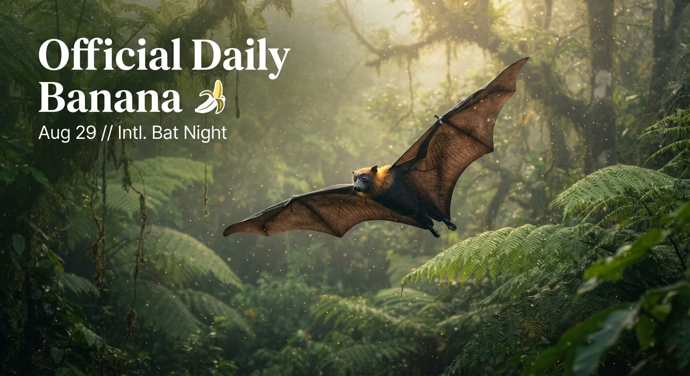
  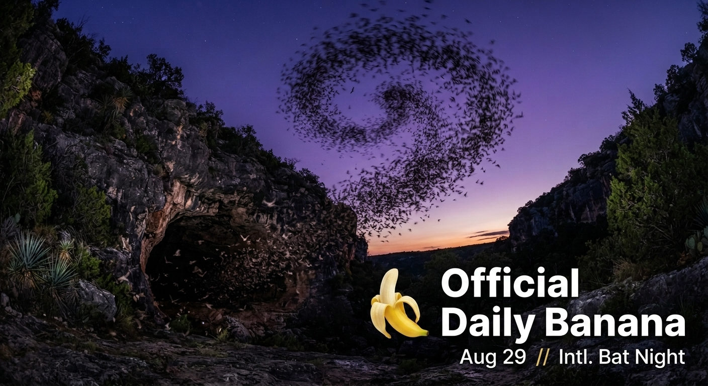
  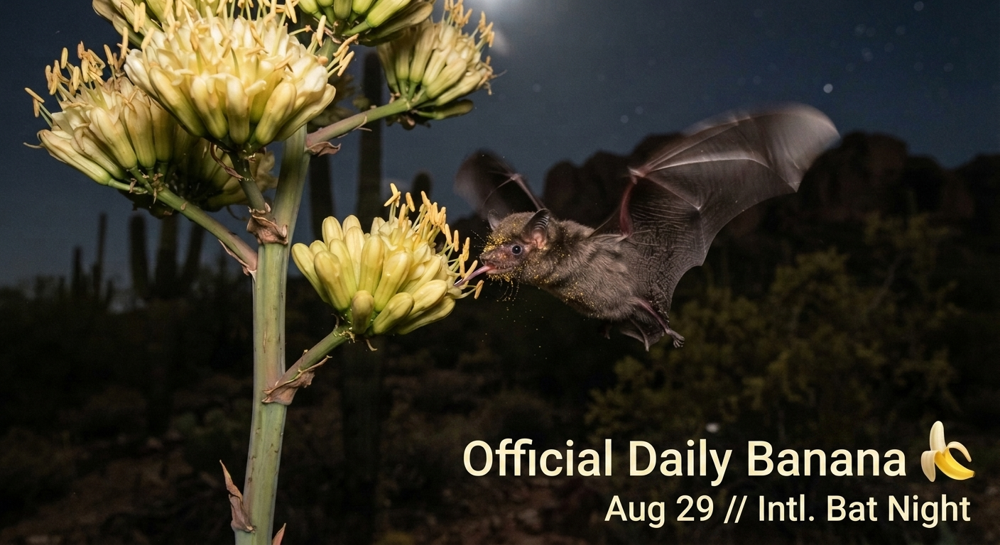
  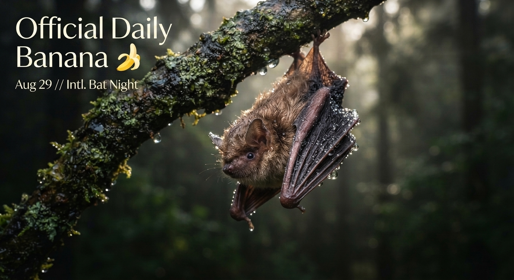
  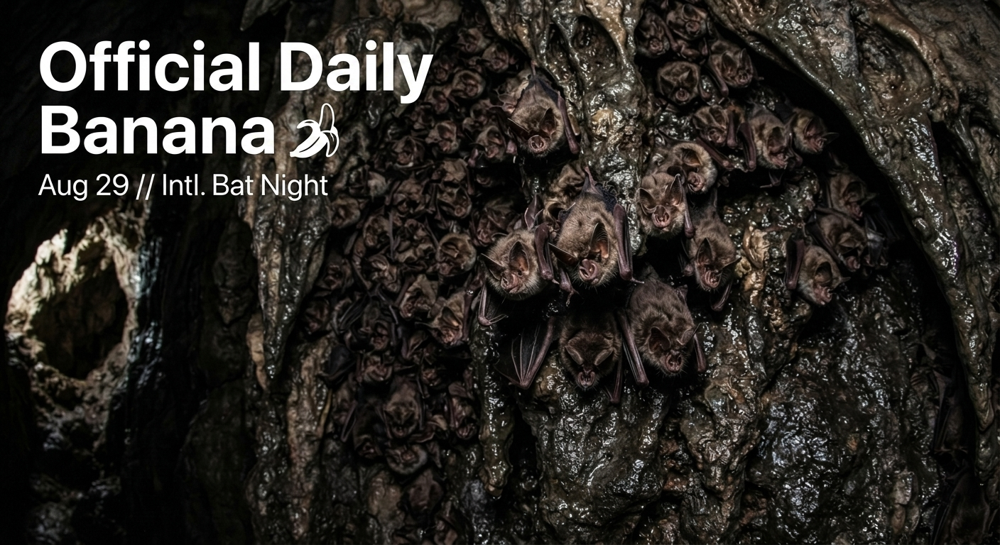

  

    <button type="button">Intl. Bat Night</button>
    <button type="button" class="discuss-btn" onclick="openDiscussion('aug-29-26')">Comments</button>
  

  
<pre class="highlight"><code><ul><li><strong>Flying Foxes (Ethereal but Realistic):</strong> A surreal yet biologically accurate scene of a Golden-crowned Flying Fox gliding through a mist-shrouded Borneo rainforest canopy at dawn. The air is filled with floating iridescent pollen and soft, diffused golden light filtering through giant ferns. The bat's fur is rendered in high detail, while the background dissolves into a dreamy, atmospheric haze of emerald and gold.</li><li><strong>Brazilian Free-tailed Bat (Cinematic):</strong> A breathtaking cinematic wide-angle shot of millions of Brazilian Free-tailed bats streaming out of the mouth of Bracken Cave in Texas. The bats form a massive, swirling obsidian ribbon against a deep violet twilight sky. Low-angle perspective, dramatic lighting, and hyper-realistic textures of the limestone cliff, capturing the sheer scale and motion of the emergence.</li><li><strong>Lesser Long-nosed Bat (Journalistic):</strong> A candid, National Geographic-style wildlife photograph of a Lesser Long-nosed bat hovering mid-air to feed from a blooming agave flower in the Sonoran Desert. Raw, unposed composition with a shallow depth of field and natural moonlight highlighting the pollen on the bat's muzzle. Grainy texture and realistic environmental lighting capture a fleeting moment of biological interaction.</li><li><strong>Common Pipistrelle (Realistic):</strong> A hyper-realistic macro shot of a Common Pipistrelle bat clinging to a dew-covered branch in the Black Forest of Germany. Soft, moody morning light creates a rim-light effect on the bat's fine brown fur and the translucent veins of its wings. Extreme detail on the water droplets and the texture of the mossy bark, with a cinematic bokeh background of a misty ancient woodland.</li><li><strong>Greater Horseshoe Bat (Journalistic):</strong> A documentary-style interior shot of Greater Horseshoe bats roosting along the damp, jagged walls of a limestone karst cave in Southern France. Wide-angle lens and natural cave lighting with high contrast highlight the distinctive nose-leaf anatomy of the bats. The composition is raw and authentic, focusing on the social clustering of the colony in their natural subterranean environment.</li></ul></code></pre>

  

</article>

<article class="post-entry" data-tags="design,middle-earth,realistic,concept-art">
<h2 id="aug-28-26" style="display: flex; justify-content: flex-start; align-items: center; gap: 25px;"><a href="#aug-28-26">Aug 28 // Outpainting</a> <button onclick="switchOutpainting()" class="toggle-btn" style="position: static;">Next Image</button> 

  design
  middle-earth
  realistic
  concept-art

</h2>

  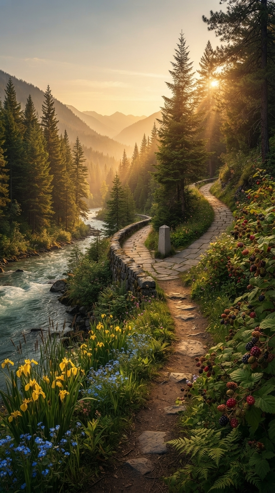
  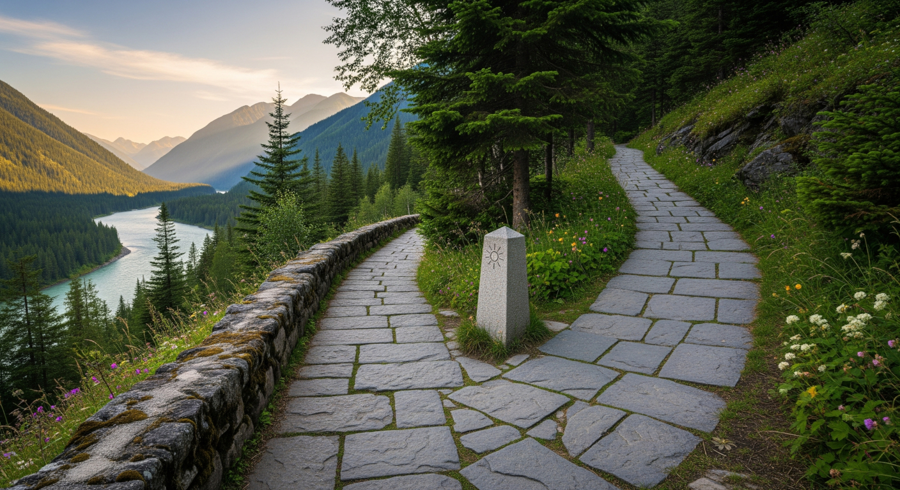

  

    <button type="button">Outpainting</button>
    <button type="button" class="discuss-btn" onclick="openDiscussion('aug-28-26')">Comments</button>
  

  
<pre class="highlight"><code>
Use the provided image as the strict visual reference for the winding road. A breathtaking, panoramic vertical landscape shot of the 2nd Age Vales of Anduin near Greenwood Forest. The Anduin river flows through the left side of the scene, but the primary focus is heavily on the right side of the river bank. Here, a prominent dirt road (matching the reference image) winds its way up a slope through the trees along its path, eventually disappearing into a distant valley. The lighting is a magical, cinematic golden hour. The landscape features a dense forest mixture of fir and pine trees, with thick undergrowth of old growth and flowering wild berries. Along the river bank, vibrant yellow Iris and blue Myosotis flowers grow alongside reeds. Studio quality photorealism, breathtaking masterpiece, extremely detailed, 9:16 vertical aspect ratio.
</code></pre>

  

</article>

<article class="post-entry" data-tags="character-design,middle-earth,realistic,concept-art,lotro">
<h2 id="aug-27-26" style="display: flex; justify-content: flex-start; align-items: center; gap: 25px;"><a href="#aug-27-26">Aug 27 // World Rock Paper Scissors Day</a> 

  character-design
  middle-earth
  realistic
  concept-art
  lotro

</h2>

  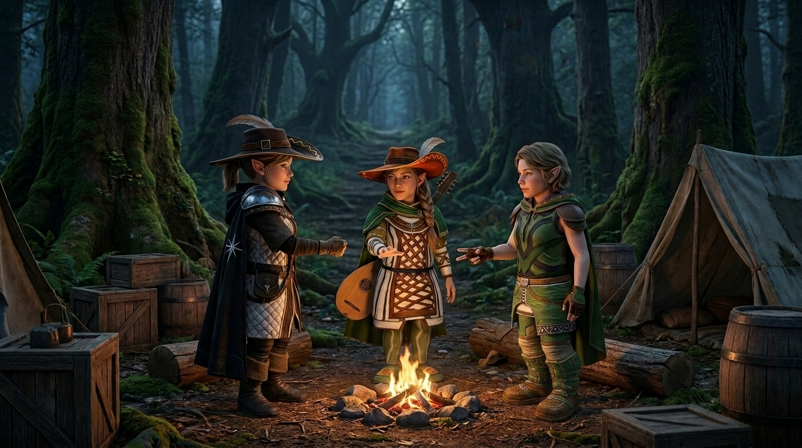

  

    <button type="button">World Rock Paper Scissors Day</button>
    <button type="button" class="discuss-btn" onclick="openDiscussion('aug-27-26')">Comments</button>
  

  
<pre class="highlight"><code>
<em>Note: Multiple reference images are provided, including a 3D campsite, 3D armor references, and generated face portraits for three distinct characters.</em>

<strong>ENVIRONMENT:</strong> A stunning, photorealistic real-world landscape photograph of a rustic campsite clearing that leads into a dark, moody ancient forest. The path into the forest is clearly visible in the background frame. This is NOT a 3D game engine—it is a photorealistic, cinematic real-world realization. In the center of the campsite, three female halflings (hobbits) are standing in a circle, engaged in a game of rock-paper-scissors to decide who is in charge.

<strong>Character-N:</strong> Use her portrait as her facial basis. She has slightly pointed halfling ears. She wears the wide-brimmed brown leather hat with a feather and gold trim from her 3D reference. Her light brown hair is pulled into a short ponytail underneath the hat. She wears the exact armor from her 3D reference: a black cloak with a silver star clasp, a single metal pauldron on her right shoulder, and a white quilted tunic. Her hand is extended forward, formed into a ROCK (a closed fist).

<strong>Character-F:</strong> Use her portrait as her facial basis. She has slightly pointed halfling ears. She wears the wide-brimmed orange and brown hat with a feather from her 3D reference. Her long light brown hair is in a loose side-braid flowing from underneath the hat. She wears the exact armor from her 3D reference: a green cowl and white tunic with brown criss-cross strapping. Her hand is extended forward, formed into PAPER (a flat, open palm).

<strong>Character-I:</strong> Use her portrait as her facial basis. She has slightly pointed halfling ears, short wavy light brown hair tucked behind her ears. She wears the exact armor from her 3D reference: a sleeveless green leather tunic with dark trim, thick brown leather pauldrons, green cape, and green cross-laced lower armor. Her hand is extended forward, formed into SCISSORS (index and middle fingers extended).

A stunning, photorealistic cinematic masterpiece, extremely detailed, real-world photography, 8k resolution, 16:9 widescreen aspect ratio.
</code></pre>

  

</article>

<article class="post-entry" data-tags="character-design,middle-earth,realistic,concept-art,lotro">
<h2 id="aug-26-26" style="display: flex; justify-content: flex-start; align-items: center; gap: 25px;"><a href="#aug-26-26">Aug 26 // Protagonists</a> 

  character-design
  middle-earth
  realistic
  concept-art
  lotro

</h2>

  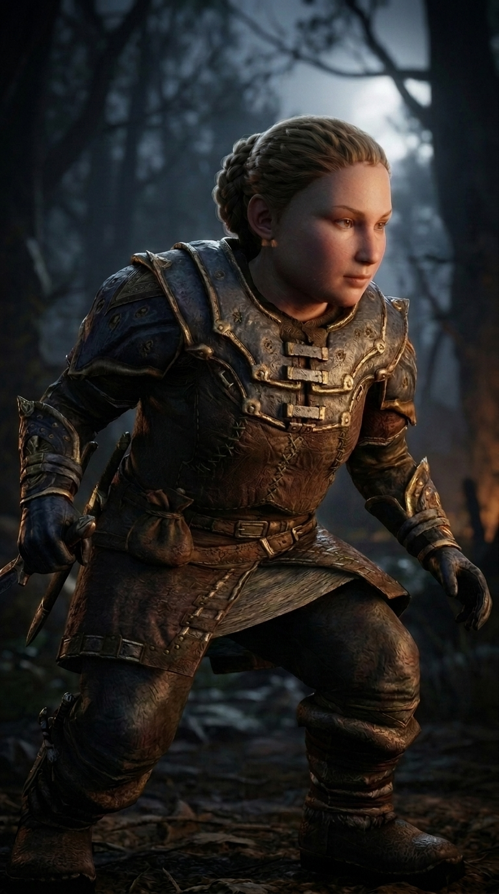

  

    <button type="button">Protagonists</button>
    <button type="button" class="discuss-btn" onclick="openDiscussion('aug-26-26')">Comments</button>
  

  
<pre class="highlight"><code>
Use the provided photorealistic portraits as strict visual references for the woman's face and hair. Use the provided 3D game screenshots as strict visual references for her distinctive armor and clothing. A stunning, photorealistic Unreal Engine 5 AAA game concept art portrait. A female fantasy hunter is captured in a tense, low sneaking posture, hunting unseen enemies in a dark, moody environment. She is NOT wearing a hood; her light brown hair is pulled back tightly into a small braided bun. She wears highly detailed rugged brown leather armor with intricate green cross-stitching, and blue-grey steel shoulder pauldrons with gold trim. The camera angle is dynamic, framing her tightly so her stealthy, tense posture fills the 9:16 vertical frame. Cinematic shadows, strong backlighting, photorealistic masterpiece, 8k resolution.
</code></pre>

  

</article>

<article class="post-entry" data-tags="character-design,middle-earth,double-exposure,concept-art,lotro">
<h2 id="aug-25-26" style="display: flex; justify-content: flex-start; align-items: center; gap: 25px;"><a href="#aug-25-26">Aug 25 // Double Exposure</a> 

  character-design
  middle-earth
  double-exposure
  concept-art
  lotro

</h2>

  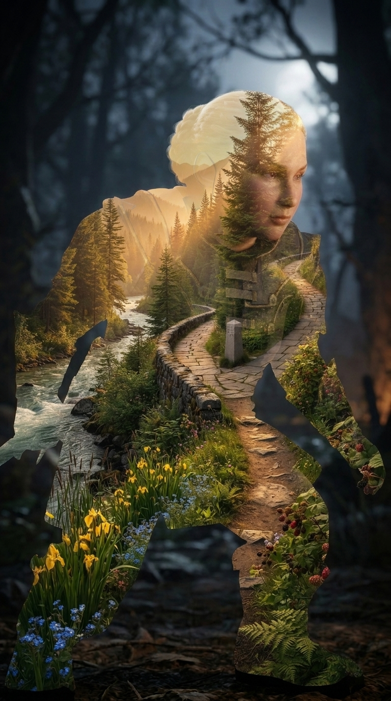

  

    <button type="button">Double Exposure</button>
    <button type="button" class="discuss-btn" onclick="openDiscussion('aug-25-26')">Comments</button>
  

  
<pre class="highlight"><code>
<strong>Positive Prompt:</strong> A breathtaking, midjourney-style double exposure masterpiece. Use Image 1 strictly for the primary base character silhouette and pose. Use Image 2 (the landscape) entirely as the texture filler. Her silhouette acts as a pure window into the landscape. Her body and form are entirely made of the sweeping forest road, trees, and river from Image 2. Do not draw any physical clothing, leather, or armor. Maintain only a faint, translucent geometric outline of her human form superimposed over the landscape so she is recognizable, but the textures inside the silhouette must be 100% forest landscape. The character's form harmoniously intertwines with the Vales of Anduin environment, creating a stunning, seamless surreal blend. Studio quality realism, cinematic lighting, extremely detailed, 9:16 vertical aspect ratio.

<strong>Negative Prompt:</strong> leather, steel, metal, fabric, clothing texture, armor texture, tunic, stitches
</code></pre>

  

</article>

<article class="post-entry" data-tags="literature,fantasy,lee-howe">
<h2 id="aug-24-26" style="display: flex; justify-content: flex-start; align-items: center; gap: 25px;"><a href="#aug-24-26">Aug 24 // Scenes from Literature II</a> <button onclick="switchHeritage()" class="toggle-btn" style="position: static;">Next Image</button> 

  literature
  fantasy
  lee-howe

</h2>

  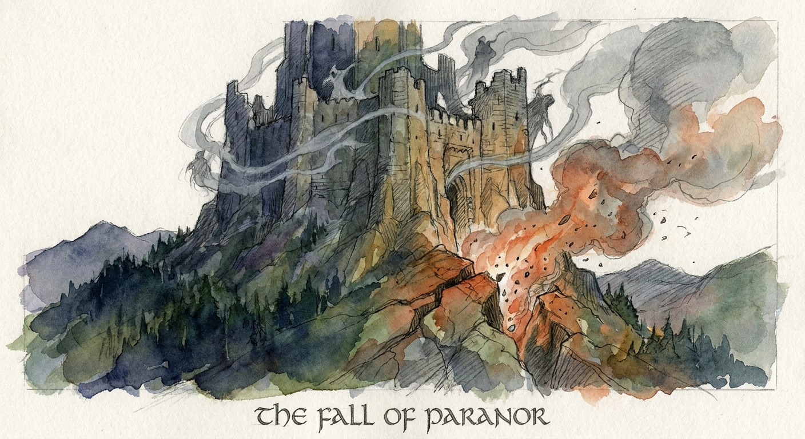
  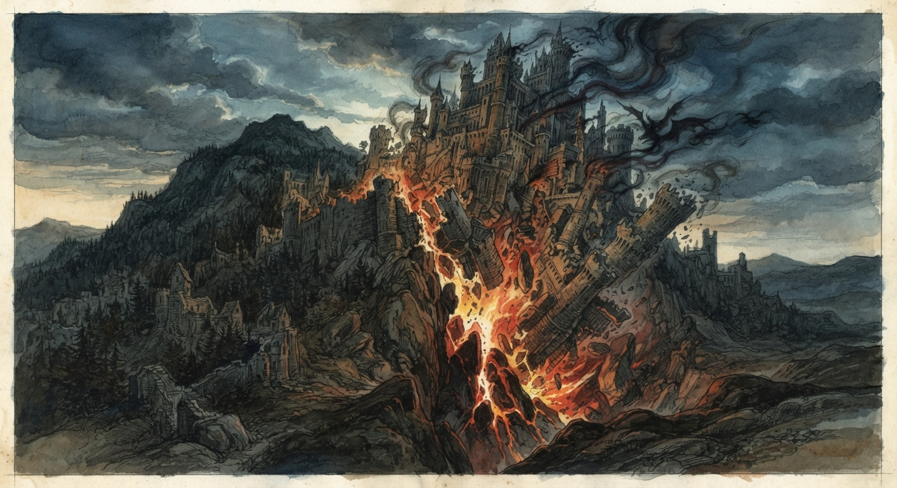
  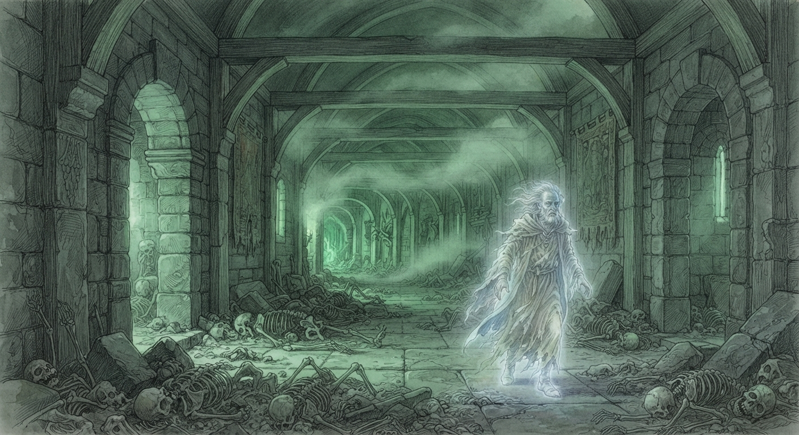
  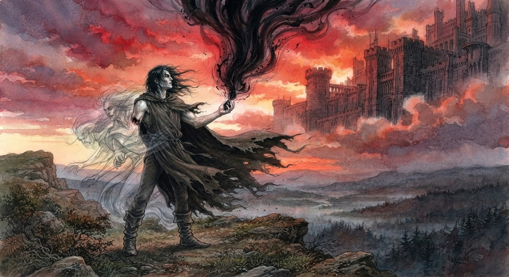
  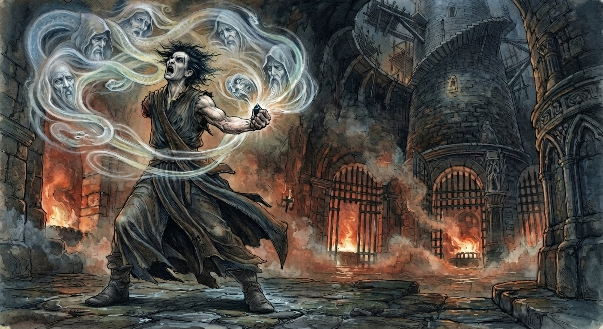

  

    <button type="button">Scenes from Literature II</button>
    <button type="button" class="discuss-btn" onclick="openDiscussion('aug-24-26')">Comments</button>
  

  
<pre class="highlight"><code>
<em>Note: To make sure our AI image prompts were 100% lore-accurate the models were guided through a "research phase" using The Heritage of Shannara series.</em>
<ul><li><strong>Prompt 1 (The Destruction of Paranor):</strong> A gorgeous, luminous watercolor and pencil illustration in the legendary high fantasy style of Alan Lee and John Howe. Ethereal, delicate washes of color, soft dreamlike lighting, highly detailed intricate sketching, conveying a deep sense of mythic age, melancholic beauty, and epic scale. Masterpiece, 8k resolution. A terrifying vision of the destruction of Paranor. A towering, weathered stone fortress sits atop a great forested mountain against the dark of the land. Sinister vapors and flitting shadows coil tightly around the castle's high battlements. A catastrophic eruption of fire splits the earth and the mountain apart from beneath. The stone and mortar of the Keep are violently cracking and crumbling into the fiery chasm below.</li><li><strong>Prompt 2 (Cogline's Spirit Walk):</strong> A gorgeous, luminous watercolor and pencil illustration in the legendary high fantasy style of Alan Lee and John Howe. Ethereal, delicate washes of color, soft dreamlike lighting, highly detailed intricate sketching. The interior of the lost Druid's Keep of Paranor, cast away by magic into a different place and time. It is an austere medieval fortress keep built of thick, heavy stone blocks with martial defense architecture. A sprawling, cavernous indoor stone hallway whose heavy beamed and arched ceilings rise into thick, suffocating clouds of ancient brume and dust. The indoor atmosphere is swathed entirely in a strange, spectral greenish cast. The cold, lifeless corridor is littered with the grotesque, misshapen skeletal remains of dark creatures and gnomes. In the foreground, the glowing, translucent spirit of an old man with wispy hair walks cautiously through the haunted, abandoned ruins.</li><li><strong>Prompt 3 (Walker Boh Restoring Paranor):</strong> A gorgeous, luminous watercolor and pencil illustration in the legendary high fantasy style of Alan Lee and John Howe. Ethereal, delicate washes of color, soft atmospheric lighting, highly detailed intricate sketching. A tall, lean, athletic man with pale skin and flowing black hair stands alone on an empty, windswept forest bluff at sunset. He is bathed in the heated, withering crimson glow of the dying sun. He wears a worn, dark travel cloak whipping violently in a magical wind. He is missing his right arm at the shoulder. His single left hand thrusts forward, tightly clutching a small, palm-sized, pitch-black gemstone. A massive torrent of magical 'black light' erupts from the tiny stone like an inverted waterfall of pure darkness. The nonlight spreads like thick ink against the crimson sunset sky, magically tracing and etching the solid architectural lines of massive stone walls, parapets, and castle towers out of thin air to restore a lost fortress. The man's body shimmers in a magical haze, fragmenting into overlapping, translucent, wraith-like sketches as he channels the immense power. Highly textured, dramatic watercolor washes, intricate pencil detailing.</li><li><strong>Prompt 4 (Walker Boh's Transformation in the Tower Well):</strong> A gorgeous, luminous watercolor and pencil illustration in the legendary high fantasy style of Alan Lee and John Howe. Ethereal, delicate washes of color, soft atmospheric lighting, highly detailed intricate sketching. Deep underground, standing on the solid stone floor at the very bottom of a massive cylindrical tower well. In the background, heavy iron grates reveal the epic, awakening glow of subterranean earth-fueled furnaces, casting a warm, atmospheric firelight that blends beautifully with the delicate watercolor style. In the center, a tall, lean, athletic man with pale skin and flowing black hair. He wears worn, dark flowing travel robes (intact, not shredded). He is missing his right arm at the shoulder. He stands with his head thrown back in screaming, defiant agony. His single left hand thrusts forward, tightly clutching a small, palm-sized pitch-black gemstone. A violent vortex of ethereal serpentine mist is being sucked from the air into the small gem. Ghostly, translucent faces of ancient, hooded Druids swirl in the mist, overlapping with his skin as their memories weave into his mind.</li></ul></code></pre>

  

</article>

<article class="post-entry" data-tags="dinosaurs,prehistoric,realistic">
<h2 id="aug-23-26" style="display: flex; justify-content: flex-start; align-items: center; gap: 25px;"><a href="#aug-23-26">Aug 23 // Dinosaurs: Plesiosaurus</a> <button onclick="switchPlesio()" class="toggle-btn" style="position: static;">Next Image</button> 

  dinosaurs
  prehistoric
  realistic

</h2>

  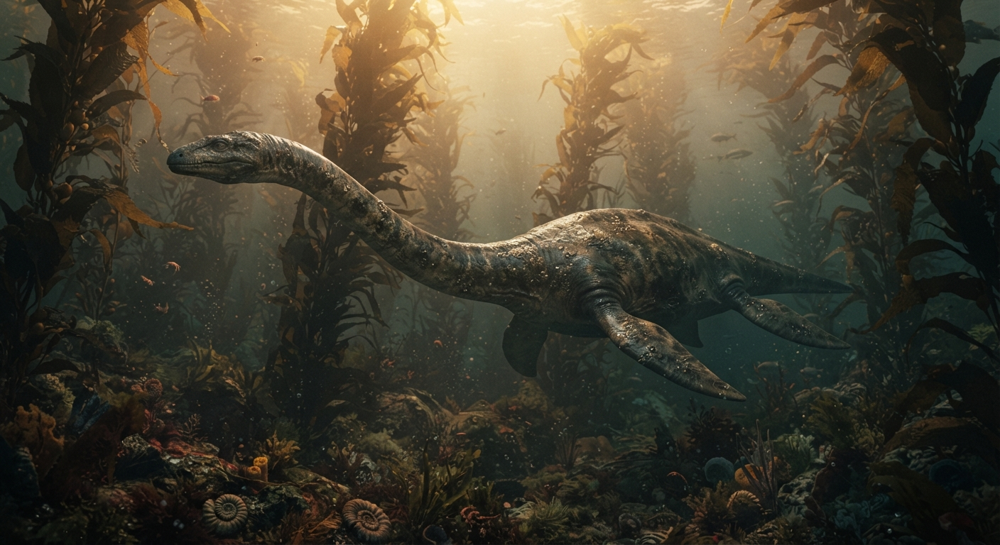
  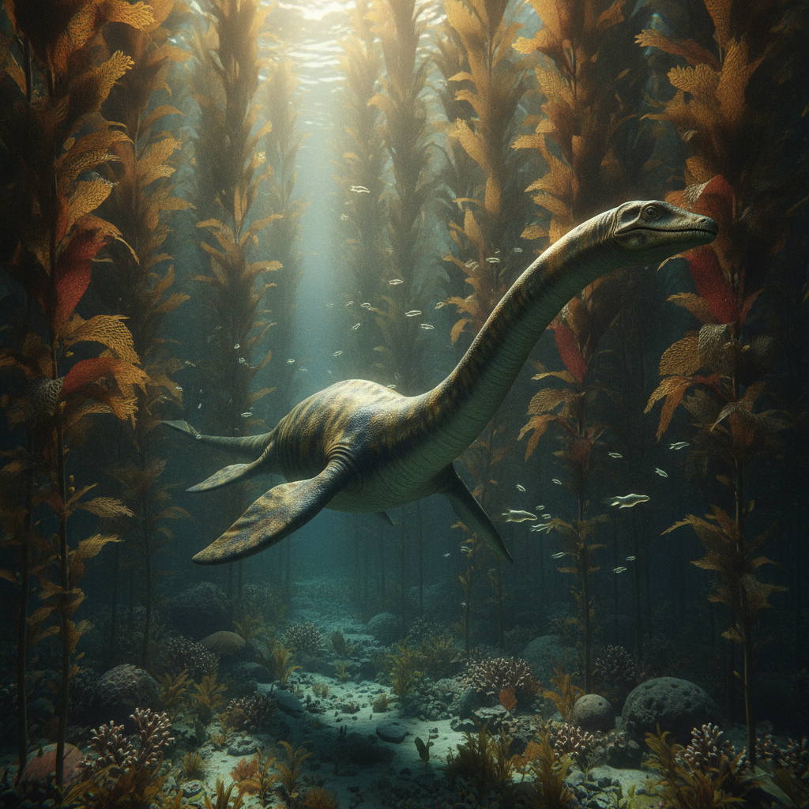
  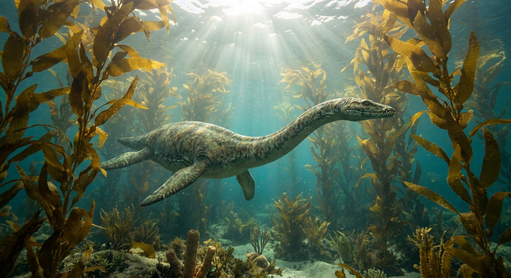
  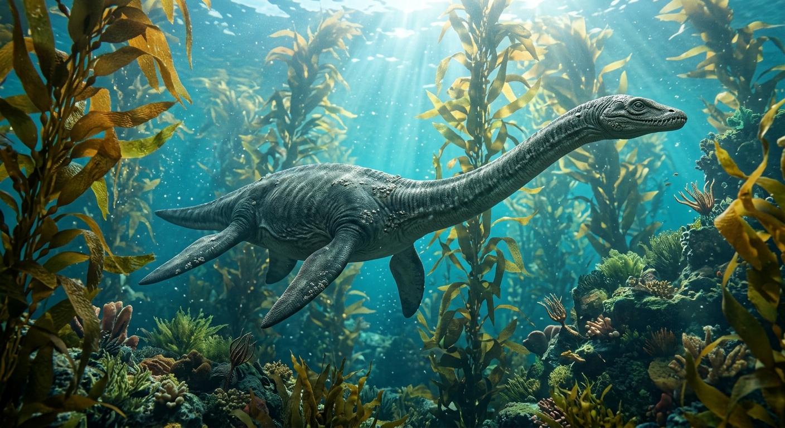

  

    <button type="button">Dinosaurs: Plesiosaurus</button>
    <button type="button" class="discuss-btn" onclick="openDiscussion('aug-23-26')">Comments</button>
  

  
<pre class="highlight"><code>
A breathtaking, studio quality, hyper-realistic depiction of a Plesiosaurus (peacefully navigating a dense prehistoric kelp forest). Full environmental effects, incredibly exquisite detail on the animal's textures, skin, and authentic prehistoric environment. Subtle, realistic camera and lens effects. CRITICAL INSTRUCTION: There must be absolutely NO predator-prey interaction, no hunting, and no feeding depicted. If this is a carnivore, it must be depicted isolated from any prey species. Masterpiece quality. {lighting_and_atmosphere}

Lighting Variants ({lighting_and_atmosphere}): Variant 1 (Morning): Lighting/Environment: Bright, crisp morning sunlight piercing through the atmosphere, vibrant colors, clear visibility. Variant 2 (Dramatic): Lighting/Environment: Dramatic, moody late afternoon golden-hour, or overcast skies with soft, diffused atmospheric shadows.
</code></pre>

  

</article>

<article class="post-entry" data-tags="folklore,historical,mask-art,sri-lanka">
<h2 id="aug-22-26" style="display: flex; justify-content: flex-start; align-items: center; gap: 25px;"><a href="#aug-22-26">Aug 22 // Tales of Folklore</a> <button onclick="switchTale()" class="toggle-btn" style="position: static;">Next Image</button> 

  folklore
  historical
  mask-art
  sri-lanka

</h2>

  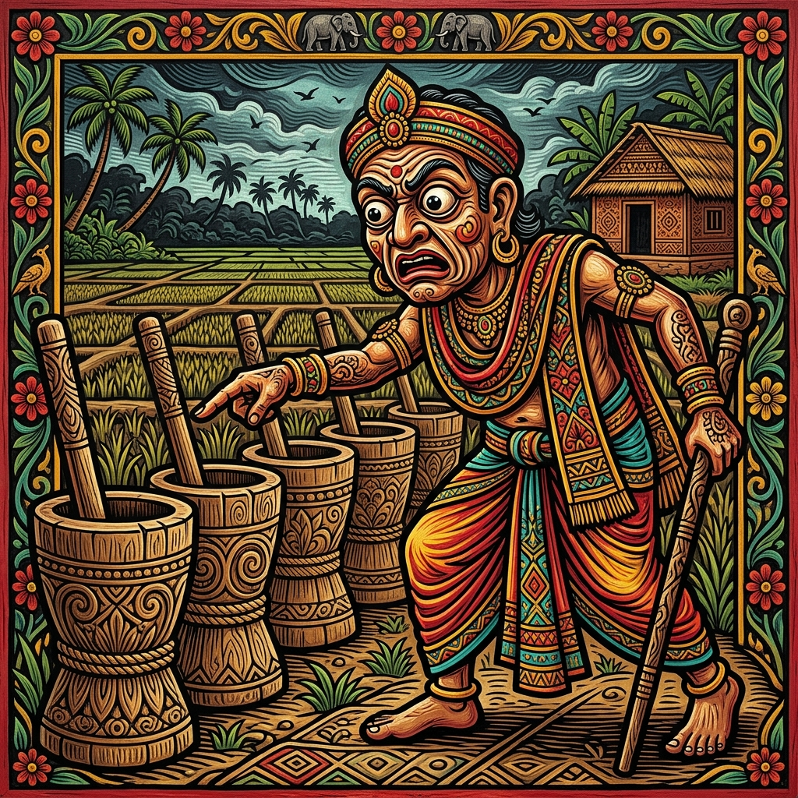
  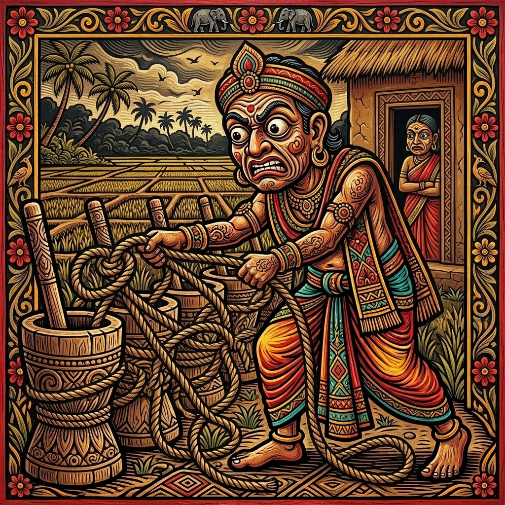
  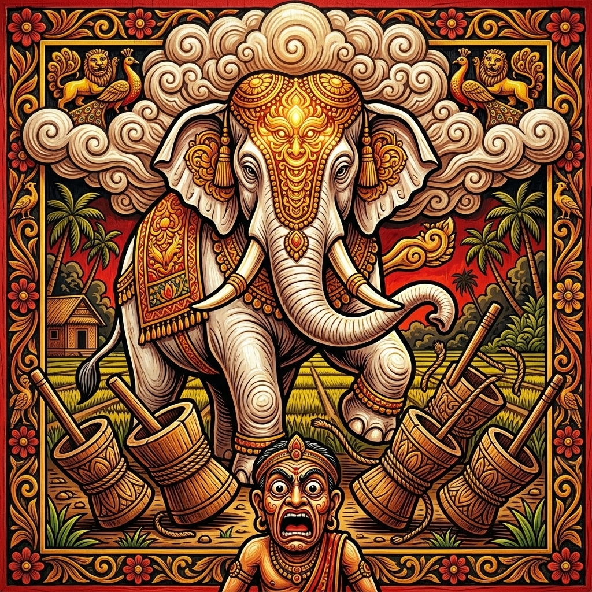
  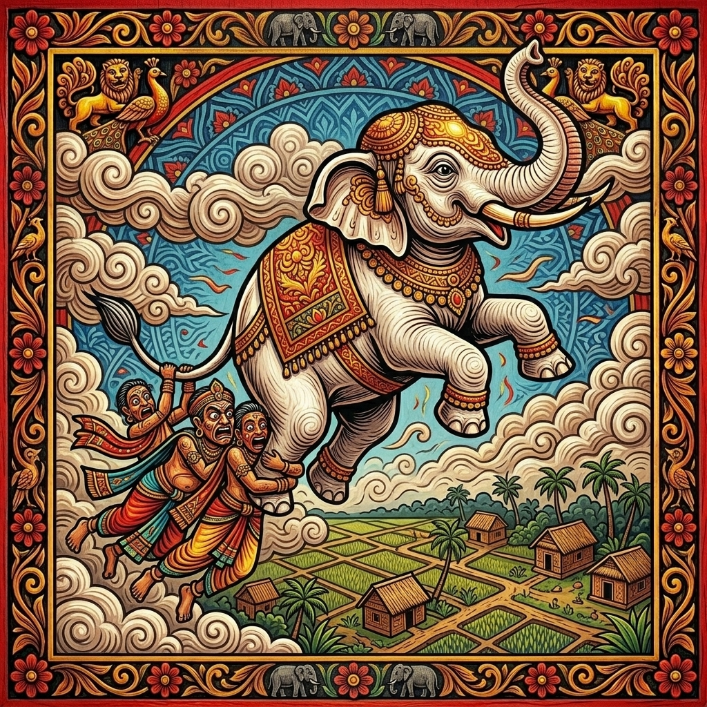
  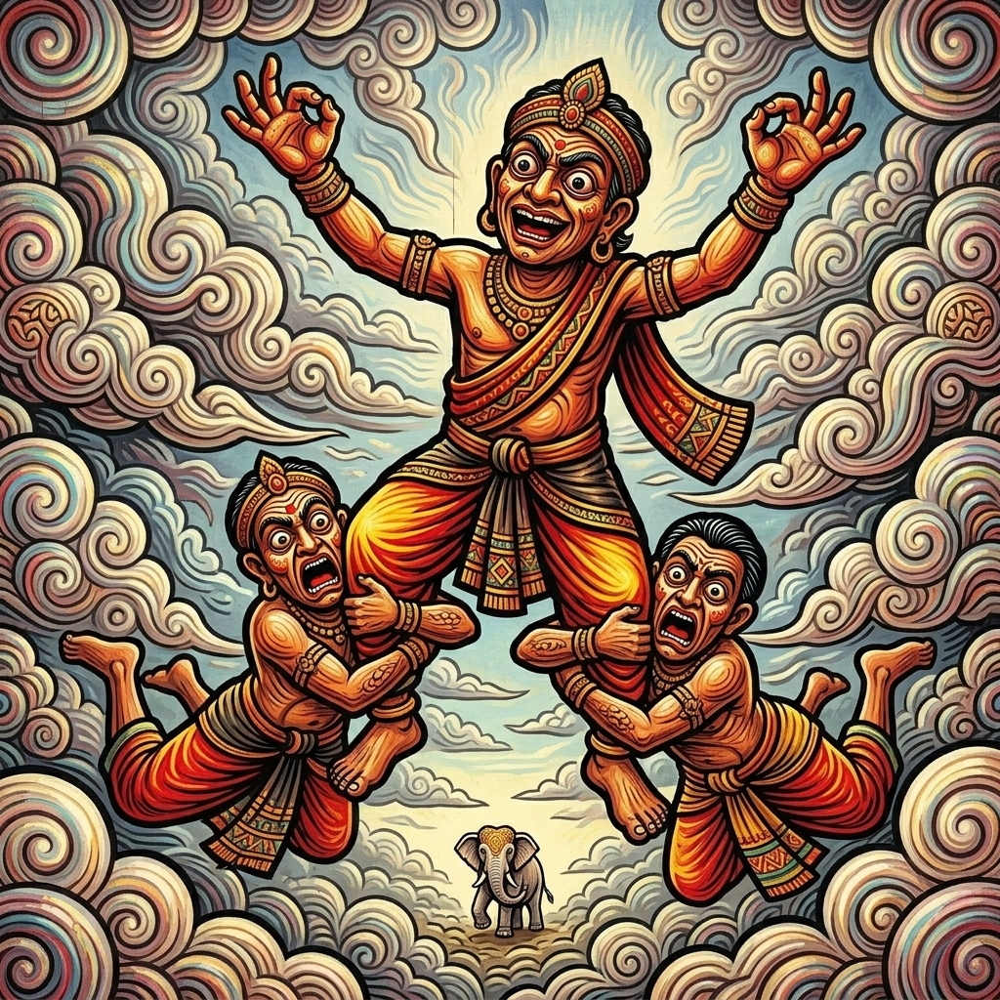
  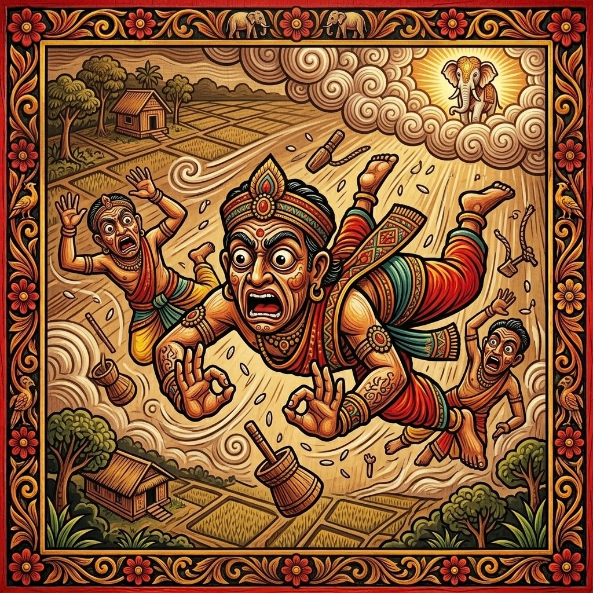

  

    <button type="button">Tales of Folklore</button>
    <button type="button" class="discuss-btn" onclick="openDiscussion('aug-22-26')">Comments</button>
  

  
<pre class="highlight"><code>
<strong>Tale of the Divine Elephant</strong>

<strong>Panel 1: The Confusion</strong> A bold, theatrical illustration inspired by Ambalangoda mask carving. The Gamarala is depicted with an exaggeratedly shocked and suspicious facial expression, his eyes wide and eyebrows arched. He stands in a stylized rural field, accusing a row of rice mortars. The color palette is high-contrast with vivid reds, bright yellows, and deep blacks. The image features intricate, symmetrical folk patterns and a rich, carved-wood texture, as if the scene were a living mask.

<strong>Panel 2: The Absurd Effort</strong> A bold, theatrical illustration inspired by Ambalangoda mask carving. The Gamarala is in a comedic frenzy, tying thick, oversized hemp ropes in complicated knots around several heavy wooden rice mortars. His face is a mask of strained, exaggerated determination. In the background, his wife stands in the doorway of a mud hut, her face a mask of deep skepticism and judgment. The color palette is high-contrast with vivid reds, bright yellows, and deep blacks. The image features intricate, symmetrical folk patterns and a rich, carved-wood texture, as if the scene were a living mask.

<strong>Panel 3: The Arrival</strong> A bold, theatrical illustration inspired by Ambalangoda mask carving. A colossal, divine white tusk elephant descends from swirling, stylized clouds. The elephant’s forehead is adorned with intricate, glowing gold mask-like ornaments. It is effortlessly knocking over the rope-tied mortars. In the foreground, the Gamarala is tiny, his face a mask of absolute awe with wide, staring eyes and a gaping mouth. The color palette is high-contrast with vivid reds, bright yellows, and deep blacks. The image features intricate, symmetrical folk patterns and a rich, carved-wood texture, as if the scene were a living mask.

<strong>Panel 4: The Ascent</strong> A bold, theatrical illustration inspired by Ambalangoda mask carving. A dynamic vertical composition. The Gamarala's hands are tightly gripping the end of a divine elephant's long tail. Below him, two other villagers hang in a human chain, each tightly gripping the ankles of the person above them. They are being pulled high into a stylized, patterned sky. Their faces are masks of terror and excitement. Their colorful sarongs flutter like decorative ribbons. Below them, the Sri Lankan village is depicted as a miniature, stylized folk-art map. The color palette is high-contrast with vivid reds, bright yellows, and deep blacks. The image features intricate, symmetrical folk patterns and a rich, carved-wood texture, as if the scene were a living mask.

<strong>Panel 5: The Fatal Mistake</strong> A bold, theatrical illustration inspired by Ambalangoda mask carving. A theatrical close-up set mid-air among iridescent, stylized clouds. A human chain of exactly three people is falling rapidly through the sky from a great height, completely detached from the elephant. At the top of the falling chain, the Gamarala has a triumphant, foolish expression, making a large circular hand gesture with both arms. Below him, two other villagers clinging to his ankles are plummeting downwards. Their faces are masks of pure horror and panic. The color palette is high-contrast with vivid reds, bright yellows, and deep blacks. The image features intricate, symmetrical folk patterns and a rich, carved-wood texture, as if the scene were a living mask.

<strong>Panel 6: The Descent</strong> A bold, theatrical illustration inspired by Ambalangoda mask carving. A dramatic vertical plunge where the Gamarala and his two friends are falling rapidly through the air, their faces frozen in comedic shock and wide-eyed realization. There are only two companions present. The divine elephant is a small, glowing figure receding into the top of the frame. The Gamarala still holds the circular "quart measure" hand gesture. The color palette is high-contrast with vivid reds, bright yellows, and deep blacks. The image features intricate, symmetrical folk patterns and a rich, carved-wood texture, as if the scene were a living mask.
</code></pre>

  

</article>

<article class="post-entry" data-tags="dinosaurs,prehistoric,realistic">
<h2 id="aug-21-26" style="display: flex; justify-content: flex-start; align-items: center; gap: 25px;"><a href="#aug-21-26">Aug 21 // Dinosaurs: Velociraptor</a> <button onclick="switchRaptor()" class="toggle-btn" style="position: static;">Next Image</button> 

  dinosaurs
  prehistoric
  realistic

</h2>

  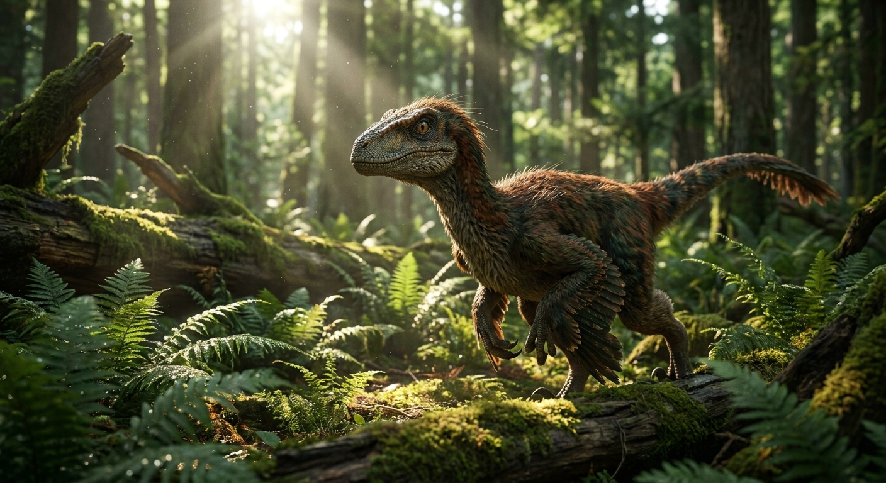
  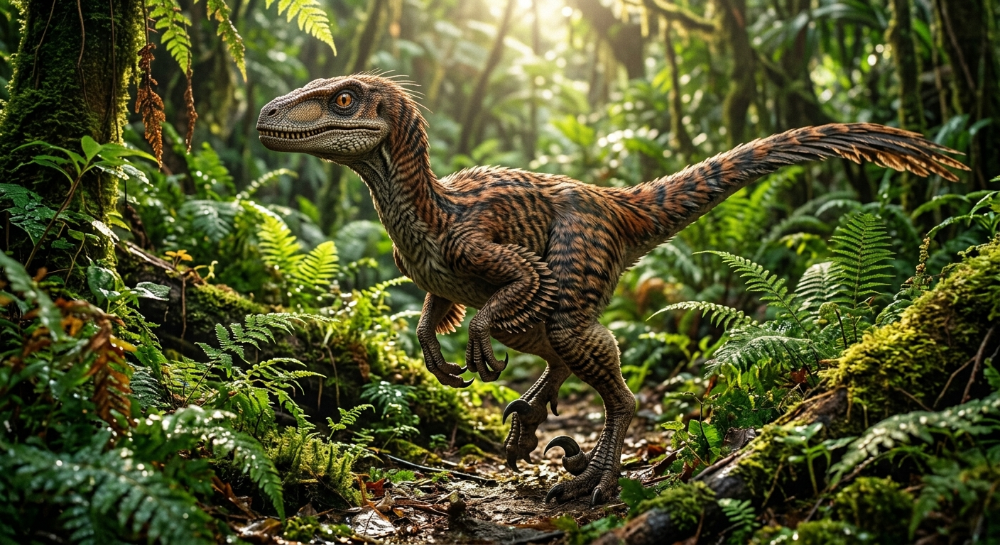
  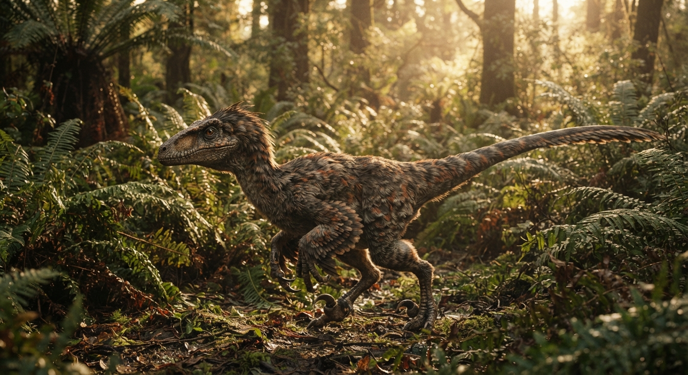

  

    <button type="button">Dinosaurs: Velociraptor</button>
    <button type="button" class="discuss-btn" onclick="openDiscussion('aug-21-26')">Comments</button>
  

  
<pre class="highlight"><code>
A breathtaking, studio quality, hyper-realistic depiction of a Velociraptor (navigating dense, sun-dappled fern undergrowth). Full environmental effects, incredibly exquisite detail on the animal's textures, skin, and authentic prehistoric environment. Subtle, realistic camera and lens effects. CRITICAL INSTRUCTION: There must be absolutely NO predator-prey interaction, no hunting, and no feeding depicted. If this is a carnivore, it must be depicted isolated from any prey species. Masterpiece quality. {lighting_and_atmosphere}

Lighting Variants ({lighting_and_atmosphere}): Variant 1 (Morning): Lighting/Environment: Bright, crisp morning sunlight piercing through the atmosphere, vibrant colors, clear visibility. Variant 2 (Dramatic): Lighting/Environment: Dramatic, moody late afternoon golden-hour, or overcast skies with soft, diffused atmospheric shadows.
</code></pre>

  

</article>

<article class="post-entry" data-tags="games,middle-earth,table-top,illustration,lotro,concept-art">
<h2 id="aug-20-26" style="display: flex; justify-content: flex-start; align-items: center; gap: 25px;"><a href="#aug-20-26">Aug 20 // Games II</a> <button onclick="switchHollin()" class="toggle-btn" style="position: static;">Next Image</button> 

  games
  middle-earth
  table-top
  illustration
  lotro
  concept-art

</h2>

  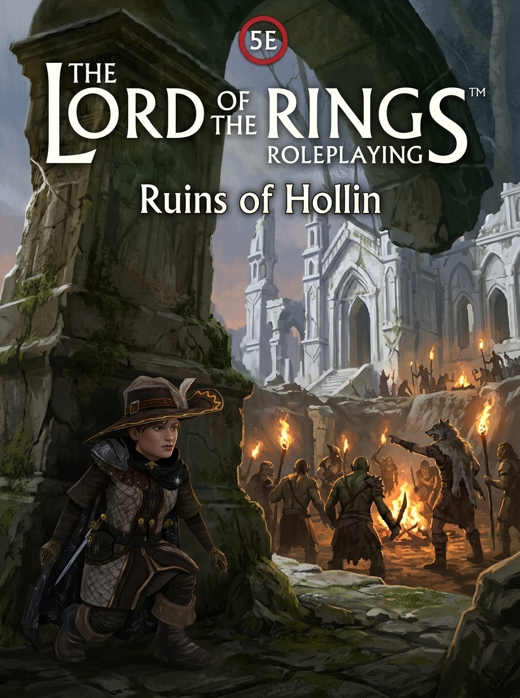
  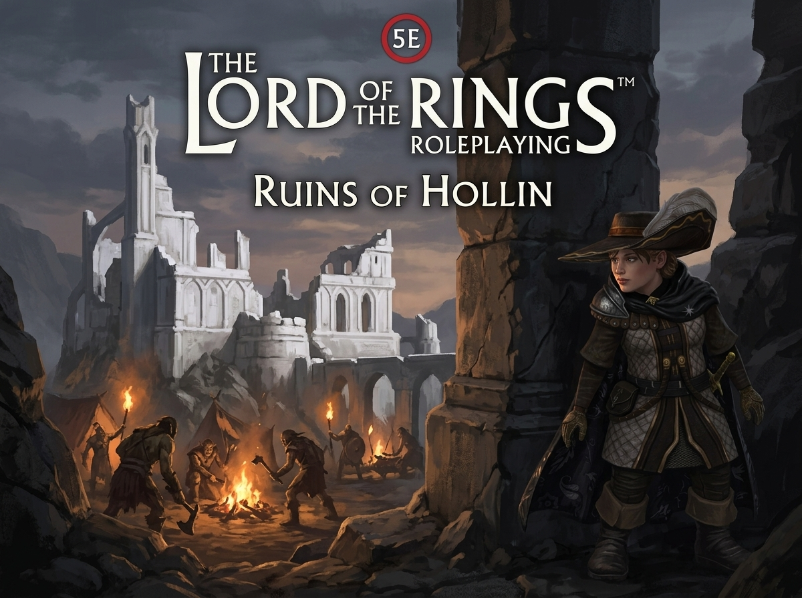

  

    <button type="button">Games II</button>
    <button type="button" class="discuss-btn" onclick="openDiscussion('aug-20-26')">Comments</button>
  

  
<pre class="highlight"><code>
Cover art for an adventure book. The layout and typography must perfectly match the provided reference image containing the 'The Lord of the Rings Roleplaying' logo. At the top center is the red ring logo containing the text '5E'. Below that is the prominent main title logo reading 'The Lord of the Rings Roleplaying' in the exact signature classic fantasy serif font shown in the reference. Below the main title, the subtitle reads 'Ruins of Hollin'.

A beautiful, highly detailed cinematic fantasy illustration. The art style MUST perfectly match the authentic, evocative painterly style of Middle-earth RPG book covers. The scene has a muted, earthy color palette with dramatic chiaroscuro lighting.

The setting is deep behind enemy lines. In the foreground, hidden securely in deep shadow behind a large, crumbling stone pillar, is a halfling burglar. The provided character reference images MUST be the sole basis for this character's physical design, clothing, and features. She is drawn in the exact same painted style as the official book covers. She is peeking out from her hiding spot, looking intently past the pillar at the enemy.

In the midground and background, the melancholic, white-stone ruins of the ancient Elven ring-forges of Eregion rise into the twilight sky. Saruman's forces—brutal Orcs and Dunlendings—are actively excavating the ancient stonework, their harsh torches and campfires casting an ominous, flickering orange glow.

8k resolution, masterpiece, official fantasy book cover design.

<strong>To be continued...</strong> <a href="https://gist.github.com/lol-dungeonmaster/56614c97fddda518d881ba66be249c1d">eregion_ttrpg_to_be_continued.md</a>
</code></pre>

  

</article>

<article class="post-entry" data-tags="animals,contemporary,journalistic,ethereal">
<h2 id="aug-19-26" style="display: flex; justify-content: flex-start; align-items: center; gap: 25px;"><a href="#aug-19-26">Aug 19 // World Orangutan Day</a> <button onclick="switchOran()" class="toggle-btn" style="position: static;">Next Image</button> 

  animals
  contemporary
  journalistic
  ethereal

</h2>

  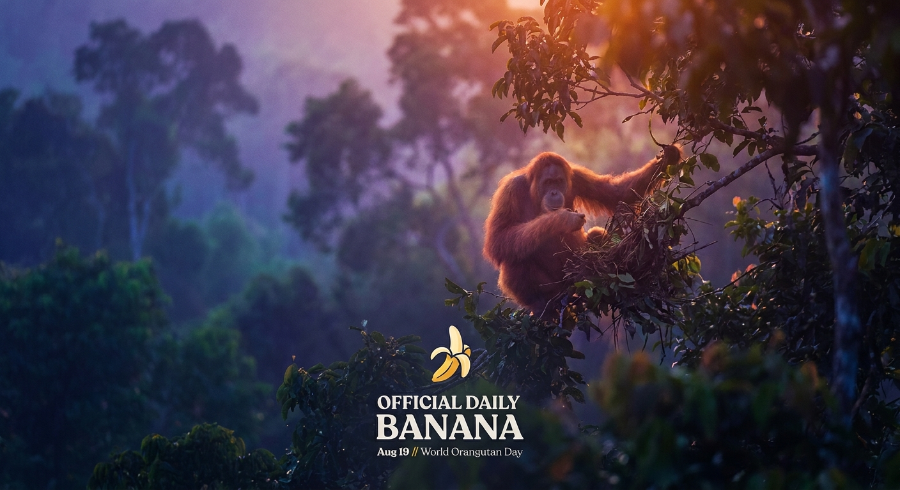
  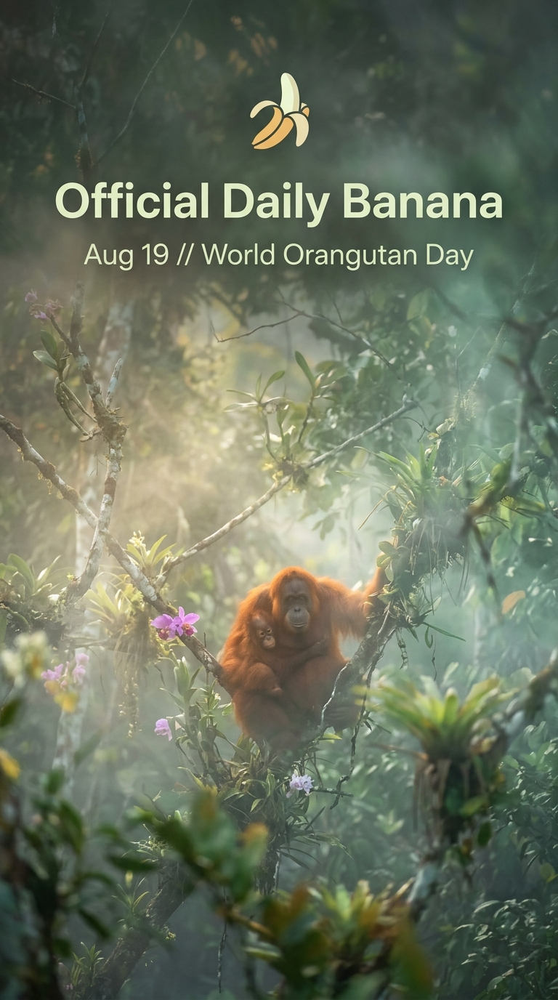
  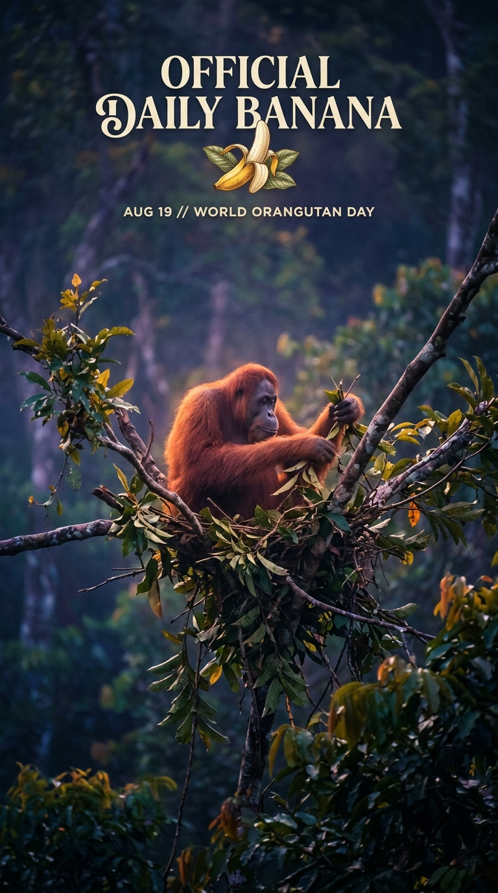

  

    <button type="button">World Orangutan Day</button>
    <button type="button" class="discuss-btn" onclick="openDiscussion('aug-19-26')">Comments</button>
  

  
<pre class="highlight"><code>
<strong>Tender Canopy Bond</strong>

1. Cinematic &amp; Hyper-realistic: A cinematic movie-poster composition of a mother orangutan and her infant nestled in the mid-canopy. Dramatic high-contrast lighting with a single powerful beam of light illuminating the bond between mother and child. Hyper-realistic textures featuring subsurface scattering on the orange fur and crystalline dew drops on surrounding wild orchids. Deep emerald greens, 8k resolution, anamorphic lens, and IMAX quality.

2. Ethereal &amp; Artistic: An atmospheric, ethereal wide shot of a mother and infant orangutan shrouded in a dense, luminous morning mist that swirls through the mid-canopy. Vibrant wild orchids and epiphytes emerge like ghosts from the soft, silver-and-gold haze, blending the animals into the environment. The mother and her infant are partially enveloped by the fog, their warm orange fur creating a glowing focal point within the cool, translucent greens of the forest. Volumetric lighting, soft-focus dreamscape, and a transcendental fine-art nature aesthetic, captured as a breathtaking, immersive environmental scene.

3. Wildlife Documentary Style: A raw, candid wildlife shot of a mother orangutan cradling her infant on a thick rainforest branch. Captured with a 600mm telephoto lens at f/5.6, featuring razor-sharp focus on the infant's curious eyes and the mother's weathered skin. Natural, neutral color grading with authentic, diffused jungle light. Unfiltered detail of matted fur and organic textures in a National Geographic style, 8k resolution, zero post-processing look.

<strong>The Forest Architect</strong>

1. Cinematic &amp; Hyper-realistic: An epic cinematic wide shot of an orangutan constructing a massive nightly nest high in the Bornean canopy during the late afternoon golden hour. Low-angle, amber sunlight pierces through the dense canopy at a sharp slant, creating realistic, defined god-rays that illuminate the heavy evening humidity and lingering forest haze. Dramatic chiaroscuro lighting creates deep, rich shadows and brilliant golden highlights on the orangutan's orange fur and the damp, mossy bark. Wide-angle anamorphic perspective emphasizing the dizzying height and the grandeur of the dipterocarp trees, 8k resolution, movie-poster scale, hyper-realistic environmental textures.

2. Ethereal &amp; Artistic: An atmospheric, artistic depiction of an orangutan weaving its nest as twilight descends upon the Bornean canopy. The scene is enveloped in a settling evening haze, with the last remnants of the sun creating a luminous, burning amber and deep violet color palette. Dreamy, volumetric fog blurs the distant forest layers into a soft wash of indigo and emerald. The orangutan's fur glows with a soft, inner light against the darkening mist, captured with a soft-focus lens for a transcendental, fine-art nature aesthetic that evokes a sense of peace and closure at the end of the day.

3. Wildlife Documentary Style: A technical, high-detail wildlife photograph of an orangutan's hands meticulously weaving branches for a nest. Captured with a 400mm lens, emphasizing the intelligent dexterity and the structural complexity of the nest. Natural, flat lighting characteristic of a dense canopy, with authentic colors and deep, realistic shadows. Sharp detail on the texture of the leaves and the rough bark of the primary forest, 8k resolution, field-research style.
</code></pre>

  

</article>

<article class="post-entry" data-tags="food-drink,historical,still-life">
<h2 style="display: flex; justify-content: flex-start; align-items: center; gap: 25px;" id="aug-18-26"><a href="#aug-18-26">Aug 18 // Intl. Pinot Noir Day</a> 

  food-drink
  historical
  still-life

</h2>

  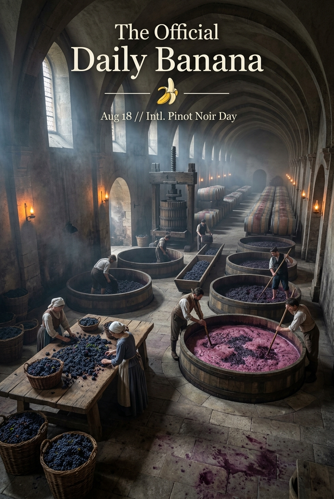

  

    <button type="button">Intl. Pinot Noir Day</button>
    <button type="button" class="discuss-btn" onclick="openDiscussion('aug-18-26')">Comments</button>
  

  
<pre class="highlight"><code>
An ultra-photorealistic, sweeping architectural vista of an expansive, vaulted historical Cistercian winery in Burgundy, France, captured from a high-angle wide perspective.

The Integrated Process Flow:

- The Harvest &amp; Sorting (Foreground): To the left, oversized hand-woven wicker baskets of deep purple Pinot Noir grapes spill onto a massive, rough-hewn oak sorting table. Artisans in 19th-century rural French attire are sorting berries by hand, moving them directly toward the fermentation hall. - The Fermentation Hall (Midground): The center of the room is dominated by a series of massive, open-top oak fermentation cuves that are half-sunken into the limestone floor, their heavy wooden rims flush with the ground. The hall shows the process in various stages: - Treading: In some cuves, workers in period attire are standing inside the vessels, treading the fresh grapes with bare feet to create the must. - Punching Down: In adjacent cuves, the wine is actively fermenting; workers stand on the limestone perimeter, leaning over the rims to punch down a thick, frothy, bubbling cap of grape skins with long wooden poles. - The Final Pressing (Midground Background): Beyond the vats stands the towering vertical wooden screw press. Wide wooden troughs filled with fermented skins are being moved from the finished cuves toward the press for the final extraction. - The Aging (Deep Background): The scene recedes into a vast, vaulted cathedral-like cellar where seasoned French oak barriques are stacked in long, vaulted rows, disappearing into a hazy, atmospheric distance.

Historical Authenticity &amp; Texture: Zero contemporary elements. Every surface is organic: oxidized copper, stained wood, damp limestone. The floor features centuries-old purple stains and mineral calcification.

Lighting &amp; Cinematic Quality: Dramatic chiaroscuro. Shafts of cold, northern light from high Romanesque windows collide with the flickering orange glow of wall-mounted oil lamps. A cool, heavy atmospheric haze and dust motes hang in the humid air.

Technical Specs: Shot on 24mm wide-angle prime lens, f/11 aperture for deep depth of field. 8k resolution, raw photographic style, muted earthy palette with the only vibrant color being the translucent, luminous ruby of the Pinot Noir.
</code></pre>

  

</article>

<article class="post-entry" data-tags="character-design,middle-earth,sprite-sheet,pixel-art,lotro">
<h2 id="aug-17-26" style="display: flex; justify-content: flex-start; align-items: center; gap: 25px;"><a href="#aug-17-26">Aug 17 // Sprite Sheets</a> <button onclick="switchSprite()" class="toggle-btn" style="position: static;">Next Image</button> 

  character-design
  middle-earth
  sprite-sheet
  pixel-art
  lotro

</h2>

  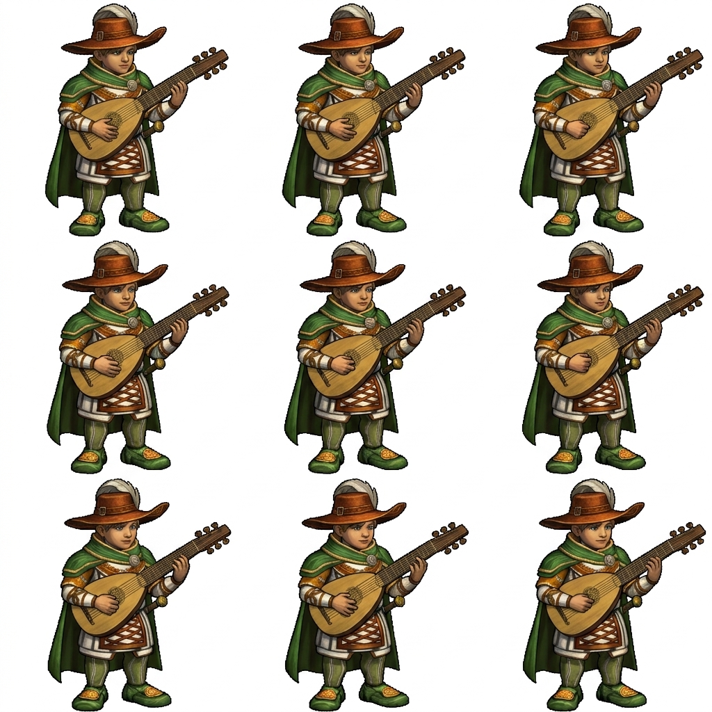
  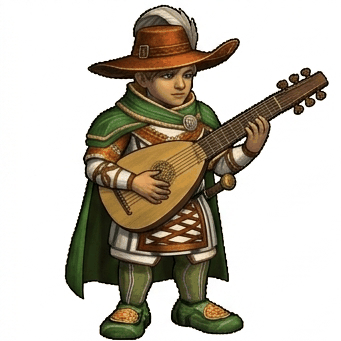
  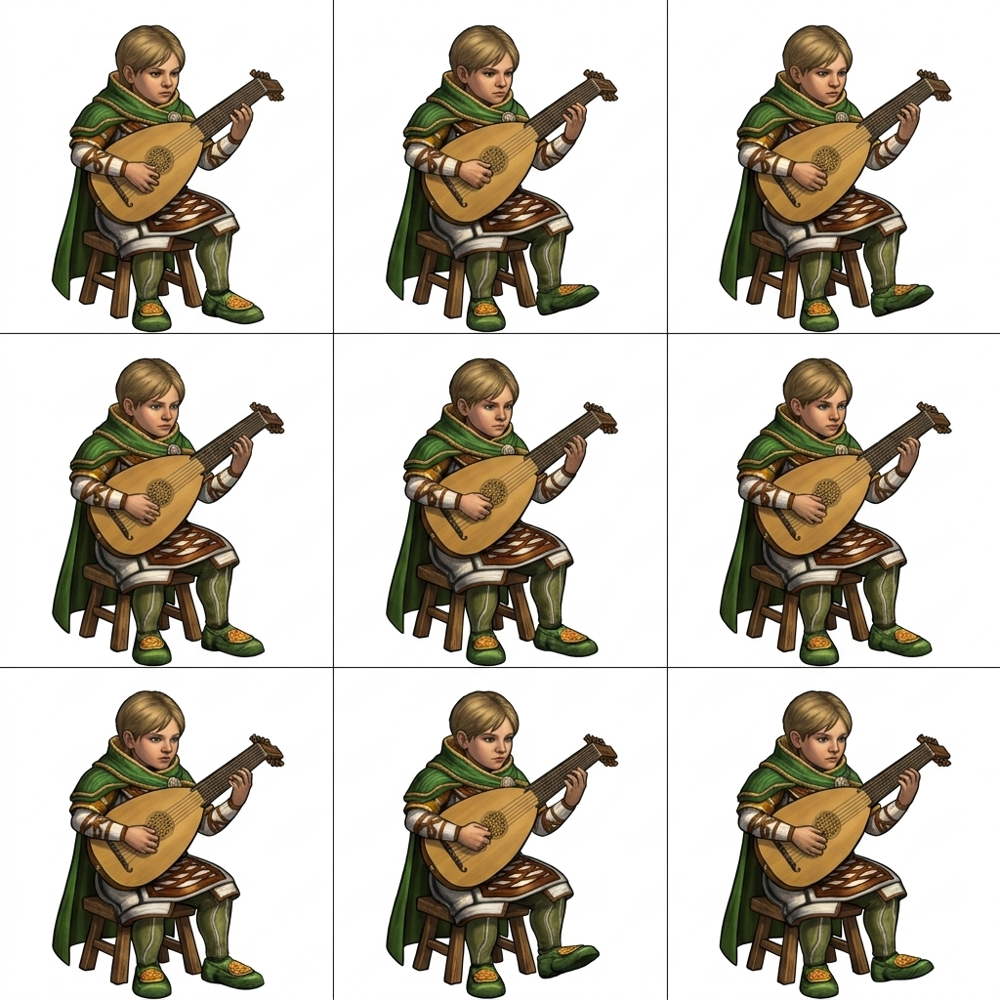
  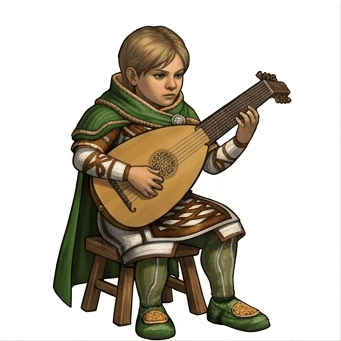
  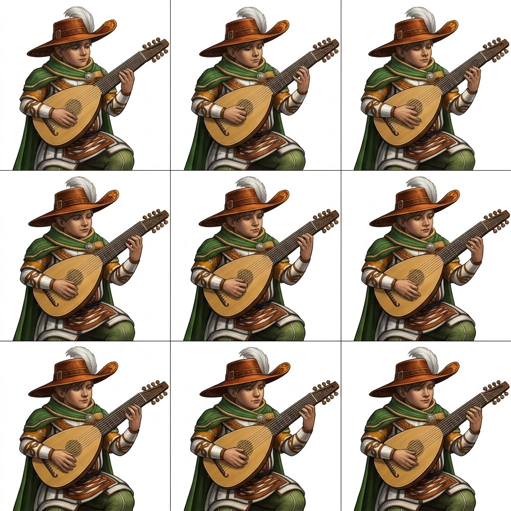
  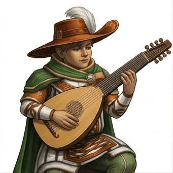
  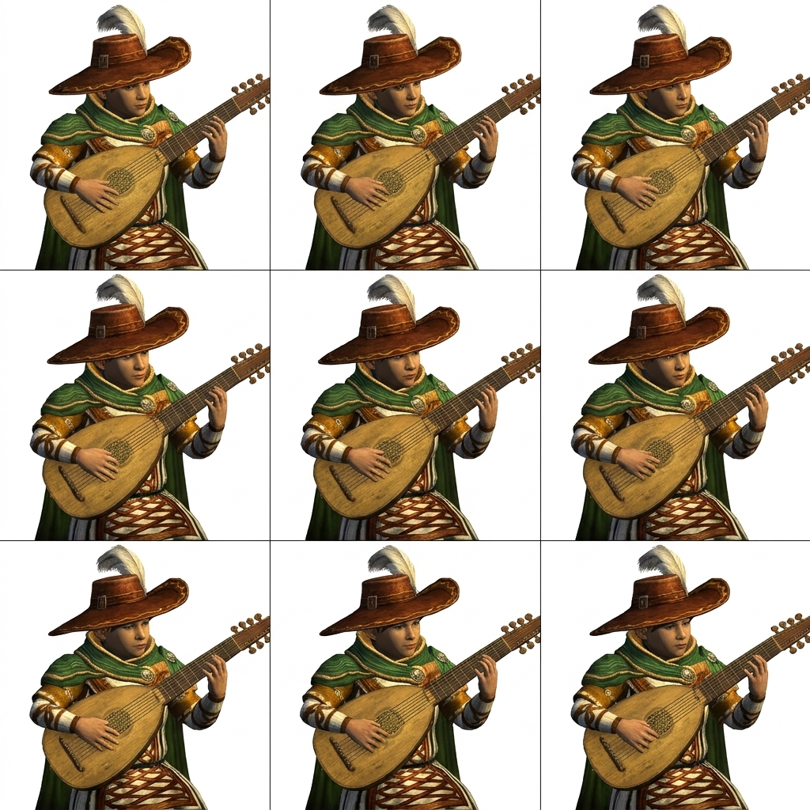
  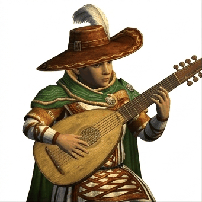
  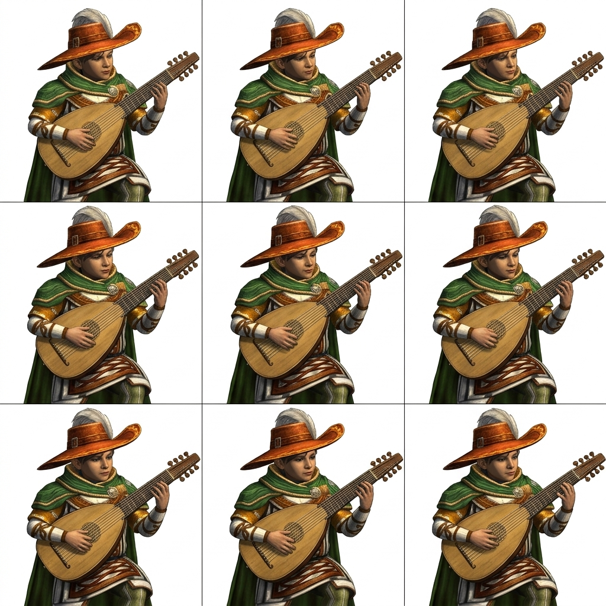
  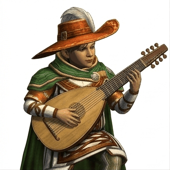
  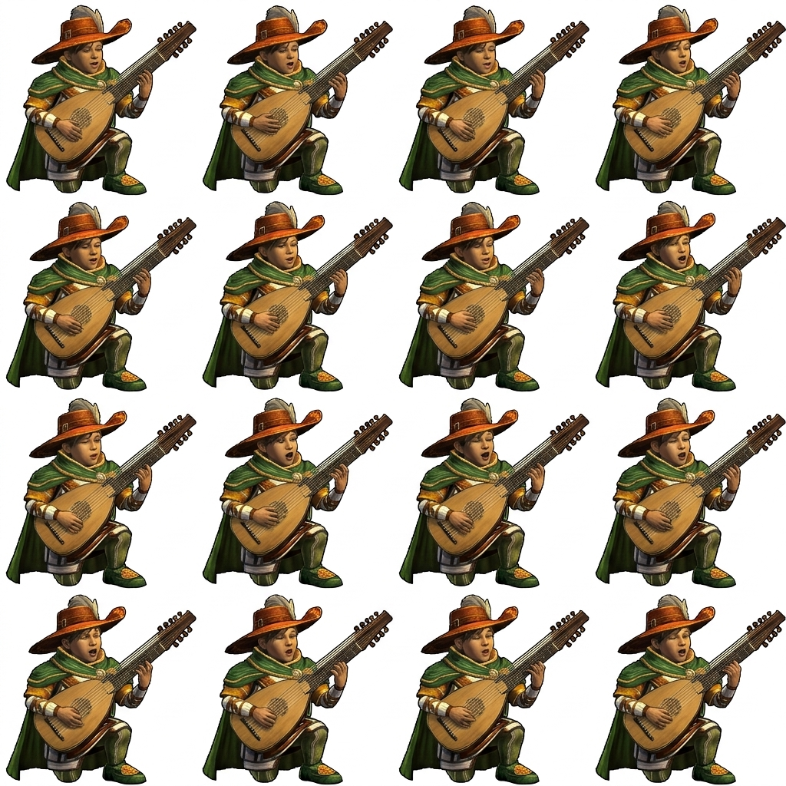
  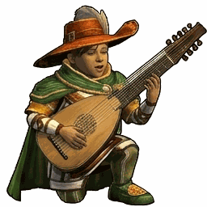
  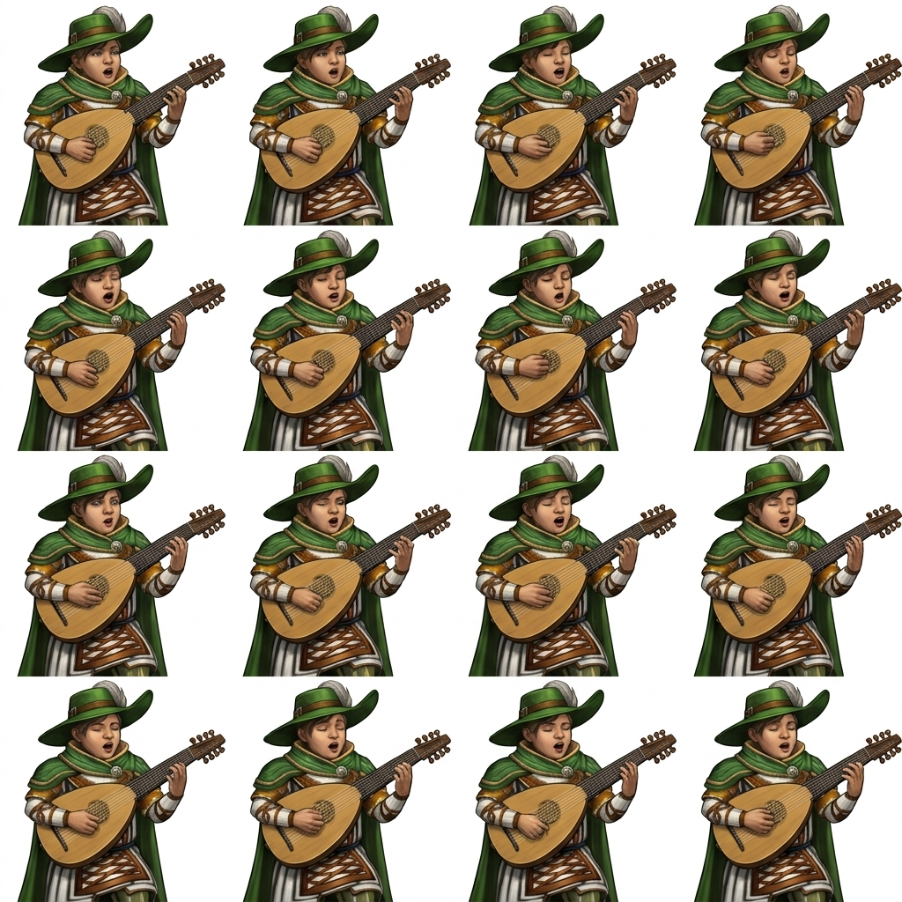
  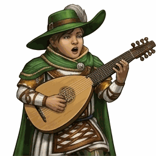

  

    <button type="button">Sprite Sheets</button>
    <button type="button" class="discuss-btn" onclick="openDiscussion('aug-17-26')">Comments</button>
  

  
<pre class="highlight"><code>
<strong>1. Generate a Sprite-sheet</strong>

<strong>- 3x3 Grid:</strong> Sprite sheet of a halfling playing their Theorbo, realistic single neck theorbo, 3x3 grid, white background, sequence, frame by frame animation, square aspect ratio. Follow the structure of the attached reference images exactly ensuring to apply to the grid template from grid_3x3_1024.png.

<strong>- 4x4 Grid + Singing Prompt:</strong> Sprite sheet of a halfling playing their Theorbo, realistic single neck theorbo, 4x4 grid, white background, sequence, frame by frame animation, square aspect ratio, 1024x1024 resolution. The character is singing along to playing the theorbo. Follow the structure of the attached reference images exactly.

<em>Note: Results may be improved with higher resolution sprite sheets (optional, up to 8K)</em>

<strong>2. Convert the sheet to GIF</strong> <a href="https://gist.github.com/lol-dungeonmaster/ae288a004e52d6a6c2ebbdbf0cb3e495">sprite_to_gif.py</a>
</code></pre>

  

</article>

<article class="post-entry" data-tags="food-drink,contemporary,infographic">
<h2 style="display: flex; justify-content: flex-start; align-items: center; gap: 25px;" id="aug-16-26"><a href="#aug-16-26">Aug 16 // Some Assembly Required</a> 

  food-drink
  contemporary
  infographic

</h2>

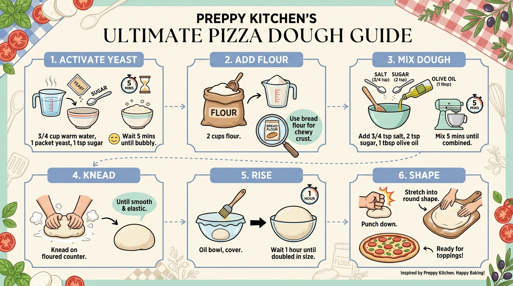

  <button type="button">Some Assembly Required</button>
  <button type="button" class="discuss-btn" onclick="openDiscussion('aug-16-26')">Comments</button>

<pre class="highlight"><code>
<strong>Two-Step Workflow for Video Infographics</strong>

<strong>1. Video Data Extraction Prompt</strong> Generate an IMAGE of an infographic poster. The image must be a visual how-to guide for making pizza dough based on this video. Output a highly detailed, visually appealing 16:9 poster image. You must include detailed, comprehensive text for every single step (ingredients, mixing, kneading, rising, shaping). STOP the instructions before adding the sauce.

<em>Note: Because this prompt demanded so much granular detail, the model decided to output it as a text-based Markdown guide rather than attempting to render it as a garbled image.</em>

<strong>2. Infographic Rendering Prompt (from summary)</strong> Generate a 16:9 highly detailed, visually appealing infographic poster titled 'PREPPY KITCHEN'S ULTIMATE PIZZA DOUGH GUIDE'. The infographic must contain 6 sections: 1. ACTIVATE YEAST (3/4 cup warm water, 1 packet yeast, 1 tsp sugar. Wait 5 mins), 2. ADD FLOUR (2 cups flour. Use bread flour for chewy crust), 3. MIX DOUGH (Add 3/4 tsp salt, 2 tsp sugar, 1 tbsp olive oil. Mix 5 mins), 4. KNEAD (Knead on floured counter until smooth), 5. RISE (Oil bowl, cover, wait 1 hour until doubled), 6. SHAPE (Punch down, stretch into round shape). Design it beautifully with clear icons for each step.
</code></pre>

</article>

<article class="post-entry" data-tags="dinosaurs,prehistoric,realistic">
<h2 id="aug-15-26" style="display: flex; justify-content: flex-start; align-items: center; gap: 25px;"><a href="#aug-15-26">Aug 15 // Dinosaurs: Stegosaurus</a> <button onclick="switchStego()" class="toggle-btn" style="position: static;">Next Image</button> 

  dinosaurs
  prehistoric
  realistic

</h2>

  
  
  

  <button type="button">Dinosaurs: Stegosaurus</button>
  <button type="button" class="discuss-btn" onclick="openDiscussion('aug-15-26')">Comments</button>

<pre class="highlight"><code>
A breathtaking, studio quality, hyper-realistic depiction of a Stegosaurus (golden-hour lighting highlighting the blood flow in its plates). Full environmental effects, incredibly exquisite detail on the animal's textures, skin, and authentic prehistoric environment. Subtle, realistic camera and lens effects. CRITICAL INSTRUCTION: There must be absolutely NO predator-prey interaction, no hunting, and no feeding depicted. If this is a carnivore, it must be depicted isolated from any prey species. Masterpiece quality. {lighting_and_atmosphere}

Lighting Variants ({lighting_and_atmosphere}):
Variant 1 (Morning): Lighting/Environment: Bright, crisp morning sunlight piercing through the atmosphere, vibrant colors, clear visibility.
Variant 2 (Dramatic): Lighting/Environment: Dramatic, moody late afternoon golden-hour, or overcast skies with soft, diffused atmospheric shadows.
</code></pre>

</article>

<article class="post-entry" data-tags="design,middle-earth,realistic">
<h2 id="aug-14-26" style="display: flex; justify-content: flex-start; align-items: center; gap: 25px;"><a href="#aug-14-26">Aug 14 // Ring Design</a> <button onclick="switchRing()" class="toggle-btn" style="position: static;">Next Image</button> 

  design
  middle-earth
  realistic

</h2>

  
  
  

  <button type="button">Ring Design</button>
  <button type="button" class="discuss-btn" onclick="openDiscussion('aug-14-26')">Comments</button>

<pre class="highlight"><code>
<strong>The Curator's Display</strong>A hyper-realistic macro photograph of three legendary rings displayed on a dark charcoal velvet cushion. Ring one (Narya): a wide, robust band of braided gold twisting like rising smoke, with a ruby carved into a flickering flame inset deeply into the metal, held by spark-shaped prongs that remain flush with the band's outer width. Ring two (Vilya): a substantial band of interwoven gold ribbons mimicking wind currents, with a sapphire carved into a wind-blown rose seamlessly integrated into the filigree, ensuring the stone does not protrude beyond the band's edges. Ring three (Nenya): a broad, heavy band of polished, rippled mithril with a liquid mirror finish, featuring a diamond carved into a glistening teardrop flush-set within a ripple-effect bezel that is carved directly into the width of the band. Cinematic museum lighting, sharp focus on gemstone facets, 8k resolution, extremely shallow depth of field.

<strong>The Obsidian Plinth</strong>A professional jewelry exhibit shot of three ornate, heavy-gauge rings arranged in a triangle on a matte black obsidian surface. The first ring features a thick braided gold band twisting like smoke, with a flame-shaped ruby recessed into the metal and secured by prongs that stay within the band's perimeter. The second ring features bold swirling gold bands like wind currents, with a rose-shaped sapphire inset into a recessed filigree center, maintaining a consistent width across the ring. The third ring features a wide rippled mithril band with a liquid finish, with a teardrop diamond perfectly flush-set in a ripple-effect bezel that blends seamlessly into the band's surface. High-contrast studio lighting, ray-traced reflections on the mithril, 100mm macro lens, f/2.8, showing the weight and density of the metal.

<strong>The Artifact Study</strong>An ultra-detailed close-up of three ancient rings of power viewed as priceless artifacts. Narya is composed of a heavy gold band braided like rising smoke, with a ruby gemstone carved into a flickering flame integrated flush into the band's architecture. Vilya is composed of thick gold ribbons swirling like atmospheric currents, with a sapphire gemstone carved into a wind-blown rose inset into the center of the band without protruding. Nenya is composed of a broad shimmering mithril band with deep liquid ripples, with a diamond gemstone carved into a glistening teardrop recessed into a ripple-style bezel that sits flush with the metal surface. Soft ambient gallery glow, emphasis on the seamless transition between stone and metal, photorealistic, 8k, incredibly sharp focus on the stone carvings.
</code></pre>

</article>

<article class="post-entry" data-tags="animals,contemporary,journalistic,ethereal">
<h2 id="aug-13-26" style="display: flex; justify-content: flex-start; align-items: center; gap: 25px;"><a href="#aug-13-26">Aug 13 // Intl. Wolf Day</a> <button onclick="switchWolf()" class="toggle-btn" style="position: static;">Next Image</button> 

  animals
  contemporary
  journalistic
  ethereal

</h2>

  
  
  

  <button type="button">Intl. Wolf Day</button>
  <button type="button" class="discuss-btn" onclick="openDiscussion('aug-13-26')">Comments</button>

<pre class="highlight"><code>
<strong>North America</strong>
<ul><li><strong>Yellowstone (Lamar Valley):</strong> A cinematic wide shot of three <strong>Northwestern Gray Wolves</strong> in a coordinated flank formation, bodies low to the ground and muscles tensed, eyes locked on an unseen target off-screen. A slight puff of condensation from their breath is visible in the crisp morning air. Behind them, the golden Lamar Valley unfolds toward the jagged, snow-dusted peaks of the Rockies under a pale lavender sunrise. 8k, cinematic depth of field, National Geographic photography.</li><li><strong>Alaska/Arctic:</strong> A heartbreakingly beautiful shot of a pack of <strong>Arctic Wolves</strong> curled together in a tight, overlapping survival huddle for warmth amidst a swirling white blizzard. Their luminous white fur blends with the snow, with only their dark, intelligent eyes and frost-covered whiskers visible. Above, a shimmering emerald and violet aurora borealis casts an ethereal glow over the silhouettes of frozen black spruce trees. Hyper-detailed, otherworldly lighting, 8k.</li><li><strong>Northern Mexico (Sierra Madre):</strong> A hauntingly tender nocturnal shot of a <strong>Mexican Gray Wolf</strong> gently nuzzling a small, fluffy pup on a limestone cliff in the Sierra Madre Occidental. The scene is illuminated by a brilliant full moon, casting a silver glow over the charcoal-toned fur of the adult and the soft reddish-brown fur of the pup. Below the cliff, a deep canyon is filled with a sea of midnight-blue fog. Ethereal lighting, high contrast, 8k, mystical atmosphere.</li></ul>
<strong>Europe</strong>
<ul><li><strong>The Carpathians:</strong> A powerful, tiered composition of a pack of <strong>Eurasian Wolves</strong> howling in unison on a misty ridge. The Alpha wolf stands central and slightly elevated, chest out, leading the chorus. The surroundings are a moody, emerald-green forest with heavy, low-hanging mist and sharp, grey alpine peaks piercing through a sea of clouds in the background. Cinematic, volumetric lighting, 8k, epic scale.</li><li><strong>Iberian Peninsula:</strong> A hyper-realistic, intimate shot of two <strong>Iberian Wolves</strong> engaged in a "muzzle-kiss," rubbing their noses together in a gesture of greeting and bonding. They are positioned in a sun-dappled grove of cork oak trees with tiny golden motes of dust dancing in the light. In the soft-focus background, the limestone walls of a Spanish river gorge plunge into a turquoise stream. Soft bokeh, warm golden-hour light, 8k.</li><li><strong>Białowieża (Summer Primeval):</strong> A high-energy shot of two <strong>Eurasian Wolves</strong> engaged in a playful, leaping chase through the heart of the Białowieża Forest. They are weaving through oversized, deep-green ferns and wild forest flowers, with blades of grass and petals kicked up in the air. Above them, a natural cathedral of gnarled, ancient oaks filters dappled sunlight across their grey-and-ochre coats. Hyper-realistic, rich saturation, 8k, immersive nature photography.</li></ul>
<strong>Asia</strong>
<ul><li><strong>Mongolia (Gobi Sunset):</strong> A breathtaking wide shot of a <strong>Steppe Wolf</strong> acting as a sentinel, standing perfectly still and alert on a towering, wind-rippled sand dune. The wolf is silhouetted against a fiery red and magenta sunset, while the rest of the pack is visible as small, resting silhouettes in the valley below. In the distance, jagged granite formations break the horizon of the Gobi Desert. High contrast, epic scale, cinematic.</li><li><strong>Siberia (Deep Taiga Mist):</strong> A cinematic shot of two <strong>Eurasian Wolves</strong> walking shoulder-to-shoulder through the deep, emerald-green Siberian Taiga, showcasing a strong pack bond. A heavy silver morning mist weaves between towering Larch trees, with brilliant "god rays" of sunlight piercing the canopy to illuminate their pale-grey fur and the moisture in the air. Volumetric lighting, moody, hyper-detailed, 8k.</li><li><strong>Kamchatka (Autumn River):</strong> A raw, action-packed shot of a <strong>Eurasian Wolf</strong> captured in a powerful, mid-air leap, splashing through a crystal-clear river to snap up a bright red sockeye salmon. Crystalline water droplets are frozen in mid-air around the wolf. The surrounding valley is an explosion of crimson berry bushes and golden birch trees, with a distant, snow-capped volcano veiled in purple twilight haze. 8k, vivid autumn palette, National Geographic style.</li></ul></code></pre>

</article>

<article class="post-entry" data-tags="animals,contemporary,ethereal">
<h2 style="display: flex; justify-content: flex-start; align-items: center; gap: 25px;" id="aug-12-26"><a href="#aug-12-26">Aug 12 // World Hirola Day</a> 

  animals
  contemporary
  ethereal

</h2>

  <button type="button">World Hirola Day</button>
  <button type="button" class="discuss-btn" onclick="openDiscussion('aug-12-26')">Comments</button>

<pre class="highlight"><code><ul><li><strong>Prompt 1 (Cinematic &amp; Hyper-realistic)</strong>: A hyper-realistic 8k cinematic shot of a male hirola antelope standing as a sentinel in the arid, open plains of the Kenya-Somalia border. The hirola is depicted with a striking reddish-brown coat and long, curving lyre-shaped horns. He is captured in a high-tension alert pose, head held high and ears twitching, scanning the horizon. The camera uses a low-angle perspective with golden hour sunlight casting long, dramatic shadows across the scrubland. Extreme detail is visible in the coarse texture of the fur, the grain of the horns, and the fine dust swirling around the hooves. Shallow depth of field with a soft, blurred background of distant acacia trees. In the bottom corner, unobtrusive but clearly readable, is a sleek text overlay that says 'Official Daily Banana', with a subtitle 'World Hirola Day'.</li><li><strong>Prompt 2 (Ethereal &amp; Artistic)</strong>: An ethereal and artistic wide-angle shot of a small family group of hirola antelopes moving through a silvery morning mist in the borderlands of Kenya and Somalia. The lighting is soft and luminous, creating a dreamlike, painterly atmosphere while maintaining photorealistic textures. The composition focuses on a mother hirola and her calf nuzzling, their tawny coats glowing softly through the fog. The scene is minimalist, with sparse, dry grass and scattered thorn bushes emerging from the white haze. The color palette is muted and airy, evoking a sense of quiet majesty and the extreme rarity of the species. Subtly placed in the misty sky, out of the way but clearly readable, is the elegant title text 'Official Daily Banana', accompanied by the subtitle 'World Hirola Day'.</li><li><strong>Prompt 3 (Wildlife Documentary Style)</strong>: A candid, National Geographic-style telephoto shot (600mm lens) of a hirola antelope grazing on dry scrub in the harsh, arid landscape of the Kenya-Somalia border. The shot captures a behavioral moment: the antelope is pausing mid-graze, glancing toward the camera with a cautious, wide-eyed expression. High-contrast midday sunlight emphasizes the coarse texture of its reddish-brown hide and the stark white of its underbelly. The environment is authentic, featuring cracked earth, brittle yellow grass, and a slight heat haze on the horizon. The focus is razor-sharp on the hirola's facial features and the unique structure of its horns, with a natural, unposed documentary feel. Neatly placed in the lower margin, designed like an authentic press watermark but clearly readable, is the title 'Official Daily Banana' and subtitle 'World Hirola Day'.</li></ul></code></pre>

</article>

<article class="post-entry" data-tags="sports,historical,cinematic">
<h2 style="display: flex; justify-content: flex-start; align-items: center; gap: 25px;" id="aug-11-26"><a href="#aug-11-26">Aug 11 // Hero Poses</a> 

  sports
  historical
  cinematic

</h2>

  <button type="button">Hero Poses</button>
  <button type="button" class="discuss-btn" onclick="openDiscussion('aug-11-26')">Comments</button>

<pre class="highlight"><code>
A dramatic, low-angle 8k cinematic shot of Babe Ruth at the moment of follow-through after hitting his 500th home run. The camera is positioned near the batter's box, looking up to make Ruth appear larger than life. He is wearing the authentic 1929 heavy wool pinstripe Yankees uniform (as the visiting team), with visible sweat stains and coarse fabric texture. The setting is explicitly League Park in Cleveland, Ohio. In the background, the crowd in the wooden bleachers of League Park is a blur of motion, men in fedoras rising in a wave of excitement. Dust motes dance in sharp beams of afternoon sunlight cutting through the historic Cleveland stadium. The focus is razor-sharp on Ruth's determined expression and the grit on his hands, with a shallow depth of field that makes League Park's iconic 40-foot right-field wall loom in the distance. In the bottom corner, unobtrusive but clearly readable, is a sleek text overlay that says 'Official Daily Banana', with a subtitle 'Hero Poses'.
</code></pre>

</article>

<article class="post-entry" data-tags="animals,contemporary,ethereal">
<h2 id="aug-10-26" style="display: flex; justify-content: flex-start; align-items: center; gap: 25px;"><a href="#aug-10-26">Aug 10 // World Lion Day</a> <button onclick="switchLion()" class="toggle-btn" style="position: static;">Next Image</button> 

  animals
  contemporary
  ethereal

</h2>

  
  
  

  <button type="button">World Lion Day</button>
  <button type="button" class="discuss-btn" onclick="openDiscussion('aug-10-26')">Comments</button>

<pre class="highlight"><code><ul><li><strong>Prompt 1 (Cinematic)</strong>: A cinematic, 8k RAW photo of a female Asiatic lion and her two young cubs nestled together in the dry deciduous teak forest of Gir National Park, Gujarat. The scene is captured during the golden hour, with warm, low-angle sunlight filtering through the branches of a nearby acacia tree, creating a dramatic interplay of light and shadow. The lions are depicted with absolute anatomical authenticity, prominently featuring the distinct longitudinal fold of skin running along their bellies that is unique to the Asiatic subspecies. Extreme detail on the texture of the tawny fur, the moisture on their noses, and the dusty laterite soil. Shallow depth of field with a soft, blurred background of rugged scrubland and teak trees, emphasizing the intimate family bond.</li><li><strong>Prompt 2 (Ethereal)</strong>: An atmospheric, wide-angle shot of a small Asiatic lion pride emerging from a thick, silvery morning mist in the rugged Kathiawar peninsula scrublands of Gujarat. The lighting is soft and diffused, giving the scene a timeless, painterly quality while maintaining photorealistic textures. The composition focuses on a mother lion with a characteristic leaner build and visible belly fold, leading her cubs through the fog, with the silhouettes of dry teak trees fading into the white background. The color palette is muted, focusing on earthy ochres, soft greys, and pale greens, evoking a sense of quiet majesty and familial protection.</li><li><strong>Prompt 3 (Journalistic,Social Bonding)</strong>: A candid, National Geographic-style telephoto shot using a 600mm lens, capturing an intimate moment of social bonding in the Gir Forest. The focus is a tight, detailed shot of a female Asiatic lion gently grooming her cub, with the cub leaning into her with closed eyes. In the soft-focus background, another female from the small pride watches over them, creating a sense of communal protection. Natural, dappled sunlight filters through the teak leaves, highlighting the fine textures of the fur and the moisture of the lions' noses. Realistic dust motes dance in the light beams, with the arid, scrubby terrain of Gujarat providing an authentic, earthy backdrop. The lions are depicted with absolute anatomical authenticity for the Asiatic subspecies, featuring the distinct longitudinal fold of skin running along their bellies.</li><li><strong>Prompt 4 (Journalistic,Leaping)</strong>: An atmospheric, wide-angle shot of two Asiatic lion cubs mid-leap, wrestling playfully in the silvery morning mist of the Gujarat scrublands. The lighting is soft and diffused, creating a dreamlike, painterly quality while retaining photorealistic fur textures. The composition captures the kinetic energy of the pounce, with tiny droplets of dew spraying from the grass. In the background, the blurred silhouette of the mother lion watches with a protective, indulgent gaze, her form partially dissolved into the fog and the pale outlines of distant teak trees. The color palette is muted, focusing on earthy ochres and soft, luminous greys. The lions are depicted with absolute anatomical authenticity for the Asiatic subspecies, featuring the distinct longitudinal fold of skin running along their bellies.</li><li><strong>Prompt 5 (Journalistic,The Hunt)</strong>: A high-tension, National Geographic-style telephoto shot using a 600mm lens, capturing a coordinated stalk in the Gir Forest. The frame focuses on the intense, gold-colored eyes of a female Asiatic lion, her body pressed low against the earth, muscles coiled for a spring. Beside her, another female from the pride is partially visible through the tall, yellow grass, their teamwork evident in their mirrored, low-profile posture. High-contrast midday lighting emphasizes the grit of the arid terrain and the individual hairs of their tawny coats. The shot is captured at the precise moment of maximum tension, with the focus razor-sharp on the predator's gaze and a shallow depth of field blurring the scrubland behind them. The lions are depicted with absolute anatomical authenticity for the Asiatic subspecies, featuring the distinct longitudinal fold of skin running along their bellies.</li></ul></code></pre>

</article>

<article class="post-entry" data-tags="animals,contemporary,journalistic">
<h2 style="display: flex; justify-content: flex-start; align-items: center; gap: 25px;" id="aug-09-26"><a href="#aug-09-26">Aug 09 // Animal Migration</a> 

  animals
  contemporary
  journalistic

</h2>

  <button type="button">Animal Migration</button>
  <button type="button" class="discuss-btn" onclick="openDiscussion('aug-09-26')">Comments</button>

<pre class="highlight"><code>
<strong>Prompt 3 (Journalistic)</strong>: A raw, National Geographic-style macro shot. The focus is a sharp, high-detail close-up of a Painted Lady Butterfly perched on a wild desert wildflower, showing the microscopic scales of its wings. The background is a wide, deep-focus shot of the rugged, arid landscape of the Guera Mountains under a harsh, clear midday sun. Beside the flower, a dusty, rusted metal road sign is visible, pointing toward "Mongo" (منغو) in faded white Arabic lettering. For a contrast in scale and temperament, a large African Spurred Tortoise is captured in the lower third of the frame, moving slowly through the scrubland beneath the fluttering butterflies. Shot on 35mm lens, f/8 aperture, natural saturation, documentary realism, high shutter speed to freeze the butterfly's wing movement.
</code></pre>

</article>

<article class="post-entry" data-tags="animals,contemporary,journalistic">
<h2 style="display: flex; justify-content: flex-start; align-items: center; gap: 25px;" id="aug-08-26"><a href="#aug-08-26">Aug 08 // International Moon Bear Day</a> 

  animals
  contemporary
  journalistic

</h2>

  <button type="button">Intl. Moon Bear Day</button>
  <button type="button" class="discuss-btn" onclick="openDiscussion('aug-08-26')">Comments</button>

<pre class="highlight"><code><ul><li><strong>Prompt 1 (Cinematic)</strong>: A breathtaking, cinematic shot of a mother moon bear and her small cub in the heart of a lush, subtropical Southeast Asian rainforest. The mother, with deep jet-black fur and a prominent, glowing cream-colored crescent moon patch on her chest, is captured in a tender moment, gently nuzzling her cub. They are surrounded by colossal, moss-covered hardwoods and prehistoric-looking ferns, with dramatic "god rays" of sunlight piercing through the emerald canopy to illuminate the floating dust motes and the intricate texture of the bears' fur. 8k resolution, photorealistic, Unreal Engine 5 render style, extreme detail on the wet noses and sparkling eyes, shallow depth of field, professional color grading with rich, saturated greens.</li><li><strong>Prompt 2 (Ethereal)</strong>: An atmospheric, mood-driven photograph of a mother moon bear and her cub emerging from a thick, silvery mist on a high Himalayan slope. The scene is grounded in realism but possesses a dreamlike quality, with the bears appearing as soft, dark silhouettes against a backdrop of pale blue peaks and frosted alpine flora. The mother's white chest crescent catches the soft, diffused morning light, creating a focal point of warmth and purity. The composition emphasizes the bond between mother and cub through a gentle, protective lean. High-end digital photography, soft-focus aesthetic, natural pastel tones, ethereal morning lighting, evoke a sense of peace and sanctuary.</li><li><strong>Prompt 3 (Journalistic)</strong>: A stunning, raw wildlife photograph in the style of National Geographic, capturing a mother moon bear teaching her cub how to forage in a dense bamboo forest. The shot is a crisp, mid-range telephoto capture, showing the mother using her sharp claws to tear into a decaying log while the cub watches with intense curiosity. The lighting is natural, filtered daylight, highlighting the coarse texture of the black fur and the damp, earthy debris of the forest floor. The focus is razor-sharp on the mother's eye and the cub's playful expression, with a natural background blur of overlapping bamboo stalks. RAW photography, ultra HD, f/4 aperture, authentic naturalism, capturing a candid moment of familial learning in the wild.</li></ul></code></pre>

</article>

<article class="post-entry" data-tags="food-drink,contemporary,journalistic,still-life">
<h2 style="display: flex; justify-content: flex-start; align-items: center; gap: 25px;" id="aug-07-26"><a href="#aug-07-26">Aug 07 // International Beer Day</a> 

  food-drink
  contemporary
  journalistic
  still-life

</h2>

  <button type="button">Intl. Beer Day</button>
  <button type="button" class="discuss-btn" onclick="openDiscussion('aug-07-26')">Comments</button>

<pre class="highlight"><code>
<strong>Prompt 3 (Journalistic)</strong>: A crisp, journalistic photograph in the style of National Geographic, capturing the atmospheric interior of a traditional Aberdeen pub. The focus is a close-up of a cold, condensation-beaded pint of Scottish craft ale resting on a dark, polished mahogany table that shows years of wear and character. Beside the glass sits a thick, textured cardboard coaster from a local brewery like BrewDog or Innis &amp; Gunn. The background is a soft, warm bokeh of a cozy pub interior, featuring the glint of brass rails, a distant wall of beer taps, and the muted colors of old leather booths. The lighting is natural and moody, with a soft glow from an unseen fireplace casting golden highlights across the beer's foam and the rich wood grain. Sharp focus on the droplets of water on the glass, ultra HD, authentic cultural photography, no people.
</code></pre>

</article>

<article class="post-entry" data-tags="literature,fantasy,ethereal">
<h2 style="display: flex; justify-content: flex-start; align-items: center; gap: 25px;" id="aug-06-26"><a href="#aug-06-26">Aug 06 // Scenes from Literature</a> 

  literature
  fantasy
  ethereal

</h2>

  <button type="button">Scenes from Literature</button>
  <button type="button" class="discuss-btn" onclick="openDiscussion('aug-06-26')">Comments</button>

<pre class="highlight"><code><ul><li><strong>Prompt 1 (Cinematic)</strong>: A stunning macro cinematic shot based on the Caterpillar scene from Alice's Adventures in Wonderland. The Caterpillar is a large, vivid blue creature with detailed, soft-textured skin, perched atop a massive, translucent red-capped mushroom with visible gills and glistening dew drops. He is holding an intricately crafted ornate hookah, with thick, volumetric swirls of iridescent smoke curling around his head in the damp, humid air. To the side, a small, bewildered Alice is captured in a low-angle shot, looking up in awe and confusion. The background is a lush, surreal jungle with oversized ferns and dappled, golden sunlight piercing through a heavy canopy. 8k resolution, photorealistic, extreme detail on textures, shallow depth of field, professional color grading.</li><li><strong>Prompt 2 (Ethereal)</strong>: A moody, atmospheric yet highly realistic composition of the encounter between Alice and the Caterpillar from Alice's Adventures in Wonderland. The scene is bathed in a natural palette of deep violets, dark teals, and soft glowing ambers. The Caterpillar is a photorealistic, textured giant insect perched firmly on a detailed bioluminescent mushroom that casts a soft physical glow upward. Beside him rests his hookah, faithfully depicted as a traditional 19th-century Turkish narghile with a glass water-base, an ornate stem, and a long, coiled, flexible hose ending in a wooden mouthpiece, held lazily by the Caterpillar. The smoke from the hookah curls naturally but thickens into subtle, realistic shapes vaguely resembling question marks and clock faces. Alice is rendered with lifelike detail, standing small against a backdrop of a dense, hazy Wonderland jungle sky. High-end cinematic photography, ethereal natural lighting, evocative atmosphere, sharp focus on authentic textures, and realistic physics.</li><li><strong>Prompt 3 (Original Illustration Style)</strong>: A faithful recreation of the original 1865 John Tenniel illustrations for the Caterpillar scene in Alice's Adventures in Wonderland. The image is a high-resolution digital ink drawing on aged, tea-stained parchment paper, featuring the signature Victorian wood-engraving style with meticulous cross-hatching and fine line work. The Caterpillar is depicted in his classic, haughty pose atop the mushroom, puffing on his nargile with precise, stylized smoke clouds. Alice stands beside him in her iconic pinafore dress, her expression one of polite frustration. The composition is clean and balanced, using muted watercolor washes of pale blue and soft red to add a touch of color to the classic black-and-white engraving. Archival quality, vintage literary aesthetic, precise anatomical proportions based on Tenniel's sketches.</li></ul></code></pre>

</article>

<article class="post-entry" data-tags="animals,contemporary,ethereal">
<h2 style="display: flex; justify-content: flex-start; align-items: center; gap: 25px;" id="aug-05-26"><a href="#aug-05-26">Aug 05 // World Tomistoma Day</a> 

  animals
  contemporary
  ethereal

</h2>

  <button type="button">World Tomistoma Day</button>
  <button type="button" class="discuss-btn" onclick="openDiscussion('aug-05-26')">Comments</button>

<pre class="highlight"><code><ul><li><strong>Prompt 1 (Cinematic)</strong>: A wide-angle, cinematic shot of a Tomistoma gliding through a dark, mirror-like peat swamp in Borneo. A vibrant Rajah Brooke's Birdwing butterfly is perched peacefully on the creature's head, its wings partially open to reveal striking iridescent greens. Dramatic "god rays" of sunlight pierce through a dense, ancient rainforest canopy, illuminating both the butterfly and the detailed olive-brown scales of the Tomistoma. The water is a deep tea-color with hyper-realistic reflections of towering dipterocarp trees. 8k resolution, Unreal Engine 5 render style, extreme detail, shallow depth of field, professional color grading with high contrast.</li><li><strong>Prompt 2 (Ethereal)</strong>: A moody, atmospheric yet highly realistic composition of a Tomistoma partially submerged in a misty Sumatran swamp forest at dawn. A Rajah Brooke's Birdwing butterfly rests delicately on the Tomistoma's snout, creating a poignant contrast between raw power and fragile beauty. The scene is enveloped in a soft, natural emerald-green haze with floating aquatic ferns and delicate white jungle orchids framing the shot. Focus on authentic textures, photorealistic scales and wings, and realistic physics of the misty water, using a palette of deep natural teals, golds, and muted greens. Ethereal natural lighting, lifelike quality, high-end wildlife photography style, evocative and serene.</li><li><strong>Prompt 3 (Journalistic)</strong>: A crisp, naturalistic telephoto shot of a Tomistoma resting on a muddy riverbank in Peninsular Malaysia. A Rajah Brooke's Birdwing butterfly has landed on the Tomistoma's head, captured in a rare, still moment of harmony. The lighting is bright, natural daylight, capturing the raw, wet texture of the skin and the intricate, velvet-like patterns of the butterfly's wings. Surround the animals with authentic tropical river flora and small ripples in the slow-moving water. National Geographic style, f/5.6 aperture for a natural background blur, sharp focus on the butterfly and the Tomistoma's eye, unedited raw photography, ultra HD.</li></ul></code></pre>

</article>

<article class="post-entry" data-tags="animals,contemporary,journalistic">
<h2 style="display: flex; justify-content: flex-start; align-items: center; gap: 25px;" id="aug-04-26"><a href="#aug-04-26">Aug 04 // Clouded Leopard Day</a> 

  animals
  contemporary
  journalistic

</h2>

  <button type="button">Clouded Leopard Day</button>
  <button type="button" class="discuss-btn" onclick="openDiscussion('aug-04-26')">Comments</button>

<pre class="highlight"><code><ul><li><strong>Prompt 1 (Cinematic)</strong>: A hyper-realistic, cinematic low-angle shot of a majestic Clouded Leopard lounging on a thick, moss-covered branch of a towering tropical rainforest tree. The leopard is draped comfortably over the limb, its massive paws hanging slightly, showcasing its unique 'cloud-like' fur patterns. The leopard is gazing upward with a look of longing and quiet curiosity toward the high, sun-drenched canopy. In the upper third of the frame, several brightly colored tropical birds are captured in mid-flight, soaring through the golden light filtering through the leaves. Deep greens, rich emeralds, and soft golden hour sunlight. 8k resolution, National Geographic photography style, extreme detail on the fur and whiskers, depth of field with a soft-focus forest background.</li><li><strong>Prompt 2 (Ethereal)</strong>: An atmospheric, artistic depiction of a Clouded Leopard in its natural Southeast Asian jungle habitat. The leopard is perched realistically on a sturdy branch, its body coiled in a relaxed lounge. The camera angle is from below, looking up at the animal's face as it watches a flock of birds dancing in the distant canopy. The lighting is 'God rays' (crepuscular rays) piercing through the dense jungle foliage, highlighting the leopard's golden-grey fur. The expression is one of serene longing. Soft bokeh, lush vegetation, vibrant jungle colors, highly detailed textures of bark and fur, 8k, ethereal lighting.</li><li><strong>Prompt 3 (Journalistic)</strong>: A professional wildlife photograph of a Clouded Leopard resting on a branch in a rainforest. The animal is positioned naturally, looking up toward the top of the tree where small birds are fluttering. The shot emphasizes the leopard's ability to climb and balance. Natural, diffused jungle light. The background is a lush, layered canopy of ferns and ancient trees. High shutter speed, crisp focus on the leopard's eye reflecting the canopy above, realistic fur physics, 8k, ultra-high definition, nature documentary aesthetic.</li></ul></code></pre>

</article>

<article class="post-entry" data-tags="character-design,middle-earth,graphic-novel,lotro,concept-art">
<h2 style="display: flex; justify-content: flex-start; align-items: center; gap: 25px;" id="aug-03-26"><a href="#aug-03-26">Aug 03 // Graphic Novel Style</a> 

  character-design
  middle-earth
  graphic-novel
  lotro
  concept-art

</h2>

  <button type="button">Graphic Novel Style</button>
  <button type="button" class="discuss-btn" onclick="openDiscussion('aug-03-26')">Comments</button>

<pre class="highlight"><code>
A breathtaking, edge-to-edge, full-bleed 16:9 widescreen illustration (absolutely no borders or picture frames). Ultra HD 8k resolution. An incredibly detailed, high-fantasy graphic novel style illustration of a meticulous, sharp-witted female warrior methodically sharpening her sword. She is sitting on the stone basin-rim of a grand Boar Fountain. Use the provided image [standing_pose_close.png] as the sole reference for her character design, face, and clothing (depict no other people or characters). Use the provided image [boar_fountain.png] to guide the highly detailed realization of the background fountain and location. Use the provided image [sword_drawn.png] to ensure her sword is depicted with absolute authenticity and zero deviation. She is actively sharpening this exact sword. Propped up right next to her on the fountain rim is her bow (reference: [holding_bow.png]) and her adventurer's backpack (reference: [standing_back_view.png]). Ensure she is NOT wearing the bow or backpack. The art style should feature stunning graphic novel aesthetics: dynamic inking, bold comic book coloring, crisp line-art, and dramatic shading that emphasizes her sharp nature and the high-fantasy setting.

<strong>Note</strong>: the models were guided by ten reference images during generation.
</code></pre>

</article>

<article class="post-entry" data-tags="nature,contemporary,cinematic,scotland">
<h2 style="display: flex; justify-content: flex-start; align-items: center; gap: 25px;" id="aug-02-26"><a href="#aug-02-26">Aug 02 // Weather</a> 

  nature
  contemporary
  cinematic
  scotland

</h2>

  <button type="button">Weather</button>
  <button type="button" class="discuss-btn" onclick="openDiscussion('aug-02-26')">Comments</button>

<pre class="highlight"><code>
A breathtaking, edge-to-edge, full-bleed 16:9 widescreen photograph (absolutely no borders or picture frames). Ultra HD 8k resolution, candid, street-level view of Aberdeen's bustling nightlife in the UK. The cinematic composition features a heavily blurred foreground of a crowded sidewalk with people dressed in warm Scottish winter coats, utilizing a beautiful bokeh effect on the glowing street lights. The razor-sharp focus is set on the glowing entrances of a traditional local pub built from the massive, rough-hewn silver-grey granite architecture typical of Aberdeen, Scotland. Above, a bright Waning Gibbous moon peeks through scattered, drifting clouds, casting a cool, atmospheric glow that delicately illuminates the city's skyline. Warm, inviting amber light glows heavily from within the pub's windows. Photorealistic urban night photography shot with beautiful high ISO film grain, showcasing an authentic, moody Scottish city atmosphere.
</code></pre>

</article>

<article class="post-entry" data-tags="food-drink,contemporary,cinematic">
<h2 style="display: flex; justify-content: flex-start; align-items: center; gap: 25px;" id="aug-01-26"><a href="#aug-01-26">Aug 01 // Ramen Shops</a> 

  food-drink
  contemporary
  cinematic

</h2>

  <button type="button">Ramen Shops</button>
  <button type="button" class="discuss-btn" onclick="openDiscussion('aug-01-26')">Comments</button>

<pre class="highlight"><code><ul><li><strong>Prompt 1 (Draft)</strong>: A breathtaking, edge-to-edge, full-bleed 16:9 widescreen photograph (absolutely no borders or picture frames). Ultra HD 8k resolution, cinematic, wide-angle interior shot of an authentic, moody Japanese ramen shop, inspired by high-end music video aesthetics with a dreamy, ethereal, yet highly realistic ambience. The space is intimate, featuring a weathered light-wood counter with high stools. Soft, warm amber pendant lighting and subtle pastel neon accents create deep cinematic shadows and a glowing, atmospheric vibe. In the background, a beautifully blurred open kitchen shows steaming stainless steel pots, swirling atmospheric steam, and stacks of ceramic ramen bowls. A traditional fabric noren curtain hangs partially closed. On the counter in sharp foreground focus: a frosted glass mug of draft beer with a thick condensation-covered foam head, small condiment jars of red pepper and sesame, and a pair of wooden chopsticks resting on a ceramic holder. Shot on a premium 35mm lens at f/1.4.</li><li><strong>Prompt 2 (Mugicha)</strong>: A breathtaking, edge-to-edge, full-bleed 16:9 widescreen photograph (absolutely no borders or picture frames). Ultra HD 8k resolution, hyper-realistic architectural interior view of a traditional, densely packed Tokyo ramen-ya. The focus is on the hyper-detailed textures of a scratched, aged wooden counter and worn leather stools. The space features a high-density layout with wooden slat partitions between customers, and walls adorned with authentic handwritten menu slips. In the beautifully blurred background, a glimpse of a ticket vending machine near the door is visible through air thick with swirling, volumetric steam. On the counter in sharp macro focus: a steaming, rich bowl of tonkotsu ramen next to a tall, condensation-covered glass of ice-cold Mugicha (roasted barley tea) and a small side of vibrant pickled ginger. Shot on a premium 35mm lens at f/1.8, natural warm incandescent lighting, showcasing extreme macro detail on the wood grain and water droplets.</li><li><strong>Prompt 3 (Ramune)</strong>: A breathtaking, edge-to-edge, full-bleed 16:9 widescreen photograph (absolutely no borders or picture frames). Ultra HD 8k resolution, cinematic first-person perspective interior shot of a Japanese ramen shop, captured from a customer's seat looking down a long, warm wooden counter. The ambiance is dreamy, ethereal, and romantic, heavily inspired by high-end music video cinematography. Soft pastel neon accents blend seamlessly with traditional glowing paper lanterns. In the soft-focus background, a chef works amidst swirling, volumetric steam, with a delicate fabric noren curtain fluttering slightly. On the counter in sharp macro foreground focus: a vibrant, highly detailed glass bottle of Ramune soda, prominently featuring its signature glass marble inside, next to a small, steaming bowl of ramen. Shot on a premium 35mm lens at f/1.4, exhibiting flawless depth of field, hyper-realistic glass reflections, and a soft cinematic glow.</li><li><strong>Prompt 4 (Modern)</strong>: A breathtaking, edge-to-edge, full-bleed 16:9 widescreen photograph (absolutely no borders or picture frames). Ultra HD 8k resolution, cinematic, extreme wide-angle interior shot of a Japanese ramen restaurant. The unique architectural layout seamlessly combines two distinct styles: the intimate, narrow, scratched wooden counter-only seating of a traditional Tokyo ramen shop on one side, which beautifully opens up into a spacious, moody, high-end Asian-restaurant dining area featuring elegant tables and leather booths on the other. The ambiance perfectly captures the dreamy, ethereal, and romantic mood of a high-end music video, featuring soft pastel neon accents blending gracefully with warm amber pendant lighting and traditional paper lanterns. Volumetric steam swirls from the open kitchen behind the traditional counter. The extreme wide-angle perspective (14mm lens) perfectly captures both the intimate counter layout and the expansive restaurant floorplan in a single cohesive, highly realistic photograph. Flawless depth of field, photorealistic textures, and exquisite architectural lighting.</li></ul></code></pre>

</article>

<article class="post-entry" data-tags="architecture,historical,concept-art,morocco,realistic,cinematic">
<h2 id="jul-31-26" style="display: flex; justify-content: flex-start; align-items: center; gap: 25px;"><a href="#jul-31-26">Jul 31 // Fortifications</a> <button onclick="switchFort()" class="toggle-btn" style="position: static;">Next Image</button> 

  architecture
  historical
  concept-art
  morocco
  realistic
  cinematic

</h2>

  
  

  <button type="button">Fortifications</button>
  <button type="button" class="discuss-btn" onclick="openDiscussion('jul-31-26')">Comments</button>

<pre class="highlight"><code><ul><li><strong>Prompt 1 (interpretive)</strong>: A highly detailed, photo-realistic, cinematic studio-quality presentation poster of the vernacular architecture of the Moroccan desert. The architecture specifically incorporates elements of The Kasbah (Fortress-Home) and The Ksar (Fortified Village). The majestic, sprawling fortress is built onto a prominent mountain or steep hill, showcasing how the intricate mud-brick and stone fortress design adapts, layers, and changes by altitude. {lighting} High-end lens effects, depth of field, breathtaking environment, masterpiece.</li><li><strong>Prompt 2 (detail)</strong>: A breathtaking, edge-to-edge, full-bleed photograph (absolutely no borders, no picture frames, no white margins). Ultra HD 8k resolution, hyper-realistic cinematic presentation of the vernacular architecture of the Moroccan desert, specifically incorporating elements of The Kasbah (Fortress-Home) and The Ksar (Fortified Village). The majestic, sprawling fortress is built onto a prominent mountain or steep hill, showcasing how the intricate mud-brick and stone fortress design adapts, layers, and changes by altitude. {lighting} Shot on a premium 35mm lens at f/1.8, exhibiting flawless depth of field, sharp focus, and photorealistic volumetric lighting with intricate environmental textures. Masterpiece, National Geographic award-winning photography.</li></ul>
(Lighting Variants)
<ul><li>Golden Hour: The environment is bathed in breathtaking golden-hour sunlight, casting long, dramatic shadows and highlighting the rich earthen tones of the architecture.</li><li>Blue Hour: The environment is captured during blue-hour twilight, with the deep blue desert sky contrasting against warm, inviting, realistic night-time fortress lighting glowing brightly from the windows, walls, and courtyards.</li></ul></code></pre>

</article>

<article class="post-entry" data-tags="character-design,sci-fi,realistic">
<h2 style="display: flex; justify-content: flex-start; align-items: center; gap: 25px;" id="jul-30-26"><a href="#jul-30-26">Jul 30 // Alternative Human</a> 

  character-design
  sci-fi
  realistic

</h2>

  <button type="button">Alternative Human</button>
  <button type="button" class="discuss-btn" onclick="openDiscussion('jul-30-26')">Comments</button>

<pre class="highlight"><code>
A hyper-realistic, studio quality photograph spoofing the King of the Hill alley scene. The camera is in the alleyway, looking over a wooden privacy fence at a suburban 1-story Texas ranch-style house. Standing in the alley leaning against the fence are four classic grey extraterrestrial aliens, each wearing a distinctly different casual outfit (e.g., one in a plain white t-shirt, one in a trucker hat and sunglasses, one in an open button-down shirt, one in a tank top). It is a beautiful golden hour sunset with warm cinematic lighting. Every alien holds a green glass bottle. The camera depth of field focuses slightly on the nearest alien's bottle, where the label clearly and legibly reads 'Soylent Green'. Above the aliens' heads are clear speech bubbles: three say 'Yep.' and the fourth on the far right says 'Mmhmm.' There are absolutely no humans in the image. Masterpiece, highly detailed.
</code></pre>

</article>

<article class="post-entry" data-tags="games,fantasy,pixel-art">
<h2 id="jul-29-26" style="display: flex; justify-content: flex-start; align-items: center; gap: 25px;"><a href="#jul-29-26">Jul 29 // Games</a> <button onclick="switchGame()" class="toggle-btn" style="position: static;">Next Image</button> 

  games
  fantasy
  pixel-art

</h2>

  
  
  
  
  
  

  <button type="button">Games</button>
  <button type="button" class="discuss-btn" onclick="openDiscussion('jul-29-26')">Comments</button>

<pre class="highlight"><code><ul><li><strong>Prompt 1</strong>: A breathtaking, studio quality, awe-inspiring illustration: A sprawling, incredibly wide panoramic 16:9 view of a Super Mario Bros level done in authentic 16-bit SNES style but rendered with hyper-realistic, intricate, breathtaking detail. The scene is a massive, sprawling landscape filled with towering green pipes, floating brick blocks, and detailed Goombas. Hidden within the unbelievable density and intricate detail-like a 'Where's Waldo' illustration-are tiny but photo-realistic depictions of Mario, Luigi, Princess Peach, and Yoshi. The viewer has to search through the sprawling, hyper-detailed mushroom kingdom to find them. The image MUST contain NO TEXT, NO LOGO, AND NO TITLES. Purely the background artwork.</li><li><strong>Prompt 2 (2.5D Diorama)</strong>: A breathtaking, studio quality, awe-inspiring 2.5D illustration: A sprawling, incredibly wide panoramic 16:9 view of a massive Super Mario Bros environment. The art style should be a hyper-realistic, highly detailed 2.5D diorama that authentically mimics realistic, playable SNES-era level design. The layout must feature clear, structured platforming paths, floating brick blocks, and distinct, logically connected biomes (overworld, aquatic, and subterranean). Populate the level with a realistic, playable number of non-main-character enemies (Goombas, Koopas) spaced out naturally along the paths-do not swarm the screen. Hidden within this beautifully structured 2.5D landscape-like a 'Where's Waldo' illustration-are tiny but photo-realistic depictions of the main heroes. CRITICAL INSTRUCTION: Mario, Luigi, Princess Peach, Toad, and Yoshi must each appear EXACTLY ONCE in the entire image. The viewer has to search through the sprawling, realistic level to find their single hiding spot. The image MUST contain NO TEXT, NO LOGO, AND NO TITLES. Purely the background artwork.</li><li><strong>Prompt 3 (Outside the Castle)</strong>: A breathtaking, studio quality, awe-inspiring 2.5D illustration: A sprawling, incredibly wide panoramic 16:9 view of a massive Super Mario Bros environment. The art style should be a hyper-realistic, highly detailed 2.5D diorama that authentically mimics realistic, playable SNES-era level design. The layout must feature clear, structured platforming paths, floating brick blocks, and distinct, logically connected biomes leading toward a massive, imposing depiction of Bowser's Castle at the end of the level. Populate the level with a realistic, playable number of non-main-character enemies (Goombas, Koopas) spaced out naturally along the paths. In or near the castle, depict a massive Bowser holding Princess Peach captive. Hidden within the rest of this beautifully structured 2.5D landscape-like a 'Where's Waldo' illustration-are tiny but photo-realistic depictions of Mario, Luigi, Toad, and Yoshi. CRITICAL INSTRUCTION: Mario, Luigi, Toad, Yoshi, Bowser, and Princess Peach must each appear EXACTLY ONCE in the entire image. The viewer has to search through the sprawling, realistic level to find where the heroes are hiding as they make their way to the castle. The image MUST contain NO TEXT, NO LOGO, AND NO TITLES. Purely the background artwork.</li></ul></code></pre>

</article>

<article class="post-entry" data-tags="technology,post-apocalyptic,concept-art,realistic">
<h2 id="jul-28-26" style="display: flex; justify-content: flex-start; align-items: center; gap: 25px;"><a href="#jul-28-26">Jul 28 // Botanical Robots</a> <button onclick="switchBot()" class="toggle-btn" style="position: static;">Next Image</button> 

  technology
  post-apocalyptic
  concept-art
  realistic

</h2>

  
  
  
  
  
  
  
  

  <button type="button">Botanical Robots</button>
  <button type="button" class="discuss-btn" onclick="openDiscussion('jul-28-26')">Comments</button>

<pre class="highlight"><code><ul><li><strong>Prompt 1 (Animals)</strong>: A photorealistic studio quality image of robot animals made of plants. The robots have no metal components, they are made of only parts of plants growing together symbiotically as appropriate to create a highly-realistic mech or robot depictions of animals (no metals). No people, but add subtitles if they add flair. Make it look inspiring with uncanny realism instead of other styles. Show the robot animal(s) in their natural settings at golden hour.</li><li><strong>Prompt 2 (Silvan Guardian)</strong>: This image is a photorealistic studio quality depiction of a plant-based robot animal. Use this image as a design guide, but create a high-resolution, ultra-detailed 1080p panoramic view depicting MULTIPLE of these creatures in their natural habitat at golden hour. The subtitle in the image currently says 'SYLVAN GUARDIAN'; you MUST change the spelling in the new subtitle to 'SILVAN GUARDIAN'. The creatures are completely made of symbiotic plants with zero metal parts. Make the details incredibly precise, sharp, and not blurry close up.</li><li><strong>Prompt 3 (Giants)</strong>: A photorealistic studio quality image of traditional giant mechs, but entirely plant-based and constructed of living, symbiotic flora with absolutely zero metal. They are depicted in nature, resembling a new biological lifeform existing at one with a lush, overgrown dystopian future where humans are only a legend. The image should evoke the theme: 'In harmony with nature, a new era of life emerges.' Include this phrase as a subtitle if it adds flair. Use cinematic studio-quality lighting, specifically golden hour or blue-hour lighting, with realistic lens effects (like bokeh or lens flare) to beautifully showcase these organic machines. Uncanny photo-realism, no humans.</li></ul></code></pre>

</article>

<article class="post-entry" data-tags="dinosaurs,prehistoric,realistic">
<h2 id="jul-27-26" style="display: flex; justify-content: flex-start; align-items: center; gap: 25px;"><a href="#jul-27-26">Jul 27 // Dinosaurs: Quetzalcoatlus</a> <button onclick="switchQuetz()" class="toggle-btn" style="position: static;">Next Image</button> 

  dinosaurs
  prehistoric
  realistic

</h2>

  
  
  

  <button type="button">Dinosaurs: Quetzalcoatlus</button>
  <button type="button" class="discuss-btn" onclick="openDiscussion('jul-27-26')">Comments</button>

<pre class="highlight"><code>
A breathtaking, studio quality, hyper-realistic depiction of a Quetzalcoatlus (standing tall like a massive stork in a prehistoric marsh). Full environmental effects, incredibly exquisite detail on the animal's textures, skin, and authentic prehistoric environment. Subtle, realistic camera and lens effects. CRITICAL INSTRUCTION: There must be absolutely NO predator-prey interaction, no hunting, and no feeding depicted. If this is a carnivore, it must be depicted isolated from any prey species. Masterpiece quality. {lighting_and_atmosphere}

Lighting Variants ({lighting_and_atmosphere}):
Variant 1 (Morning): Lighting/Environment: Bright, crisp morning sunlight piercing through the atmosphere, vibrant colors, clear visibility.
Variant 2 (Dramatic): Lighting/Environment: Dramatic, moody late afternoon golden-hour, or overcast skies with soft, diffused atmospheric shadows.
</code></pre>

</article>

<article class="post-entry" data-tags="dinosaurs,prehistoric,realistic">
<h2 id="jul-26-26" style="display: flex; justify-content: flex-start; align-items: center; gap: 25px;"><a href="#jul-26-26">Jul 26 // Dinosaurs: Archaeopteryx</a> <button onclick="switchArcha()" class="toggle-btn" style="position: static;">Next Image</button> 

  dinosaurs
  prehistoric
  realistic

</h2>

  
  
  
  

  <button type="button">Dinosaurs: Archaeopteryx</button>
  <button type="button" class="discuss-btn" onclick="openDiscussion('jul-26-26')">Comments</button>

<pre class="highlight"><code>
A breathtaking, studio quality, hyper-realistic depiction of a Archaeopteryx (perched on a cycad branch, macro lens focus). Full environmental effects, incredibly exquisite detail on the animal's textures, skin, and authentic prehistoric environment. Subtle, realistic camera and lens effects. CRITICAL INSTRUCTION: There must be absolutely NO predator-prey interaction, no hunting, and no feeding depicted. If this is a carnivore, it must be depicted isolated from any prey species. Masterpiece quality. {lighting_and_atmosphere}

Lighting Variants ({lighting_and_atmosphere}):
Variant 1 (Morning): Lighting/Environment: Bright, crisp morning sunlight piercing through the atmosphere, vibrant colors, clear visibility.
Variant 2 (Dramatic): Lighting/Environment: Dramatic, moody late afternoon golden-hour, or overcast skies with soft, diffused atmospheric shadows.
</code></pre>

</article>

<article class="post-entry" data-tags="dinosaurs,prehistoric,realistic">
<h2 id="jul-25-26" style="display: flex; justify-content: flex-start; align-items: center; gap: 25px;"><a href="#jul-25-26">Jul 25 // Dinosaurs: Tyrannosaurus Rex</a> <button onclick="switchTyran()" class="toggle-btn" style="position: static;">Next Image</button> 

  dinosaurs
  prehistoric
  realistic

</h2>

  
  
  

  <button type="button">Dinosaurs: Tyrannosaurus Rex</button>
  <button type="button" class="discuss-btn" onclick="openDiscussion('jul-25-26')">Comments</button>

<pre class="highlight"><code>
A breathtaking, studio quality, hyper-realistic depiction of a Tyrannosaurus Rex (dense misty redwood forest). Full environmental effects, incredibly exquisite detail on the animal’s textures, skin, and authentic prehistoric environment. Subtle, realistic camera and lens effects. CRITICAL INSTRUCTION: There must be absolutely NO predator-prey interaction, no hunting, and no feeding depicted. If this is a carnivore, it must be depicted isolated from any prey species. Masterpiece quality. {lighting_and_atmosphere}

Lighting Variants ({lighting_and_atmosphere}):
Variant 1 (Morning): Lighting/Environment: Bright, crisp morning sunlight piercing through the atmosphere, vibrant colors, clear visibility.
Variant 2 (Dramatic): Lighting/Environment: Dramatic, moody late afternoon golden-hour, or overcast skies with soft, diffused atmospheric shadows.
</code></pre>

</article>

<article class="post-entry" data-tags="animals,sci-fi,cinematic">
<h2 id="jul-24-26" style="display: flex; justify-content: flex-start; align-items: center; gap: 25px;"><a href="#jul-24-26">Jul 24 // Time-traveling Animals</a> <button onclick="switchTTP()" class="toggle-btn" style="position: static;">Next Image</button> 

  animals
  sci-fi
  cinematic

</h2>

  
  
  
  
  
  

  <button type="button">Time-traveling Animals</button>
  <button type="button" class="discuss-btn" onclick="openDiscussion('jul-24-26')">Comments</button>

<pre class="highlight"><code>
A photorealistic studio quality image of a bearded dragon riding a time-traveling cat to find this mornings fresh tasty kale. No people, but add subtitles if they add flair. Make it look inspiring to impress. The cat and bearded dragon are time-traveling pets.
</code></pre>

</article>

<article class="post-entry" data-tags="dinosaurs,prehistoric,realistic">
<h2 id="jul-23-26" style="display: flex; justify-content: flex-start; align-items: center; gap: 25px;"><a href="#jul-23-26">Jul 23 // Dinosaurs: Mosasaurus</a> <button onclick="switchMosa()" class="toggle-btn" style="position: static;">Next Image</button> 

  dinosaurs
  prehistoric
  realistic

</h2>

  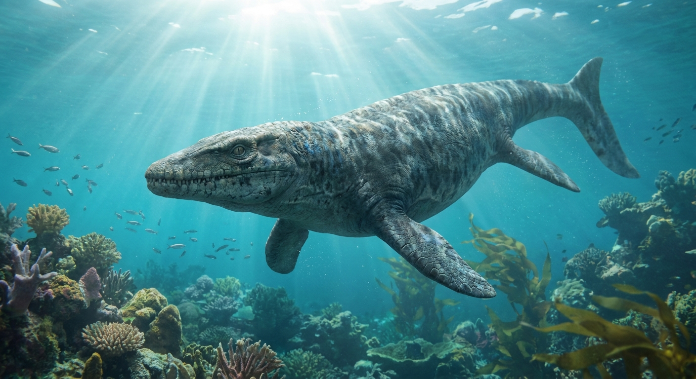
  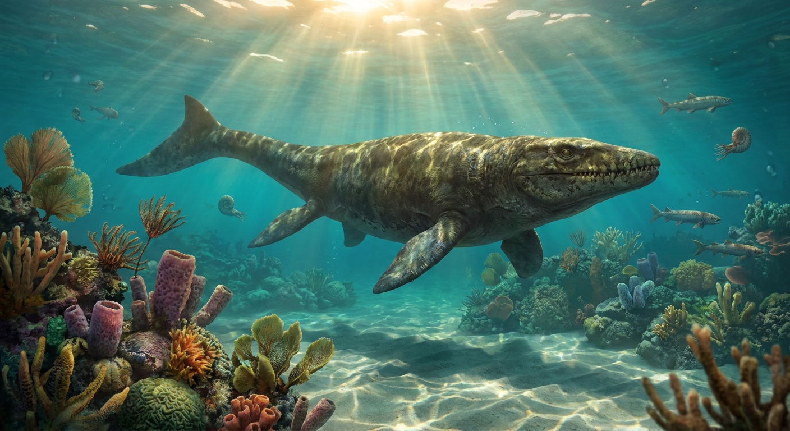
  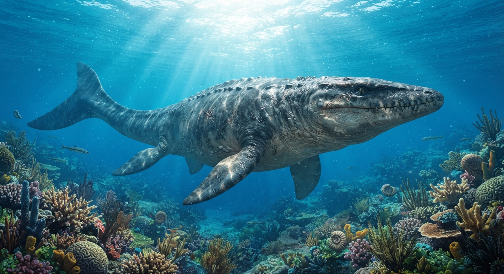

  <button type="button">Dinosaurs: Mosasaurus</button>
  <button type="button" class="discuss-btn" onclick="openDiscussion('jul-23-26')">Comments</button>

<pre class="highlight"><code>
A breathtaking, studio quality, hyper-realistic depiction of a Mosasaurus (gliding gracefully through a sunlit, crystal-clear prehistoric reef). Full environmental effects, incredibly exquisite detail on the animal's textures, skin, and authentic prehistoric environment. Subtle, realistic camera and lens effects. CRITICAL INSTRUCTION: There must be absolutely NO predator-prey interaction, no hunting, and no feeding depicted. If this is a carnivore, it must be depicted isolated from any prey species. Masterpiece quality. {lighting_and_atmosphere}

Lighting Variants ({lighting_and_atmosphere}): Variant 1 (Morning): Lighting/Environment: Bright, crisp morning sunlight piercing through the atmosphere, vibrant colors, clear visibility. Variant 2 (Dramatic): Lighting/Environment: Dramatic, moody late afternoon golden-hour, or overcast skies with soft, diffused atmospheric shadows.
</code></pre>

</article>

<article class="post-entry" data-tags="design,middle-earth,sand-art,realistic,lotro">
<h2 id="jul-22-26" style="display: flex; justify-content: flex-start; align-items: center; gap: 25px;"><a href="#jul-22-26">Jul 22 // At the Beach</a> <button onclick="switchBree()" class="toggle-btn" style="position: static;">Next Image</button> 

  design
  middle-earth
  sand-art
  realistic
  lotro

</h2>

  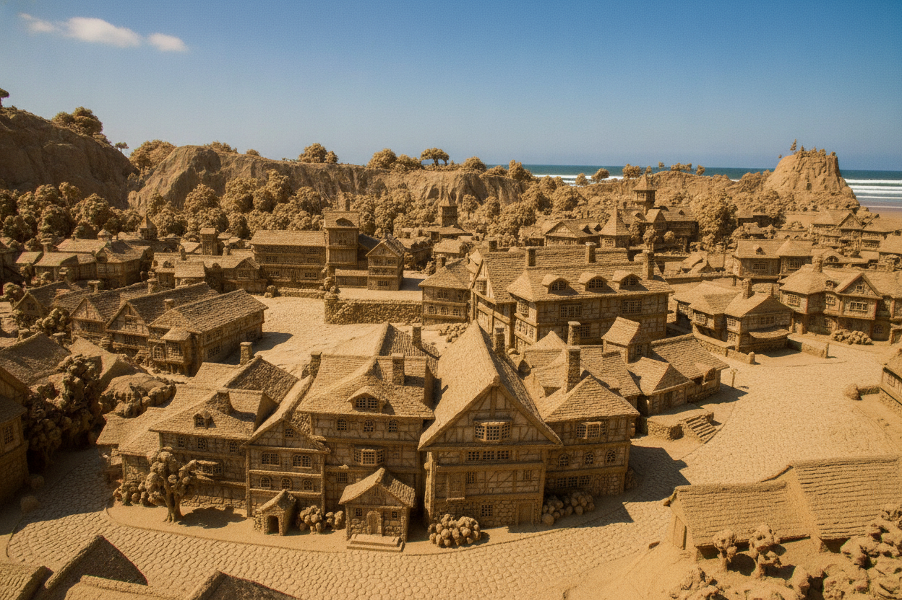
  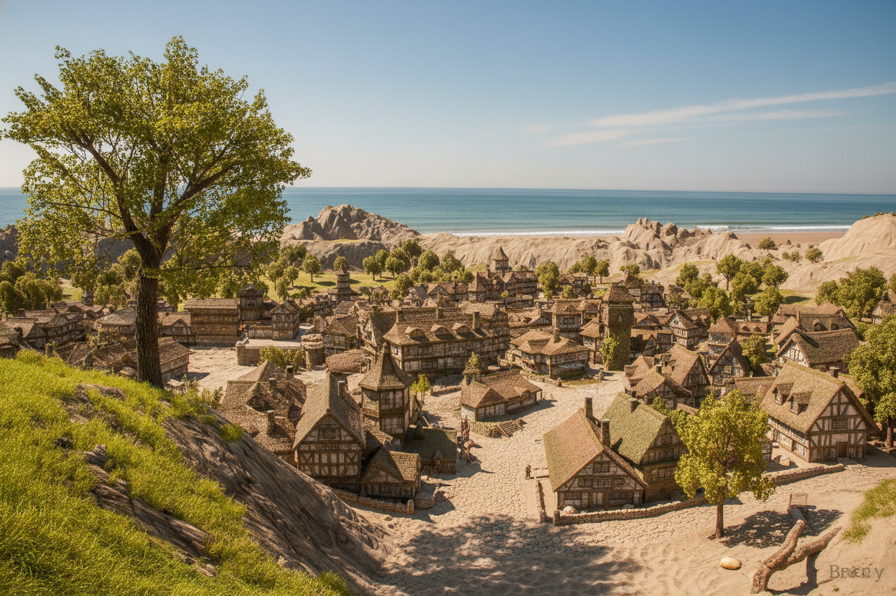
  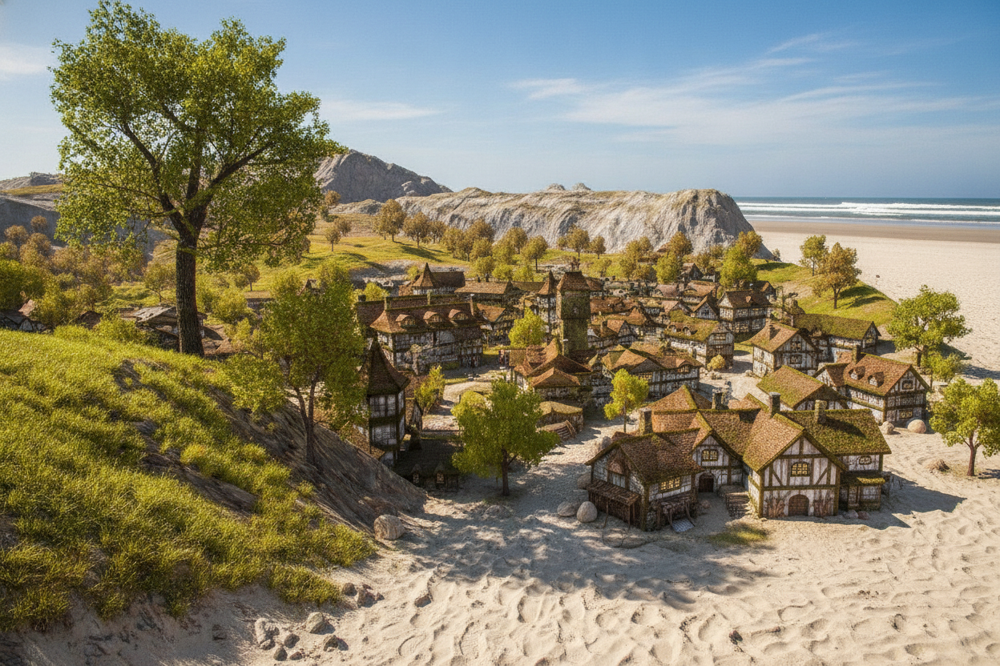
  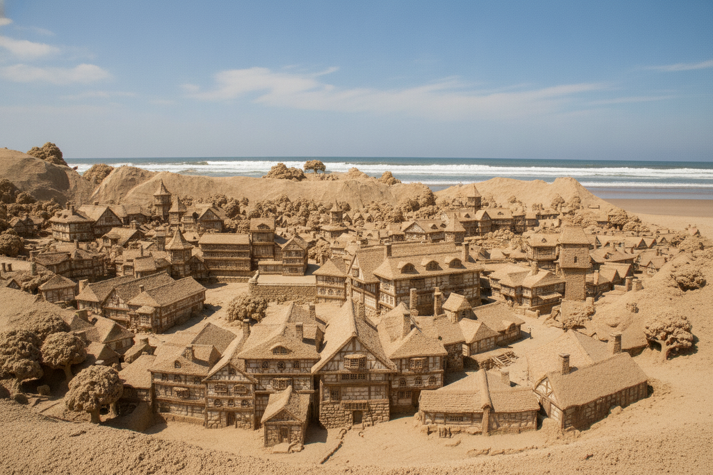
  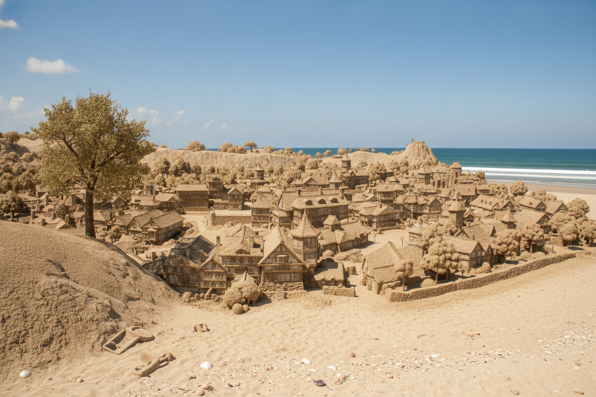
  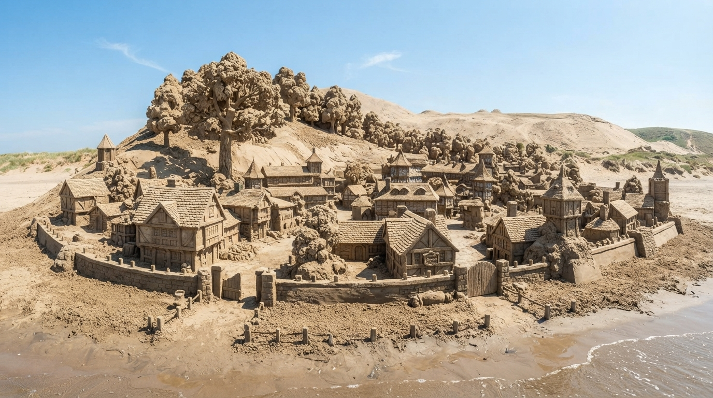
  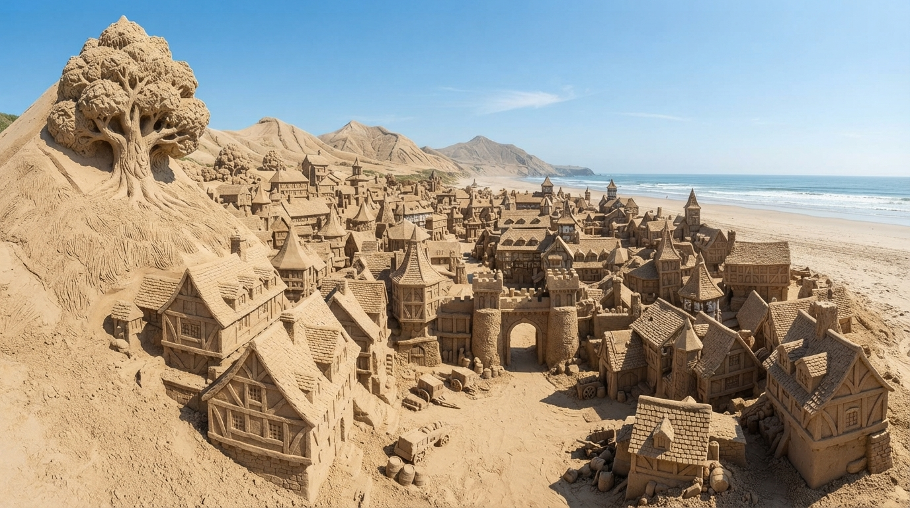
  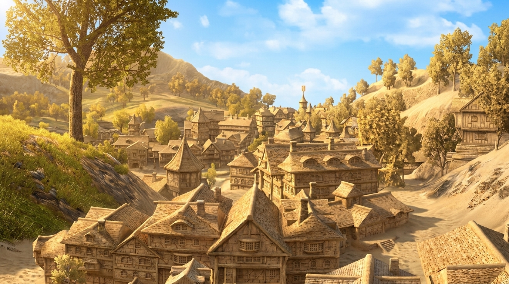
  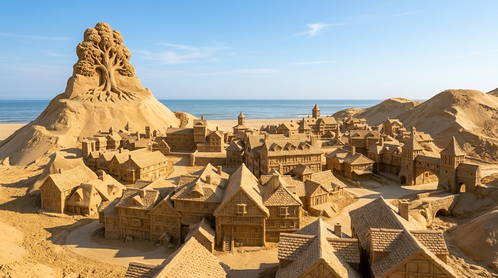

  <button type="button">At the Beach</button>
  <button type="button" class="discuss-btn" onclick="openDiscussion('jul-22-26')">Comments</button>

<pre class="highlight"><code>
<strong>Bree Sand Art Workflow</strong>

<strong>1. Processing Individual Slices</strong> This is the [left-side / center / right-side] of a panoramic image. Use this image as a base to generate a breathtaking sand-art version of the [left-side / center / right-side] of the city of Bree from LOTRO. Depicted on a beautiful sunny day at the beach. Intricate sand castle architecture matching the rustic town of Bree. No people.

<strong>2. Synthesizing the Slices (Attempt 1)</strong> These three images are the left, center, and right slices of a panoramic view of Bree. Synthesize them into a single, cohesive, standard 16:9 aspect ratio image depicting a photo-realistic, physically accurate representation of the entirety of Bree done as intricate sand art on a beautiful sunny day at the beach. Ensure consistent treatment of elements like trees. No people.

<strong>3. Refined Synthesis Prompt ("All Sand" Rule)</strong> These three images are the left, center, and right slices of a panoramic view of Bree. Synthesize them into a single, cohesive, standard 16:9 aspect ratio image depicting the entirety of Bree as a massive, intricately sculpted sandcastle sitting on a real beach on a beautiful sunny day. EVERYTHING in the town must be made entirely of sand—including the trees, foliage, buildings, and ground. There should be no real wood, no real leaves, and no green colors; it must all look like it was painstakingly carved out of wet beach sand. No people.
</code></pre>

</article>

<article class="post-entry" data-tags="meme,middle-earth,cinematic">
<h2 style="display: flex; justify-content: flex-start; align-items: center; gap: 25px;" id="jul-21-26"><a href="#jul-21-26">Jul 21 // Asking for Revert</a> 

  meme
  middle-earth
  cinematic

</h2>

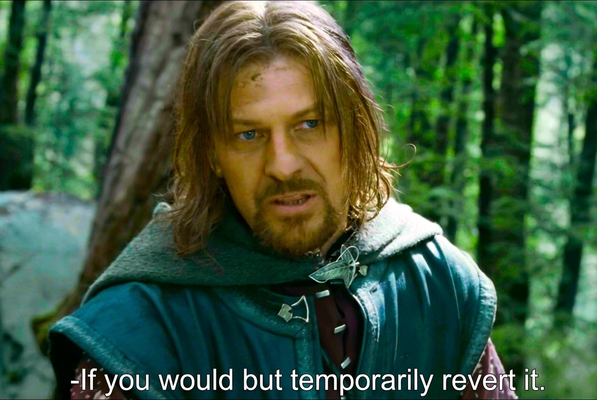

  <button type="button">Asking for Revert</button>
  <button type="button" class="discuss-btn" onclick="openDiscussion('jul-21-26')">Comments</button>

<pre class="highlight"><code>
Change the text subtitle at the bottom of the image. The original text '-If you would but lend me the Ring.' should be replaced with '-If you would but temporarily revert it.'. Keep the font style, white color with a black outline, position, and the original high-resolution Boromir background exactly the same. Do not alter any other details of the image.
</code></pre>

</article>

<article class="post-entry" data-tags="design,middle-earth,lotro,concept-art">
<h2 id="jul-14-26" style="display: flex; justify-content: flex-start; align-items: center; gap: 25px;"><a href="#jul-14-26">Jul 14 // Forgotten Forest Secrets</a> <button onclick="switchForest()" class="toggle-btn" style="position: static;">Next Image</button> 

  design
  middle-earth
  lotro
  concept-art

</h2>

  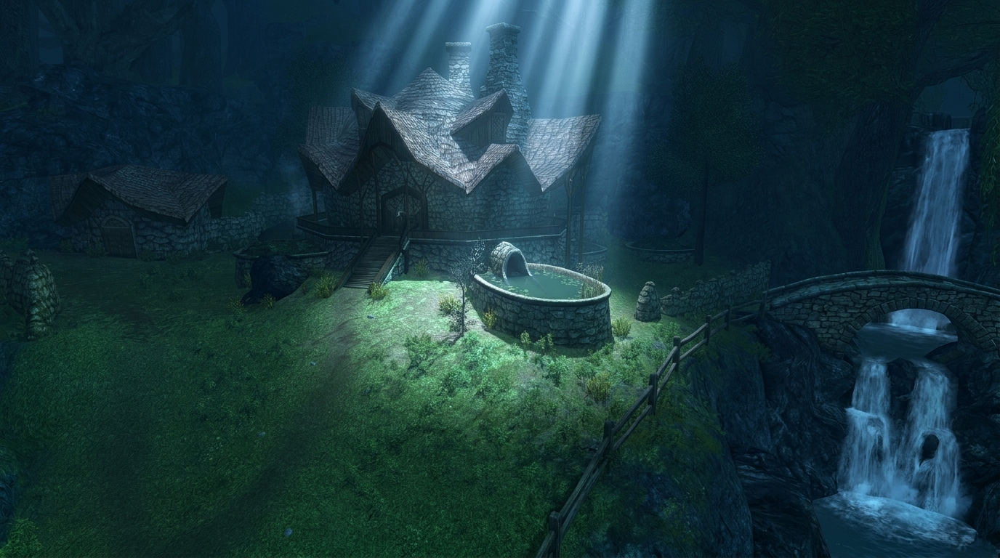
  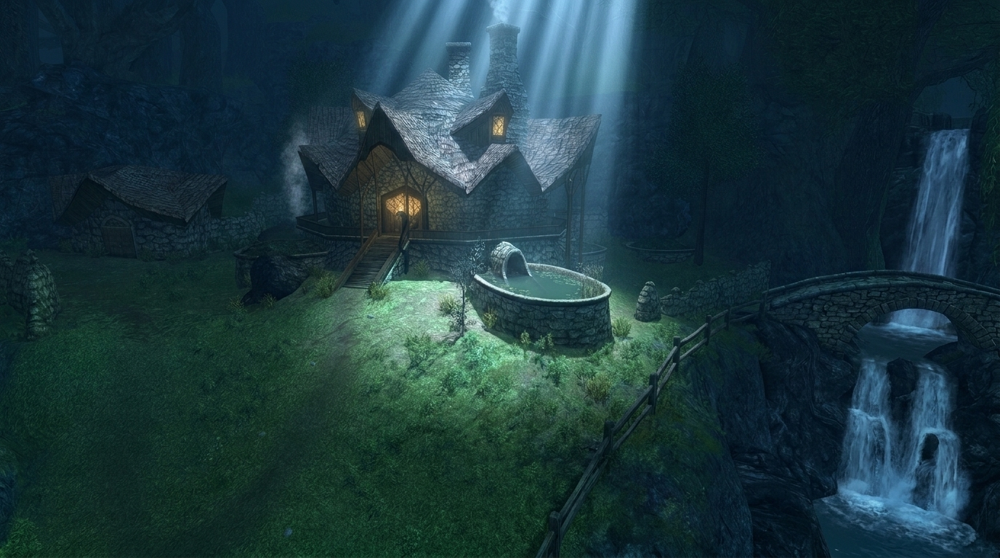

  <button type="button">Forgotten Forest Secrets</button>
  <button type="button" class="discuss-btn" onclick="openDiscussion('jul-14-26')">Comments</button>

<pre class="highlight"><code>
<strong>Reference Material: forest_secret_1, forest_secret_2, and forest_secret_3</strong>

<strong>Phase 1: The Establishing Prompt</strong> An ultra-detailed cinematic, photorealistic shot of a forgotten forest shack at blue hour. Ethereal moonlight streaming through a dense canopy, highlighting deep, moody cinematic blues and glowing lunar highlights across the valley. Lush mossy stone textures on the roof and bridge. The scene must include the rocky ridge path, guard-rail, cistern, and stone arch bridge over the waterfall. Negative prompt: The scene must be completely devoid of characters or people.

<strong>Reference Material: v1_forest_secret</strong>

<strong>Phase 2: The Correction Prompt</strong> Using the provided reference image, maintain the precise spatial layout and magical blue-hour moonlight. Modifications: Apply a very subdued, realistic warm amber glow ONLY to the exact pre-existing windows on the main large shack as seen in the original basis shot. Crucial: Do not add any new windows or structural fixtures that are not in the reference image. Retain the gentle chimney woodsmoke rising into the night air. Keep the small left structure perfectly dark. Do not add any characters.
</code></pre>

</article>

  &times;
  
  

    <button id="lightbox-next-btn" class="lightbox-btn" style="display: none;">Next Image</button>
    <a href="" id="lightbox-link" target="_blank" class="lightbox-btn">View Original</a>
  


