



<h2 id="aug-15">Aug 15 // Dinosaurs: Stegosaurus</h2>

  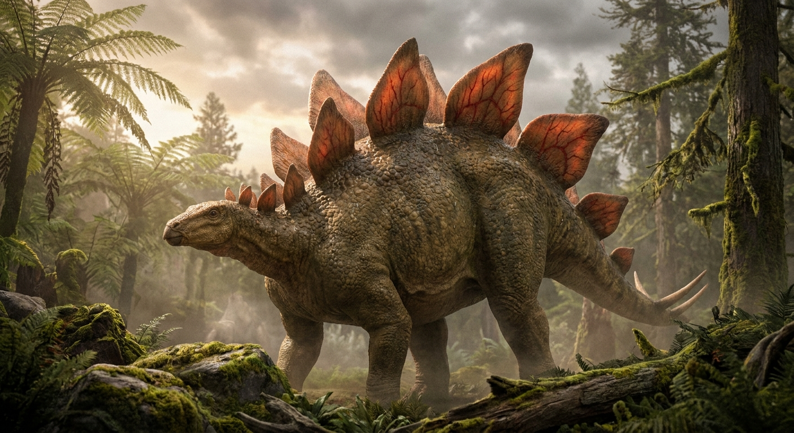
  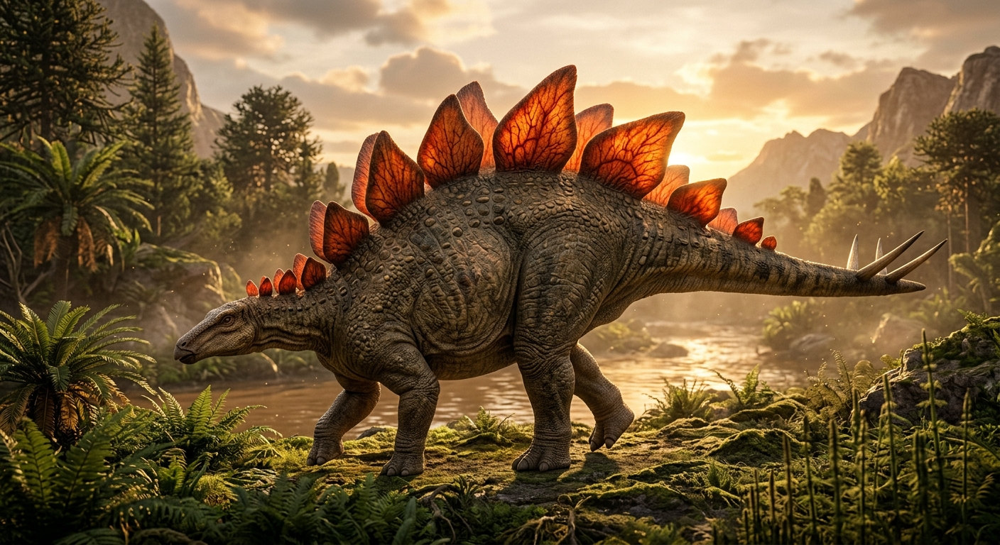
  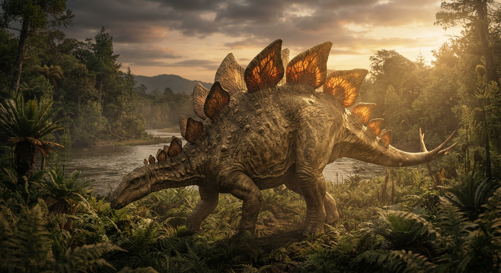
  
  <button onclick="switchStego()" class="toggle-btn">Next Image</button>

<button type="button">Dinosaurs: Stegosaurus</button>

<pre class="highlight"><code>
A breathtaking, studio quality, hyper-realistic depiction of a Stegosaurus (golden-hour lighting highlighting the blood flow in its plates). Full environmental effects, incredibly exquisite detail on the animal's textures, skin, and authentic prehistoric environment. Subtle, realistic camera and lens effects. CRITICAL INSTRUCTION: There must be absolutely NO predator-prey interaction, no hunting, and no feeding depicted. If this is a carnivore, it must be depicted isolated from any prey species. Masterpiece quality. {lighting_and_atmosphere}

Lighting Variants ({lighting_and_atmosphere}):
Variant 1 (Morning): Lighting/Environment: Bright, crisp morning sunlight piercing through the atmosphere, vibrant colors, clear visibility.
Variant 2 (Dramatic): Lighting/Environment: Dramatic, moody late afternoon golden-hour, or overcast skies with soft, diffused atmospheric shadows.
</code></pre>

<h2 id="aug-14">Aug 14 // Ring Design</h2>

  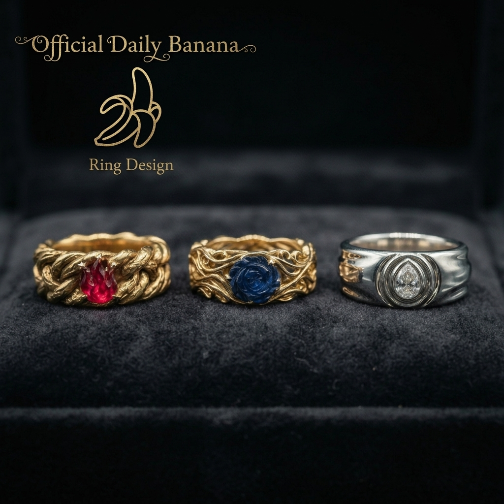
  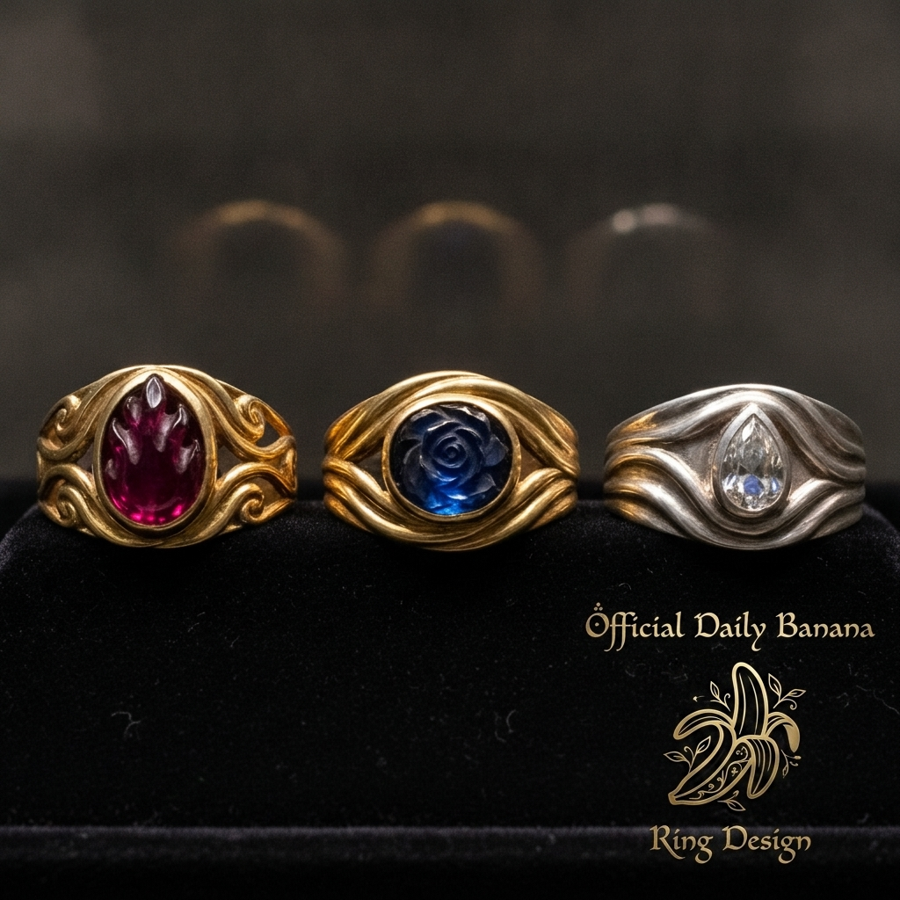
  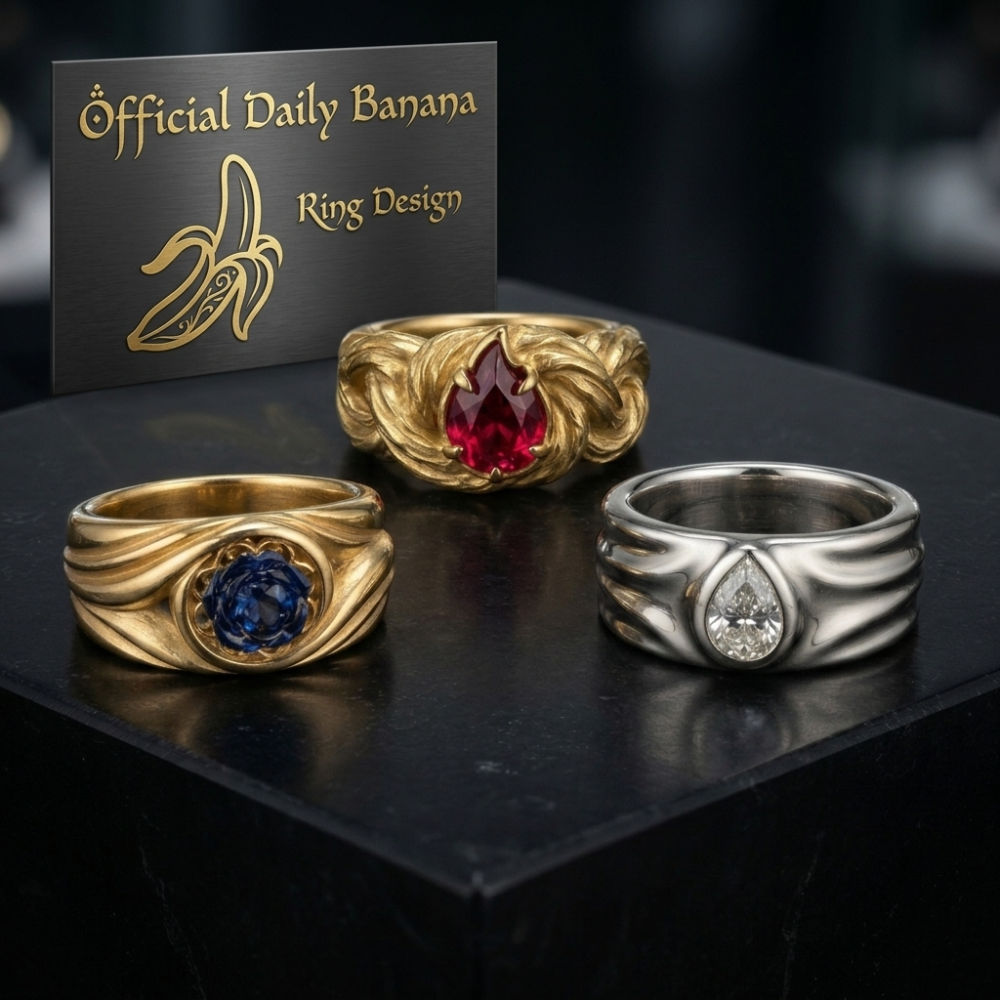
  
  <button onclick="switchRing()" class="toggle-btn">Next Image</button>

<button type="button">Ring Design</button>

<pre class="highlight"><code>
<strong>The Curator's Display</strong>A hyper-realistic macro photograph of three legendary rings displayed on a dark charcoal velvet cushion. Ring one (Narya): a wide, robust band of braided gold twisting like rising smoke, with a ruby carved into a flickering flame inset deeply into the metal, held by spark-shaped prongs that remain flush with the band's outer width. Ring two (Vilya): a substantial band of interwoven gold ribbons mimicking wind currents, with a sapphire carved into a wind-blown rose seamlessly integrated into the filigree, ensuring the stone does not protrude beyond the band's edges. Ring three (Nenya): a broad, heavy band of polished, rippled mithril with a liquid mirror finish, featuring a diamond carved into a glistening teardrop flush-set within a ripple-effect bezel that is carved directly into the width of the band. Cinematic museum lighting, sharp focus on gemstone facets, 8k resolution, extremely shallow depth of field.

<strong>The Obsidian Plinth</strong>A professional jewelry exhibit shot of three ornate, heavy-gauge rings arranged in a triangle on a matte black obsidian surface. The first ring features a thick braided gold band twisting like smoke, with a flame-shaped ruby recessed into the metal and secured by prongs that stay within the band's perimeter. The second ring features bold swirling gold bands like wind currents, with a rose-shaped sapphire inset into a recessed filigree center, maintaining a consistent width across the ring. The third ring features a wide rippled mithril band with a liquid finish, with a teardrop diamond perfectly flush-set in a ripple-effect bezel that blends seamlessly into the band's surface. High-contrast studio lighting, ray-traced reflections on the mithril, 100mm macro lens, f/2.8, showing the weight and density of the metal.

<strong>The Artifact Study</strong>An ultra-detailed close-up of three ancient rings of power viewed as priceless artifacts. Narya is composed of a heavy gold band braided like rising smoke, with a ruby gemstone carved into a flickering flame integrated flush into the band's architecture. Vilya is composed of thick gold ribbons swirling like atmospheric currents, with a sapphire gemstone carved into a wind-blown rose inset into the center of the band without protruding. Nenya is composed of a broad shimmering mithril band with deep liquid ripples, with a diamond gemstone carved into a glistening teardrop recessed into a ripple-style bezel that sits flush with the metal surface. Soft ambient gallery glow, emphasis on the seamless transition between stone and metal, photorealistic, 8k, incredibly sharp focus on the stone carvings.
</code></pre>

<h2 id="aug-13">Aug 13 // Intl. Wolf Day</h2>

  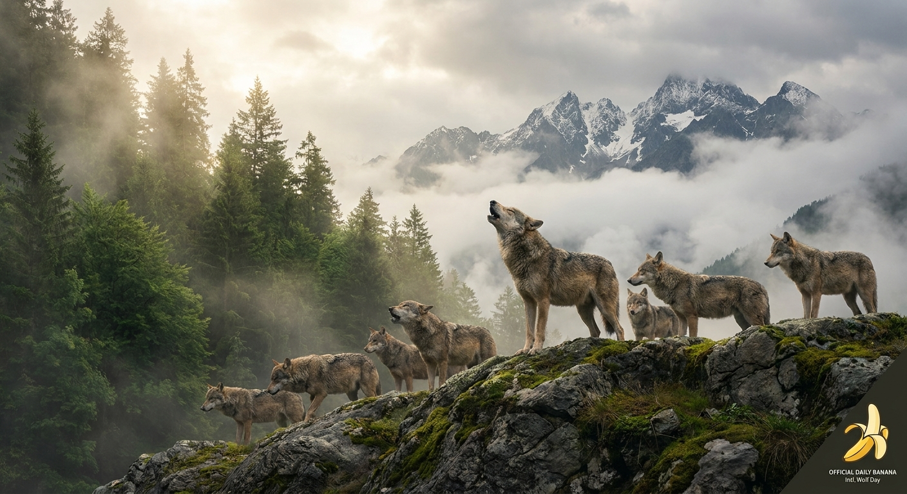
  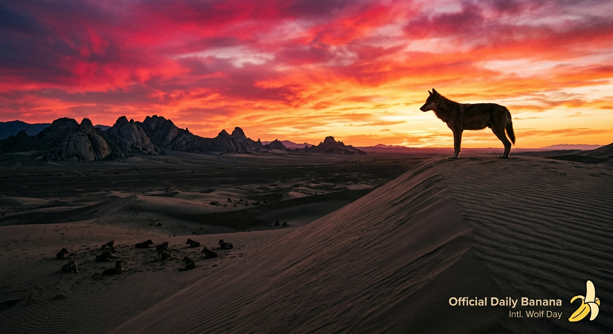
  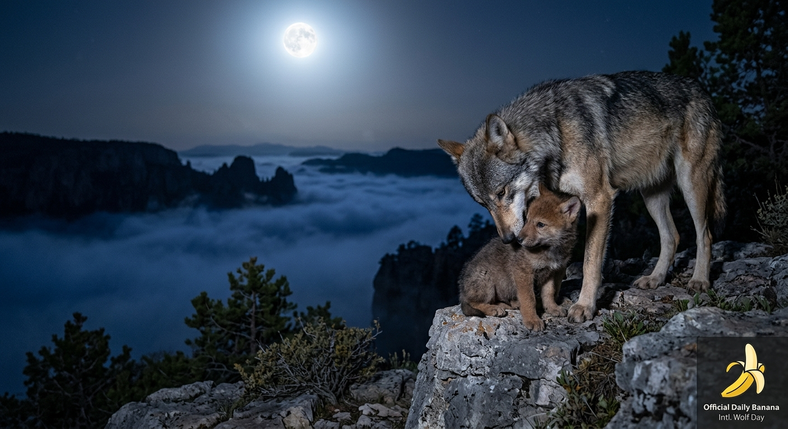
  
  <button onclick="switchWolf()" class="toggle-btn">Next Image</button>

<button type="button">Intl. Wolf Day</button>

<pre class="highlight"><code>
<strong>North America</strong>
<ul><li><strong>Yellowstone (Lamar Valley):</strong> A cinematic wide shot of three <strong>Northwestern Gray Wolves</strong> in a coordinated flank formation, bodies low to the ground and muscles tensed, eyes locked on an unseen target off-screen. A slight puff of condensation from their breath is visible in the crisp morning air. Behind them, the golden Lamar Valley unfolds toward the jagged, snow-dusted peaks of the Rockies under a pale lavender sunrise. 8k, cinematic depth of field, National Geographic photography.</li><li><strong>Alaska/Arctic:</strong> A heartbreakingly beautiful shot of a pack of <strong>Arctic Wolves</strong> curled together in a tight, overlapping survival huddle for warmth amidst a swirling white blizzard. Their luminous white fur blends with the snow, with only their dark, intelligent eyes and frost-covered whiskers visible. Above, a shimmering emerald and violet aurora borealis casts an ethereal glow over the silhouettes of frozen black spruce trees. Hyper-detailed, otherworldly lighting, 8k.</li><li><strong>Northern Mexico (Sierra Madre):</strong> A hauntingly tender nocturnal shot of a <strong>Mexican Gray Wolf</strong> gently nuzzling a small, fluffy pup on a limestone cliff in the Sierra Madre Occidental. The scene is illuminated by a brilliant full moon, casting a silver glow over the charcoal-toned fur of the adult and the soft reddish-brown fur of the pup. Below the cliff, a deep canyon is filled with a sea of midnight-blue fog. Ethereal lighting, high contrast, 8k, mystical atmosphere.</li></ul>
<strong>Europe</strong>
<ul><li><strong>The Carpathians:</strong> A powerful, tiered composition of a pack of <strong>Eurasian Wolves</strong> howling in unison on a misty ridge. The Alpha wolf stands central and slightly elevated, chest out, leading the chorus. The surroundings are a moody, emerald-green forest with heavy, low-hanging mist and sharp, grey alpine peaks piercing through a sea of clouds in the background. Cinematic, volumetric lighting, 8k, epic scale.</li><li><strong>Iberian Peninsula:</strong> A hyper-realistic, intimate shot of two <strong>Iberian Wolves</strong> engaged in a "muzzle-kiss," rubbing their noses together in a gesture of greeting and bonding. They are positioned in a sun-dappled grove of cork oak trees with tiny golden motes of dust dancing in the light. In the soft-focus background, the limestone walls of a Spanish river gorge plunge into a turquoise stream. Soft bokeh, warm golden-hour light, 8k.</li><li><strong>Białowieża (Summer Primeval):</strong> A high-energy shot of two <strong>Eurasian Wolves</strong> engaged in a playful, leaping chase through the heart of the Białowieża Forest. They are weaving through oversized, deep-green ferns and wild forest flowers, with blades of grass and petals kicked up in the air. Above them, a natural cathedral of gnarled, ancient oaks filters dappled sunlight across their grey-and-ochre coats. Hyper-realistic, rich saturation, 8k, immersive nature photography.</li></ul>
<strong>Asia</strong>
<ul><li><strong>Mongolia (Gobi Sunset):</strong> A breathtaking wide shot of a <strong>Steppe Wolf</strong> acting as a sentinel, standing perfectly still and alert on a towering, wind-rippled sand dune. The wolf is silhouetted against a fiery red and magenta sunset, while the rest of the pack is visible as small, resting silhouettes in the valley below. In the distance, jagged granite formations break the horizon of the Gobi Desert. High contrast, epic scale, cinematic.</li><li><strong>Siberia (Deep Taiga Mist):</strong> A cinematic shot of two <strong>Eurasian Wolves</strong> walking shoulder-to-shoulder through the deep, emerald-green Siberian Taiga, showcasing a strong pack bond. A heavy silver morning mist weaves between towering Larch trees, with brilliant "god rays" of sunlight piercing the canopy to illuminate their pale-grey fur and the moisture in the air. Volumetric lighting, moody, hyper-detailed, 8k.</li><li><strong>Kamchatka (Autumn River):</strong> A raw, action-packed shot of a <strong>Eurasian Wolf</strong> captured in a powerful, mid-air leap, splashing through a crystal-clear river to snap up a bright red sockeye salmon. Crystalline water droplets are frozen in mid-air around the wolf. The surrounding valley is an explosion of crimson berry bushes and golden birch trees, with a distant, snow-capped volcano veiled in purple twilight haze. 8k, vivid autumn palette, National Geographic style.</li></ul></code></pre>

<h2 id="aug-12">Aug 12 // World Hirola Day</h2>

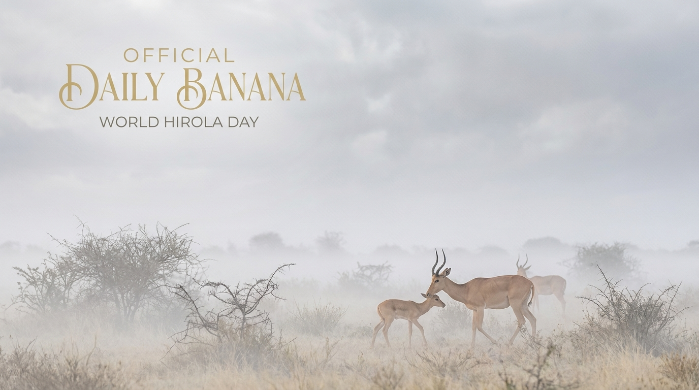

<button type="button">World Hirola Day</button>

<pre class="highlight"><code><ul><li><strong>Prompt 1 (Cinematic &amp; Hyper-realistic)</strong>: A hyper-realistic 8k cinematic shot of a male hirola antelope standing as a sentinel in the arid, open plains of the Kenya-Somalia border. The hirola is depicted with a striking reddish-brown coat and long, curving lyre-shaped horns. He is captured in a high-tension alert pose, head held high and ears twitching, scanning the horizon. The camera uses a low-angle perspective with golden hour sunlight casting long, dramatic shadows across the scrubland. Extreme detail is visible in the coarse texture of the fur, the grain of the horns, and the fine dust swirling around the hooves. Shallow depth of field with a soft, blurred background of distant acacia trees. In the bottom corner, unobtrusive but clearly readable, is a sleek text overlay that says 'Official Daily Banana', with a subtitle 'World Hirola Day'.</li><li><strong>Prompt 2 (Ethereal &amp; Artistic)</strong>: An ethereal and artistic wide-angle shot of a small family group of hirola antelopes moving through a silvery morning mist in the borderlands of Kenya and Somalia. The lighting is soft and luminous, creating a dreamlike, painterly atmosphere while maintaining photorealistic textures. The composition focuses on a mother hirola and her calf nuzzling, their tawny coats glowing softly through the fog. The scene is minimalist, with sparse, dry grass and scattered thorn bushes emerging from the white haze. The color palette is muted and airy, evoking a sense of quiet majesty and the extreme rarity of the species. Subtly placed in the misty sky, out of the way but clearly readable, is the elegant title text 'Official Daily Banana', accompanied by the subtitle 'World Hirola Day'.</li><li><strong>Prompt 3 (Wildlife Documentary Style)</strong>: A candid, National Geographic-style telephoto shot (600mm lens) of a hirola antelope grazing on dry scrub in the harsh, arid landscape of the Kenya-Somalia border. The shot captures a behavioral moment: the antelope is pausing mid-graze, glancing toward the camera with a cautious, wide-eyed expression. High-contrast midday sunlight emphasizes the coarse texture of its reddish-brown hide and the stark white of its underbelly. The environment is authentic, featuring cracked earth, brittle yellow grass, and a slight heat haze on the horizon. The focus is razor-sharp on the hirola's facial features and the unique structure of its horns, with a natural, unposed documentary feel. Neatly placed in the lower margin, designed like an authentic press watermark but clearly readable, is the title 'Official Daily Banana' and subtitle 'World Hirola Day'.</li></ul></code></pre>

<h2 id="aug-11">Aug 11 // Hero Poses</h2>

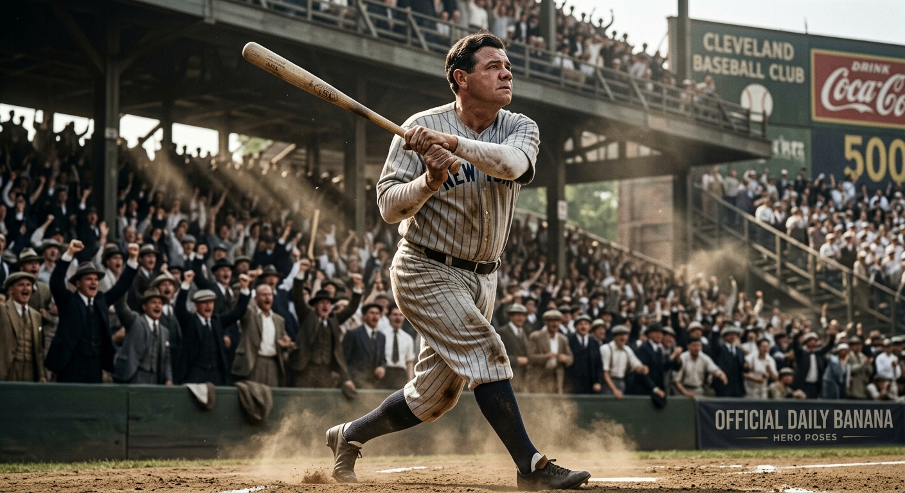

<button type="button">Hero Poses</button>

<pre class="highlight"><code>
A dramatic, low-angle 8k cinematic shot of Babe Ruth at the moment of follow-through after hitting his 500th home run. The camera is positioned near the batter's box, looking up to make Ruth appear larger than life. He is wearing the authentic 1929 heavy wool pinstripe Yankees uniform (as the visiting team), with visible sweat stains and coarse fabric texture. The setting is explicitly League Park in Cleveland, Ohio. In the background, the crowd in the wooden bleachers of League Park is a blur of motion, men in fedoras rising in a wave of excitement. Dust motes dance in sharp beams of afternoon sunlight cutting through the historic Cleveland stadium. The focus is razor-sharp on Ruth's determined expression and the grit on his hands, with a shallow depth of field that makes League Park's iconic 40-foot right-field wall loom in the distance. In the bottom corner, unobtrusive but clearly readable, is a sleek text overlay that says 'Official Daily Banana', with a subtitle 'Hero Poses'.
</code></pre>

<h2 id="aug-10">Aug 10 // World Lion Day</h2>

  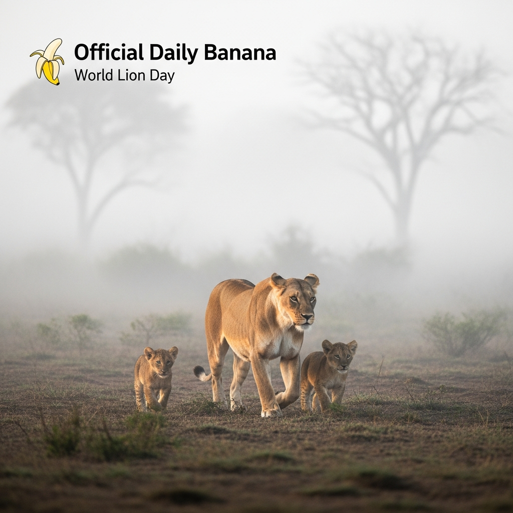
  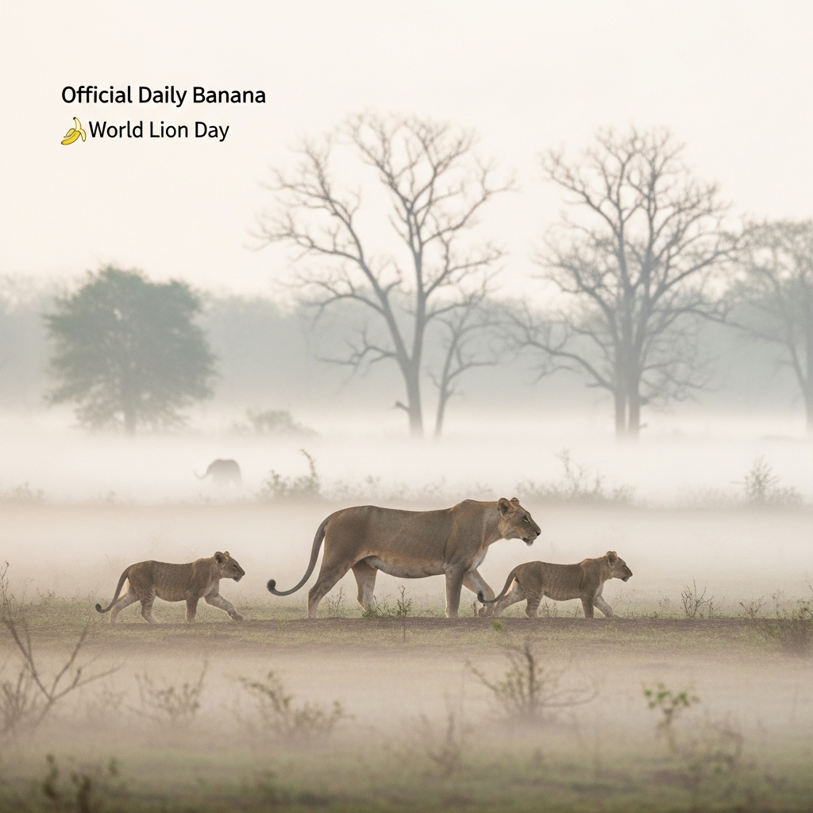
  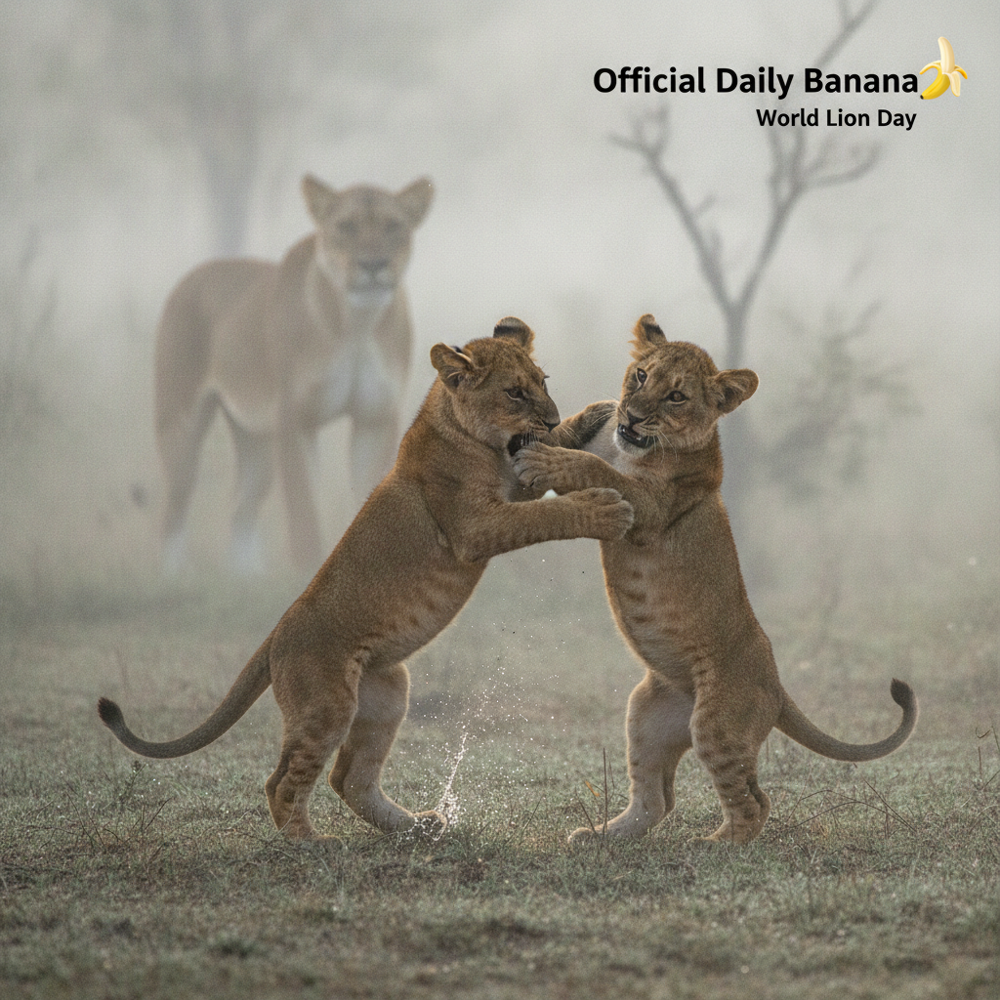
  
  <button onclick="switchLion()" class="toggle-btn">Next Image</button>

<button type="button">World Lion Day</button>

<pre class="highlight"><code><ul><li><strong>Prompt 1 (Cinematic)</strong>: A cinematic, 8k RAW photo of a female Asiatic lion and her two young cubs nestled together in the dry deciduous teak forest of Gir National Park, Gujarat. The scene is captured during the golden hour, with warm, low-angle sunlight filtering through the branches of a nearby acacia tree, creating a dramatic interplay of light and shadow. The lions are depicted with absolute anatomical authenticity, prominently featuring the distinct longitudinal fold of skin running along their bellies that is unique to the Asiatic subspecies. Extreme detail on the texture of the tawny fur, the moisture on their noses, and the dusty laterite soil. Shallow depth of field with a soft, blurred background of rugged scrubland and teak trees, emphasizing the intimate family bond.</li><li><strong>Prompt 2 (Ethereal)</strong>: An atmospheric, wide-angle shot of a small Asiatic lion pride emerging from a thick, silvery morning mist in the rugged Kathiawar peninsula scrublands of Gujarat. The lighting is soft and diffused, giving the scene a timeless, painterly quality while maintaining photorealistic textures. The composition focuses on a mother lion with a characteristic leaner build and visible belly fold, leading her cubs through the fog, with the silhouettes of dry teak trees fading into the white background. The color palette is muted, focusing on earthy ochres, soft greys, and pale greens, evoking a sense of quiet majesty and familial protection.</li><li><strong>Prompt 3 (Journalistic,Social Bonding)</strong>: A candid, National Geographic-style telephoto shot using a 600mm lens, capturing an intimate moment of social bonding in the Gir Forest. The focus is a tight, detailed shot of a female Asiatic lion gently grooming her cub, with the cub leaning into her with closed eyes. In the soft-focus background, another female from the small pride watches over them, creating a sense of communal protection. Natural, dappled sunlight filters through the teak leaves, highlighting the fine textures of the fur and the moisture of the lions' noses. Realistic dust motes dance in the light beams, with the arid, scrubby terrain of Gujarat providing an authentic, earthy backdrop. The lions are depicted with absolute anatomical authenticity for the Asiatic subspecies, featuring the distinct longitudinal fold of skin running along their bellies.</li><li><strong>Prompt 4 (Journalistic,Leaping)</strong>: An atmospheric, wide-angle shot of two Asiatic lion cubs mid-leap, wrestling playfully in the silvery morning mist of the Gujarat scrublands. The lighting is soft and diffused, creating a dreamlike, painterly quality while retaining photorealistic fur textures. The composition captures the kinetic energy of the pounce, with tiny droplets of dew spraying from the grass. In the background, the blurred silhouette of the mother lion watches with a protective, indulgent gaze, her form partially dissolved into the fog and the pale outlines of distant teak trees. The color palette is muted, focusing on earthy ochres and soft, luminous greys. The lions are depicted with absolute anatomical authenticity for the Asiatic subspecies, featuring the distinct longitudinal fold of skin running along their bellies.</li><li><strong>Prompt 5 (Journalistic,The Hunt)</strong>: A high-tension, National Geographic-style telephoto shot using a 600mm lens, capturing a coordinated stalk in the Gir Forest. The frame focuses on the intense, gold-colored eyes of a female Asiatic lion, her body pressed low against the earth, muscles coiled for a spring. Beside her, another female from the pride is partially visible through the tall, yellow grass, their teamwork evident in their mirrored, low-profile posture. High-contrast midday lighting emphasizes the grit of the arid terrain and the individual hairs of their tawny coats. The shot is captured at the precise moment of maximum tension, with the focus razor-sharp on the predator's gaze and a shallow depth of field blurring the scrubland behind them. The lions are depicted with absolute anatomical authenticity for the Asiatic subspecies, featuring the distinct longitudinal fold of skin running along their bellies.</li></ul></code></pre>

<h2 id="aug-09">Aug 09 // Animal Migration</h2>

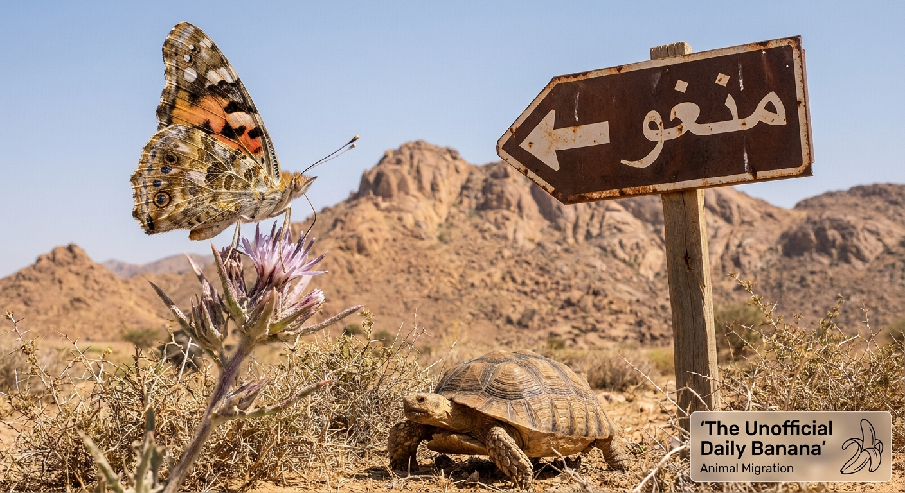

<button type="button">Animal Migration</button>

<pre class="highlight"><code>
<strong>Prompt 3 (Journalistic)</strong>: A raw, National Geographic-style macro shot. The focus is a sharp, high-detail close-up of a Painted Lady Butterfly perched on a wild desert wildflower, showing the microscopic scales of its wings. The background is a wide, deep-focus shot of the rugged, arid landscape of the Guera Mountains under a harsh, clear midday sun. Beside the flower, a dusty, rusted metal road sign is visible, pointing toward "Mongo" (منغو) in faded white Arabic lettering. For a contrast in scale and temperament, a large African Spurred Tortoise is captured in the lower third of the frame, moving slowly through the scrubland beneath the fluttering butterflies. Shot on 35mm lens, f/8 aperture, natural saturation, documentary realism, high shutter speed to freeze the butterfly's wing movement.
</code></pre>

<h2 id="aug-08">Aug 08 // International Moon Bear Day</h2>

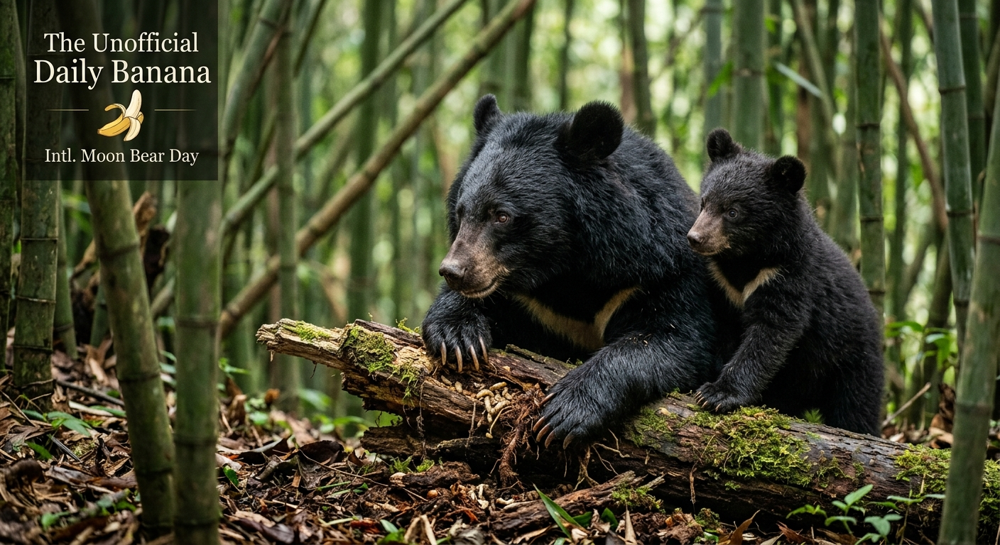

<button type="button">Intl. Moon Bear Day</button>

<pre class="highlight"><code><ul><li><strong>Prompt 1 (Cinematic)</strong>: A breathtaking, cinematic shot of a mother moon bear and her small cub in the heart of a lush, subtropical Southeast Asian rainforest. The mother, with deep jet-black fur and a prominent, glowing cream-colored crescent moon patch on her chest, is captured in a tender moment, gently nuzzling her cub. They are surrounded by colossal, moss-covered hardwoods and prehistoric-looking ferns, with dramatic "god rays" of sunlight piercing through the emerald canopy to illuminate the floating dust motes and the intricate texture of the bears' fur. 8k resolution, photorealistic, Unreal Engine 5 render style, extreme detail on the wet noses and sparkling eyes, shallow depth of field, professional color grading with rich, saturated greens.</li><li><strong>Prompt 2 (Ethereal)</strong>: An atmospheric, mood-driven photograph of a mother moon bear and her cub emerging from a thick, silvery mist on a high Himalayan slope. The scene is grounded in realism but possesses a dreamlike quality, with the bears appearing as soft, dark silhouettes against a backdrop of pale blue peaks and frosted alpine flora. The mother's white chest crescent catches the soft, diffused morning light, creating a focal point of warmth and purity. The composition emphasizes the bond between mother and cub through a gentle, protective lean. High-end digital photography, soft-focus aesthetic, natural pastel tones, ethereal morning lighting, evoke a sense of peace and sanctuary.</li><li><strong>Prompt 3 (Journalistic)</strong>: A stunning, raw wildlife photograph in the style of National Geographic, capturing a mother moon bear teaching her cub how to forage in a dense bamboo forest. The shot is a crisp, mid-range telephoto capture, showing the mother using her sharp claws to tear into a decaying log while the cub watches with intense curiosity. The lighting is natural, filtered daylight, highlighting the coarse texture of the black fur and the damp, earthy debris of the forest floor. The focus is razor-sharp on the mother's eye and the cub's playful expression, with a natural background blur of overlapping bamboo stalks. RAW photography, ultra HD, f/4 aperture, authentic naturalism, capturing a candid moment of familial learning in the wild.</li></ul></code></pre>

<h2 id="aug-07">Aug 07 // International Beer Day</h2>

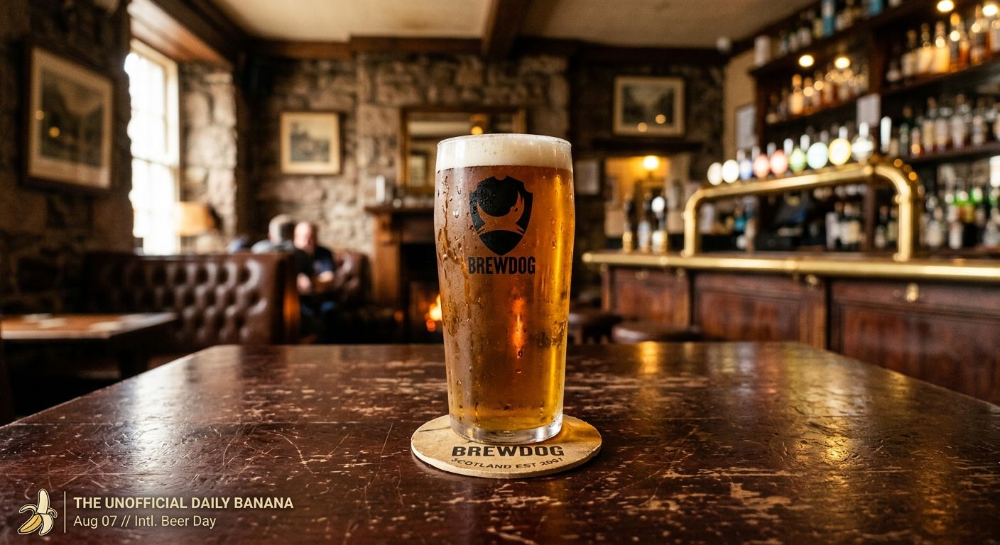

<button type="button">Intl. Beer Day</button>

<pre class="highlight"><code>
<strong>Prompt 3 (Journalistic)</strong>: A crisp, journalistic photograph in the style of National Geographic, capturing the atmospheric interior of a traditional Aberdeen pub. The focus is a close-up of a cold, condensation-beaded pint of Scottish craft ale resting on a dark, polished mahogany table that shows years of wear and character. Beside the glass sits a thick, textured cardboard coaster from a local brewery like BrewDog or Innis &amp; Gunn. The background is a soft, warm bokeh of a cozy pub interior, featuring the glint of brass rails, a distant wall of beer taps, and the muted colors of old leather booths. The lighting is natural and moody, with a soft glow from an unseen fireplace casting golden highlights across the beer's foam and the rich wood grain. Sharp focus on the droplets of water on the glass, ultra HD, authentic cultural photography, no people.
</code></pre>

<h2 id="aug-06">Aug 06 // Scenes from Literature</h2>

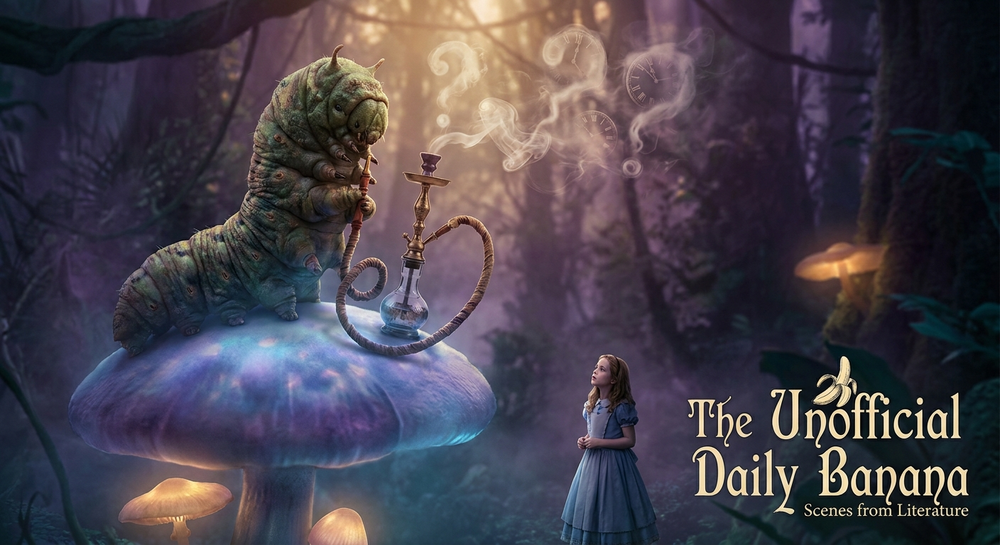

<button type="button">Scenes from Literature</button>

<pre class="highlight"><code><ul><li><strong>Prompt 1 (Cinematic)</strong>: A stunning macro cinematic shot based on the Caterpillar scene from Alice's Adventures in Wonderland. The Caterpillar is a large, vivid blue creature with detailed, soft-textured skin, perched atop a massive, translucent red-capped mushroom with visible gills and glistening dew drops. He is holding an intricately crafted ornate hookah, with thick, volumetric swirls of iridescent smoke curling around his head in the damp, humid air. To the side, a small, bewildered Alice is captured in a low-angle shot, looking up in awe and confusion. The background is a lush, surreal jungle with oversized ferns and dappled, golden sunlight piercing through a heavy canopy. 8k resolution, photorealistic, extreme detail on textures, shallow depth of field, professional color grading.</li><li><strong>Prompt 2 (Ethereal)</strong>: A moody, atmospheric yet highly realistic composition of the encounter between Alice and the Caterpillar from Alice's Adventures in Wonderland. The scene is bathed in a natural palette of deep violets, dark teals, and soft glowing ambers. The Caterpillar is a photorealistic, textured giant insect perched firmly on a detailed bioluminescent mushroom that casts a soft physical glow upward. Beside him rests his hookah, faithfully depicted as a traditional 19th-century Turkish narghile with a glass water-base, an ornate stem, and a long, coiled, flexible hose ending in a wooden mouthpiece, held lazily by the Caterpillar. The smoke from the hookah curls naturally but thickens into subtle, realistic shapes vaguely resembling question marks and clock faces. Alice is rendered with lifelike detail, standing small against a backdrop of a dense, hazy Wonderland jungle sky. High-end cinematic photography, ethereal natural lighting, evocative atmosphere, sharp focus on authentic textures, and realistic physics.</li><li><strong>Prompt 3 (Original Illustration Style)</strong>: A faithful recreation of the original 1865 John Tenniel illustrations for the Caterpillar scene in Alice's Adventures in Wonderland. The image is a high-resolution digital ink drawing on aged, tea-stained parchment paper, featuring the signature Victorian wood-engraving style with meticulous cross-hatching and fine line work. The Caterpillar is depicted in his classic, haughty pose atop the mushroom, puffing on his nargile with precise, stylized smoke clouds. Alice stands beside him in her iconic pinafore dress, her expression one of polite frustration. The composition is clean and balanced, using muted watercolor washes of pale blue and soft red to add a touch of color to the classic black-and-white engraving. Archival quality, vintage literary aesthetic, precise anatomical proportions based on Tenniel's sketches.</li></ul></code></pre>

<h2 id="aug-05">Aug 05 // World Tomistoma Day</h2>

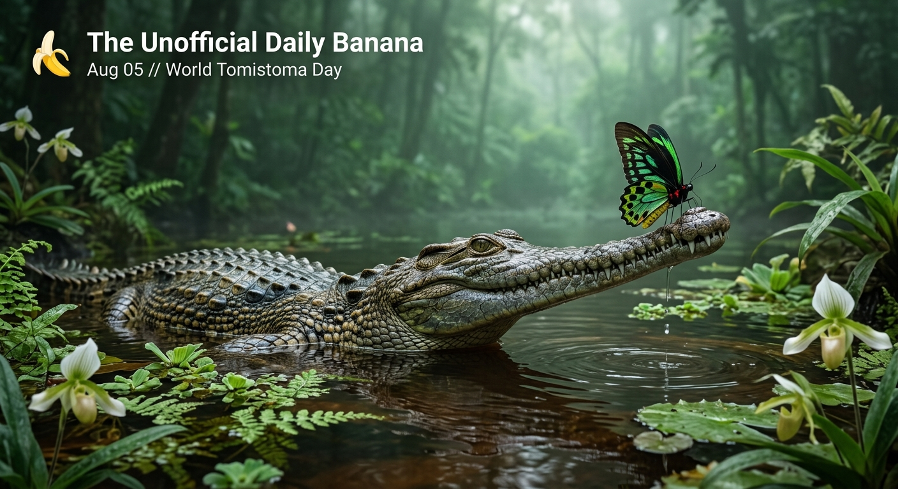

<button type="button">World Tomistoma Day</button>

<pre class="highlight"><code><ul><li><strong>Prompt 1 (Cinematic)</strong>: A wide-angle, cinematic shot of a Tomistoma gliding through a dark, mirror-like peat swamp in Borneo. A vibrant Rajah Brooke's Birdwing butterfly is perched peacefully on the creature's head, its wings partially open to reveal striking iridescent greens. Dramatic "god rays" of sunlight pierce through a dense, ancient rainforest canopy, illuminating both the butterfly and the detailed olive-brown scales of the Tomistoma. The water is a deep tea-color with hyper-realistic reflections of towering dipterocarp trees. 8k resolution, Unreal Engine 5 render style, extreme detail, shallow depth of field, professional color grading with high contrast.</li><li><strong>Prompt 2 (Ethereal)</strong>: A moody, atmospheric yet highly realistic composition of a Tomistoma partially submerged in a misty Sumatran swamp forest at dawn. A Rajah Brooke's Birdwing butterfly rests delicately on the Tomistoma's snout, creating a poignant contrast between raw power and fragile beauty. The scene is enveloped in a soft, natural emerald-green haze with floating aquatic ferns and delicate white jungle orchids framing the shot. Focus on authentic textures, photorealistic scales and wings, and realistic physics of the misty water, using a palette of deep natural teals, golds, and muted greens. Ethereal natural lighting, lifelike quality, high-end wildlife photography style, evocative and serene.</li><li><strong>Prompt 3 (Journalistic)</strong>: A crisp, naturalistic telephoto shot of a Tomistoma resting on a muddy riverbank in Peninsular Malaysia. A Rajah Brooke's Birdwing butterfly has landed on the Tomistoma's head, captured in a rare, still moment of harmony. The lighting is bright, natural daylight, capturing the raw, wet texture of the skin and the intricate, velvet-like patterns of the butterfly's wings. Surround the animals with authentic tropical river flora and small ripples in the slow-moving water. National Geographic style, f/5.6 aperture for a natural background blur, sharp focus on the butterfly and the Tomistoma's eye, unedited raw photography, ultra HD.</li></ul></code></pre>

<h2 id="aug-04">Aug 04 // Clouded Leopard Day</h2>

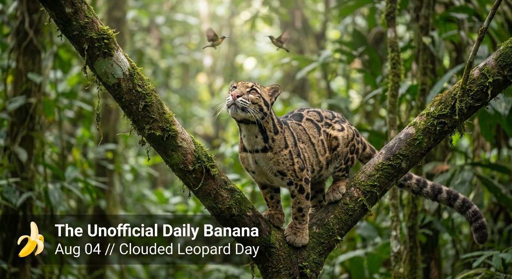

<button type="button">Clouded Leopard Day</button>

<pre class="highlight"><code><ul><li><strong>Prompt 1 (Cinematic)</strong>: A hyper-realistic, cinematic low-angle shot of a majestic Clouded Leopard lounging on a thick, moss-covered branch of a towering tropical rainforest tree. The leopard is draped comfortably over the limb, its massive paws hanging slightly, showcasing its unique 'cloud-like' fur patterns. The leopard is gazing upward with a look of longing and quiet curiosity toward the high, sun-drenched canopy. In the upper third of the frame, several brightly colored tropical birds are captured in mid-flight, soaring through the golden light filtering through the leaves. Deep greens, rich emeralds, and soft golden hour sunlight. 8k resolution, National Geographic photography style, extreme detail on the fur and whiskers, depth of field with a soft-focus forest background.</li><li><strong>Prompt 2 (Ethereal)</strong>: An atmospheric, artistic depiction of a Clouded Leopard in its natural Southeast Asian jungle habitat. The leopard is perched realistically on a sturdy branch, its body coiled in a relaxed lounge. The camera angle is from below, looking up at the animal's face as it watches a flock of birds dancing in the distant canopy. The lighting is 'God rays' (crepuscular rays) piercing through the dense jungle foliage, highlighting the leopard's golden-grey fur. The expression is one of serene longing. Soft bokeh, lush vegetation, vibrant jungle colors, highly detailed textures of bark and fur, 8k, ethereal lighting.</li><li><strong>Prompt 3 (Journalistic)</strong>: A professional wildlife photograph of a Clouded Leopard resting on a branch in a rainforest. The animal is positioned naturally, looking up toward the top of the tree where small birds are fluttering. The shot emphasizes the leopard's ability to climb and balance. Natural, diffused jungle light. The background is a lush, layered canopy of ferns and ancient trees. High shutter speed, crisp focus on the leopard's eye reflecting the canopy above, realistic fur physics, 8k, ultra-high definition, nature documentary aesthetic.</li></ul></code></pre>

<h2 id="aug-03">Aug 03 // Graphic Novel Style</h2>

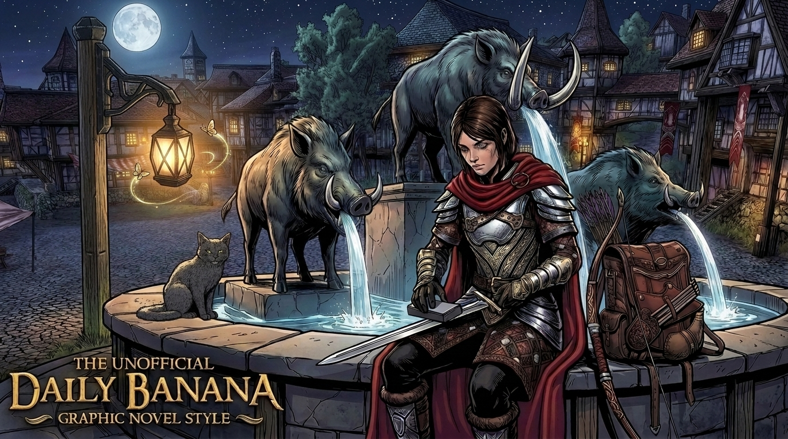

<button type="button">Graphic Novel Style</button>

<pre class="highlight"><code>
A breathtaking, edge-to-edge, full-bleed 16:9 widescreen illustration (absolutely no borders or picture frames). Ultra HD 8k resolution. An incredibly detailed, high-fantasy graphic novel style illustration of a meticulous, sharp-witted female warrior methodically sharpening her sword. She is sitting on the stone basin-rim of a grand Boar Fountain. Use the provided image [standing_pose_close.png] as the sole reference for her character design, face, and clothing (depict no other people or characters). Use the provided image [boar_fountain.png] to guide the highly detailed realization of the background fountain and location. Use the provided image [sword_drawn.png] to ensure her sword is depicted with absolute authenticity and zero deviation. She is actively sharpening this exact sword. Propped up right next to her on the fountain rim is her bow (reference: [holding_bow.png]) and her adventurer's backpack (reference: [standing_back_view.png]). Ensure she is NOT wearing the bow or backpack. The art style should feature stunning graphic novel aesthetics: dynamic inking, bold comic book coloring, crisp line-art, and dramatic shading that emphasizes her sharp nature and the high-fantasy setting.

<strong>Note</strong>: the models were guided by ten reference images during generation.
</code></pre>

<h2 id="aug-02">Aug 02 // Weather</h2>

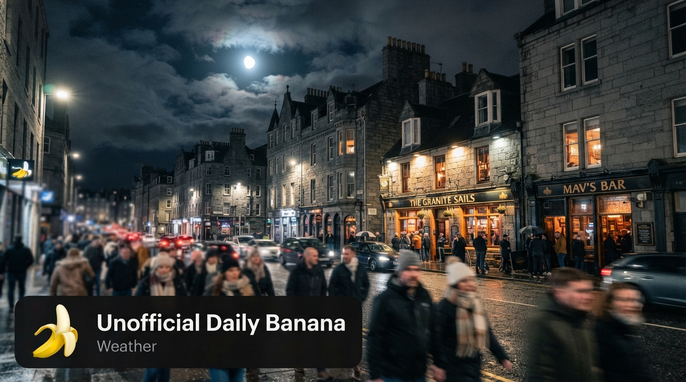

<button type="button">Weather</button>

<pre class="highlight"><code>
A breathtaking, edge-to-edge, full-bleed 16:9 widescreen photograph (absolutely no borders or picture frames). Ultra HD 8k resolution, candid, street-level view of Aberdeen's bustling nightlife in the UK. The cinematic composition features a heavily blurred foreground of a crowded sidewalk with people dressed in warm Scottish winter coats, utilizing a beautiful bokeh effect on the glowing street lights. The razor-sharp focus is set on the glowing entrances of a traditional local pub built from the massive, rough-hewn silver-grey granite architecture typical of Aberdeen, Scotland. Above, a bright Waning Gibbous moon peeks through scattered, drifting clouds, casting a cool, atmospheric glow that delicately illuminates the city's skyline. Warm, inviting amber light glows heavily from within the pub's windows. Photorealistic urban night photography shot with beautiful high ISO film grain, showcasing an authentic, moody Scottish city atmosphere.
</code></pre>

<h2 id="aug-01">Aug 01 // Ramen Shops</h2>

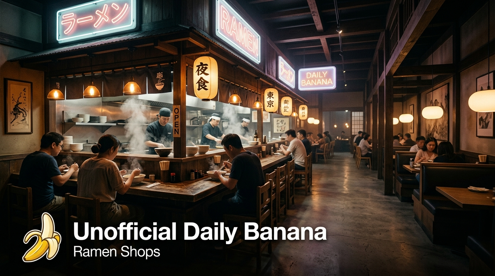

<button type="button">Ramen Shops</button>

<pre class="highlight"><code><ul><li><strong>Prompt 1 (Draft)</strong>: A breathtaking, edge-to-edge, full-bleed 16:9 widescreen photograph (absolutely no borders or picture frames). Ultra HD 8k resolution, cinematic, wide-angle interior shot of an authentic, moody Japanese ramen shop, inspired by high-end music video aesthetics with a dreamy, ethereal, yet highly realistic ambience. The space is intimate, featuring a weathered light-wood counter with high stools. Soft, warm amber pendant lighting and subtle pastel neon accents create deep cinematic shadows and a glowing, atmospheric vibe. In the background, a beautifully blurred open kitchen shows steaming stainless steel pots, swirling atmospheric steam, and stacks of ceramic ramen bowls. A traditional fabric noren curtain hangs partially closed. On the counter in sharp foreground focus: a frosted glass mug of draft beer with a thick condensation-covered foam head, small condiment jars of red pepper and sesame, and a pair of wooden chopsticks resting on a ceramic holder. Shot on a premium 35mm lens at f/1.4.</li><li><strong>Prompt 2 (Mugicha)</strong>: A breathtaking, edge-to-edge, full-bleed 16:9 widescreen photograph (absolutely no borders or picture frames). Ultra HD 8k resolution, hyper-realistic architectural interior view of a traditional, densely packed Tokyo ramen-ya. The focus is on the hyper-detailed textures of a scratched, aged wooden counter and worn leather stools. The space features a high-density layout with wooden slat partitions between customers, and walls adorned with authentic handwritten menu slips. In the beautifully blurred background, a glimpse of a ticket vending machine near the door is visible through air thick with swirling, volumetric steam. On the counter in sharp macro focus: a steaming, rich bowl of tonkotsu ramen next to a tall, condensation-covered glass of ice-cold Mugicha (roasted barley tea) and a small side of vibrant pickled ginger. Shot on a premium 35mm lens at f/1.8, natural warm incandescent lighting, showcasing extreme macro detail on the wood grain and water droplets.</li><li><strong>Prompt 3 (Ramune)</strong>: A breathtaking, edge-to-edge, full-bleed 16:9 widescreen photograph (absolutely no borders or picture frames). Ultra HD 8k resolution, cinematic first-person perspective interior shot of a Japanese ramen shop, captured from a customer's seat looking down a long, warm wooden counter. The ambiance is dreamy, ethereal, and romantic, heavily inspired by high-end music video cinematography. Soft pastel neon accents blend seamlessly with traditional glowing paper lanterns. In the soft-focus background, a chef works amidst swirling, volumetric steam, with a delicate fabric noren curtain fluttering slightly. On the counter in sharp macro foreground focus: a vibrant, highly detailed glass bottle of Ramune soda, prominently featuring its signature glass marble inside, next to a small, steaming bowl of ramen. Shot on a premium 35mm lens at f/1.4, exhibiting flawless depth of field, hyper-realistic glass reflections, and a soft cinematic glow.</li><li><strong>Prompt 4 (Modern)</strong>: A breathtaking, edge-to-edge, full-bleed 16:9 widescreen photograph (absolutely no borders or picture frames). Ultra HD 8k resolution, cinematic, extreme wide-angle interior shot of a Japanese ramen restaurant. The unique architectural layout seamlessly combines two distinct styles: the intimate, narrow, scratched wooden counter-only seating of a traditional Tokyo ramen shop on one side, which beautifully opens up into a spacious, moody, high-end Asian-restaurant dining area featuring elegant tables and leather booths on the other. The ambiance perfectly captures the dreamy, ethereal, and romantic mood of a high-end music video, featuring soft pastel neon accents blending gracefully with warm amber pendant lighting and traditional paper lanterns. Volumetric steam swirls from the open kitchen behind the traditional counter. The extreme wide-angle perspective (14mm lens) perfectly captures both the intimate counter layout and the expansive restaurant floorplan in a single cohesive, highly realistic photograph. Flawless depth of field, photorealistic textures, and exquisite architectural lighting.</li></ul></code></pre>

<h2 id="jul-31">Jul 31 // Fortifications</h2>

  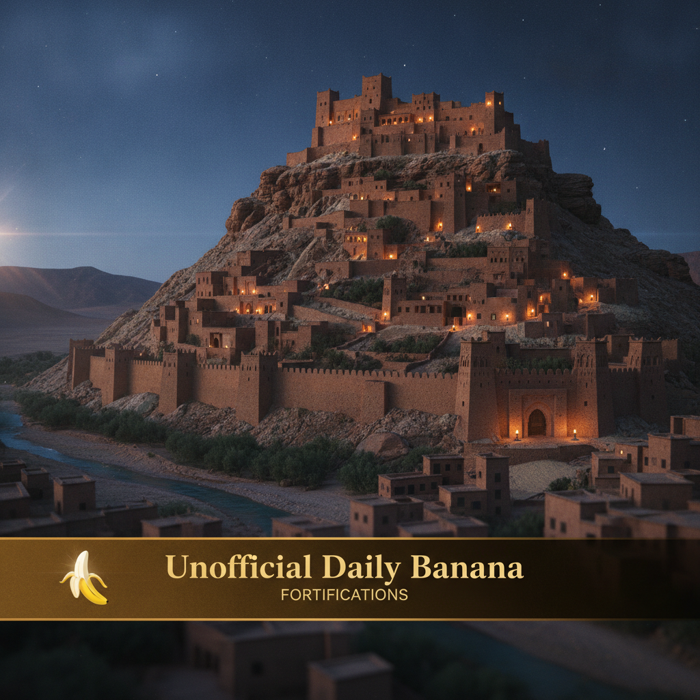
  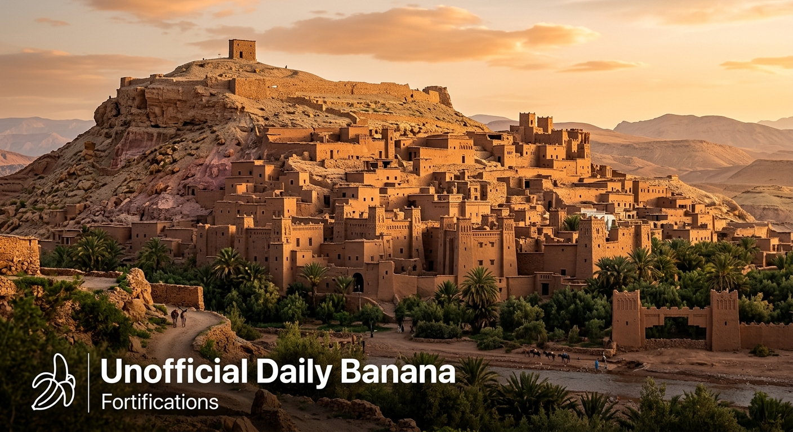
  
  <button onclick="switchFort()" class="toggle-btn">Next Image</button>

<button type="button">Fortifications</button>

<pre class="highlight"><code><ul><li><strong>Prompt 1 (interpretive)</strong>: A highly detailed, photo-realistic, cinematic studio-quality presentation poster of the vernacular architecture of the Moroccan desert. The architecture specifically incorporates elements of The Kasbah (Fortress-Home) and The Ksar (Fortified Village). The majestic, sprawling fortress is built onto a prominent mountain or steep hill, showcasing how the intricate mud-brick and stone fortress design adapts, layers, and changes by altitude. {lighting} High-end lens effects, depth of field, breathtaking environment, masterpiece.</li><li><strong>Prompt 2 (detail)</strong>: A breathtaking, edge-to-edge, full-bleed photograph (absolutely no borders, no picture frames, no white margins). Ultra HD 8k resolution, hyper-realistic cinematic presentation of the vernacular architecture of the Moroccan desert, specifically incorporating elements of The Kasbah (Fortress-Home) and The Ksar (Fortified Village). The majestic, sprawling fortress is built onto a prominent mountain or steep hill, showcasing how the intricate mud-brick and stone fortress design adapts, layers, and changes by altitude. {lighting} Shot on a premium 35mm lens at f/1.8, exhibiting flawless depth of field, sharp focus, and photorealistic volumetric lighting with intricate environmental textures. Masterpiece, National Geographic award-winning photography.</li></ul>
(Lighting Variants)
<ul><li>Golden Hour: The environment is bathed in breathtaking golden-hour sunlight, casting long, dramatic shadows and highlighting the rich earthen tones of the architecture.</li><li>Blue Hour: The environment is captured during blue-hour twilight, with the deep blue desert sky contrasting against warm, inviting, realistic night-time fortress lighting glowing brightly from the windows, walls, and courtyards.</li></ul></code></pre>

<h2 id="jul-30">Jul 30 // Alternative Human</h2>

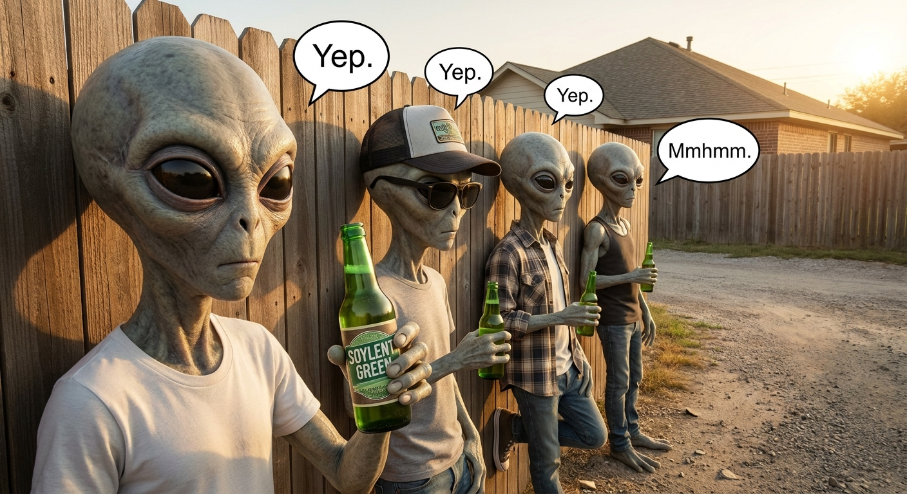

<button type="button">Alternative Human</button>

<pre class="highlight"><code>
A hyper-realistic, studio quality photograph spoofing the King of the Hill alley scene. The camera is in the alleyway, looking over a wooden privacy fence at a suburban 1-story Texas ranch-style house. Standing in the alley leaning against the fence are four classic grey extraterrestrial aliens, each wearing a distinctly different casual outfit (e.g., one in a plain white t-shirt, one in a trucker hat and sunglasses, one in an open button-down shirt, one in a tank top). It is a beautiful golden hour sunset with warm cinematic lighting. Every alien holds a green glass bottle. The camera depth of field focuses slightly on the nearest alien's bottle, where the label clearly and legibly reads 'Soylent Green'. Above the aliens' heads are clear speech bubbles: three say 'Yep.' and the fourth on the far right says 'Mmhmm.' There are absolutely no humans in the image. Masterpiece, highly detailed.
</code></pre>

<h2 id="jul-29">Jul 29 // Games</h2>

  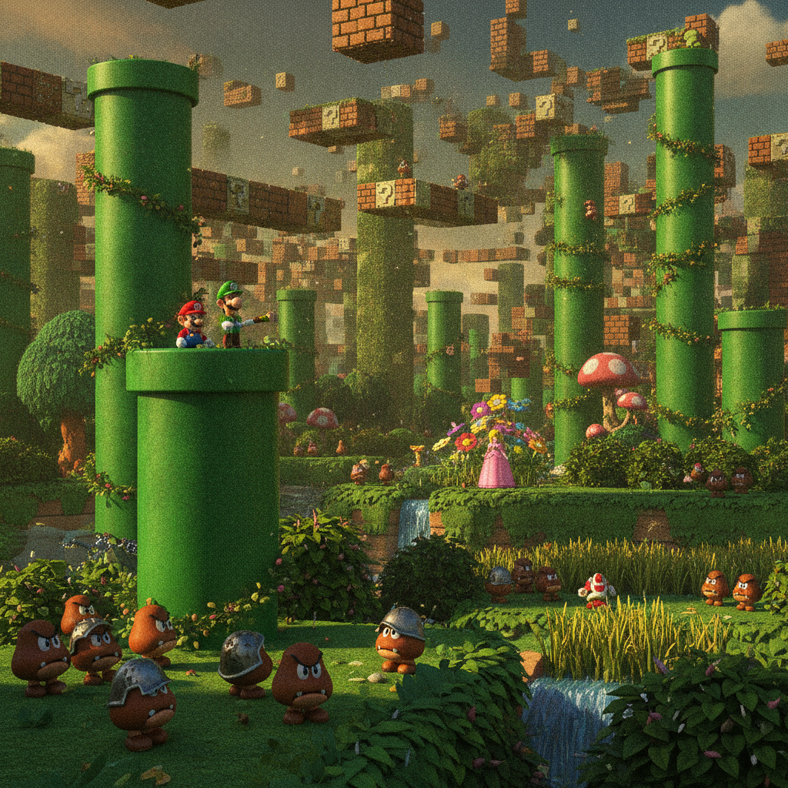
  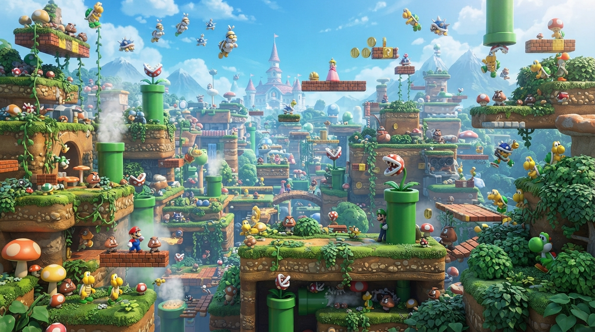
  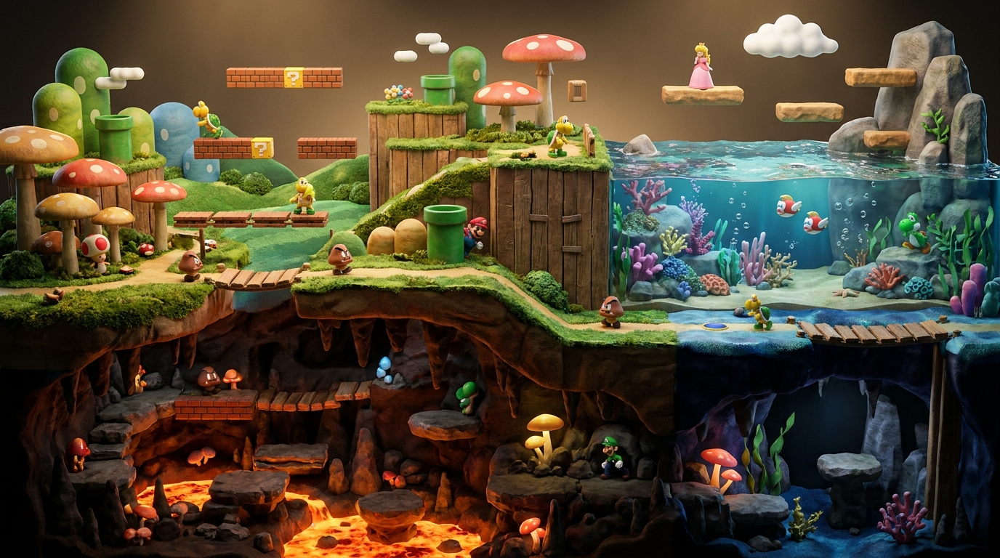
  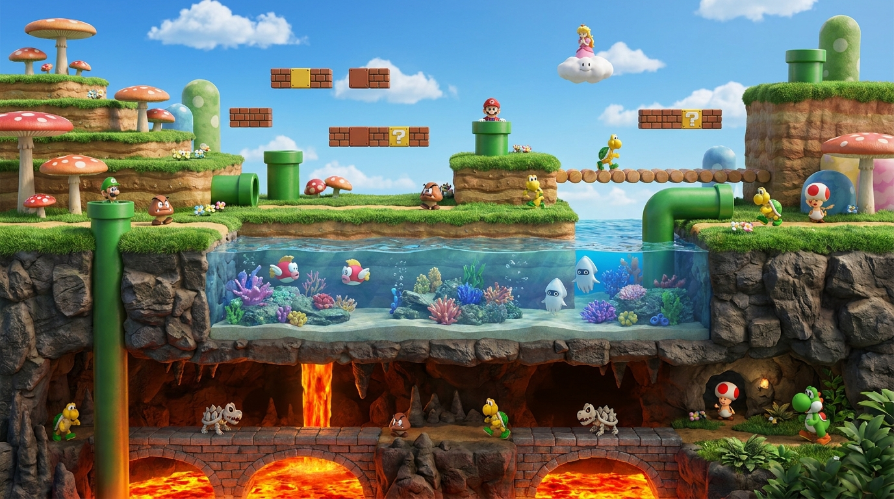
  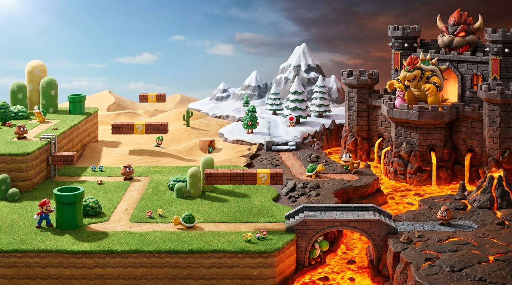
  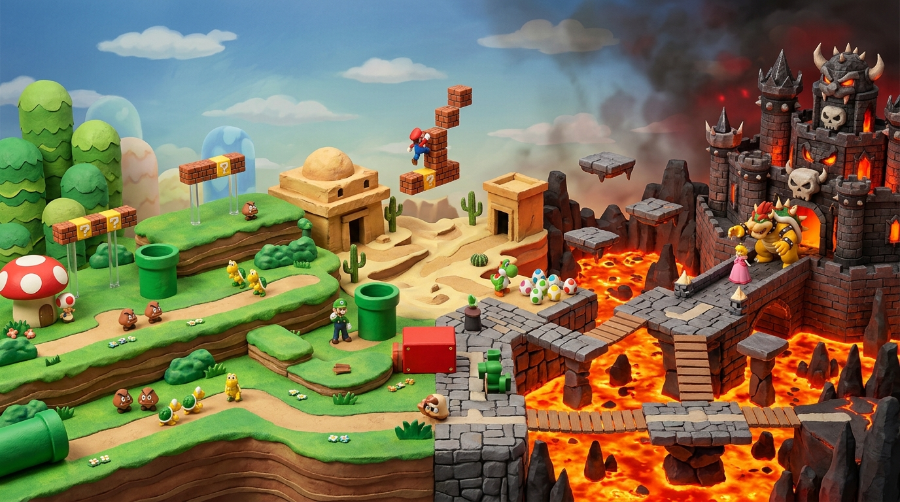
  
  <button onclick="switchGame()" class="toggle-btn">Next Image</button>

<button type="button">Games</button>

<pre class="highlight"><code><ul><li><strong>Prompt 1</strong>: A breathtaking, studio quality, awe-inspiring illustration: A sprawling, incredibly wide panoramic 16:9 view of a Super Mario Bros level done in authentic 16-bit SNES style but rendered with hyper-realistic, intricate, breathtaking detail. The scene is a massive, sprawling landscape filled with towering green pipes, floating brick blocks, and detailed Goombas. Hidden within the unbelievable density and intricate detail-like a 'Where's Waldo' illustration-are tiny but photo-realistic depictions of Mario, Luigi, Princess Peach, and Yoshi. The viewer has to search through the sprawling, hyper-detailed mushroom kingdom to find them. The image MUST contain NO TEXT, NO LOGO, AND NO TITLES. Purely the background artwork.</li><li><strong>Prompt 2 (2.5D Diorama)</strong>: A breathtaking, studio quality, awe-inspiring 2.5D illustration: A sprawling, incredibly wide panoramic 16:9 view of a massive Super Mario Bros environment. The art style should be a hyper-realistic, highly detailed 2.5D diorama that authentically mimics realistic, playable SNES-era level design. The layout must feature clear, structured platforming paths, floating brick blocks, and distinct, logically connected biomes (overworld, aquatic, and subterranean). Populate the level with a realistic, playable number of non-main-character enemies (Goombas, Koopas) spaced out naturally along the paths-do not swarm the screen. Hidden within this beautifully structured 2.5D landscape-like a 'Where's Waldo' illustration-are tiny but photo-realistic depictions of the main heroes. CRITICAL INSTRUCTION: Mario, Luigi, Princess Peach, Toad, and Yoshi must each appear EXACTLY ONCE in the entire image. The viewer has to search through the sprawling, realistic level to find their single hiding spot. The image MUST contain NO TEXT, NO LOGO, AND NO TITLES. Purely the background artwork.</li><li><strong>Prompt 3 (Outside the Castle)</strong>: A breathtaking, studio quality, awe-inspiring 2.5D illustration: A sprawling, incredibly wide panoramic 16:9 view of a massive Super Mario Bros environment. The art style should be a hyper-realistic, highly detailed 2.5D diorama that authentically mimics realistic, playable SNES-era level design. The layout must feature clear, structured platforming paths, floating brick blocks, and distinct, logically connected biomes leading toward a massive, imposing depiction of Bowser's Castle at the end of the level. Populate the level with a realistic, playable number of non-main-character enemies (Goombas, Koopas) spaced out naturally along the paths. In or near the castle, depict a massive Bowser holding Princess Peach captive. Hidden within the rest of this beautifully structured 2.5D landscape-like a 'Where's Waldo' illustration-are tiny but photo-realistic depictions of Mario, Luigi, Toad, and Yoshi. CRITICAL INSTRUCTION: Mario, Luigi, Toad, Yoshi, Bowser, and Princess Peach must each appear EXACTLY ONCE in the entire image. The viewer has to search through the sprawling, realistic level to find where the heroes are hiding as they make their way to the castle. The image MUST contain NO TEXT, NO LOGO, AND NO TITLES. Purely the background artwork.</li></ul></code></pre>

<h2 id="jul-28">Jul 28 // Botanical Robots</h2>

  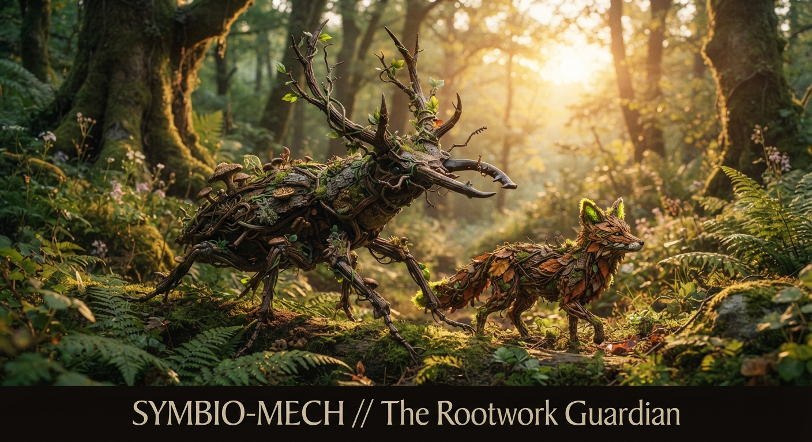
  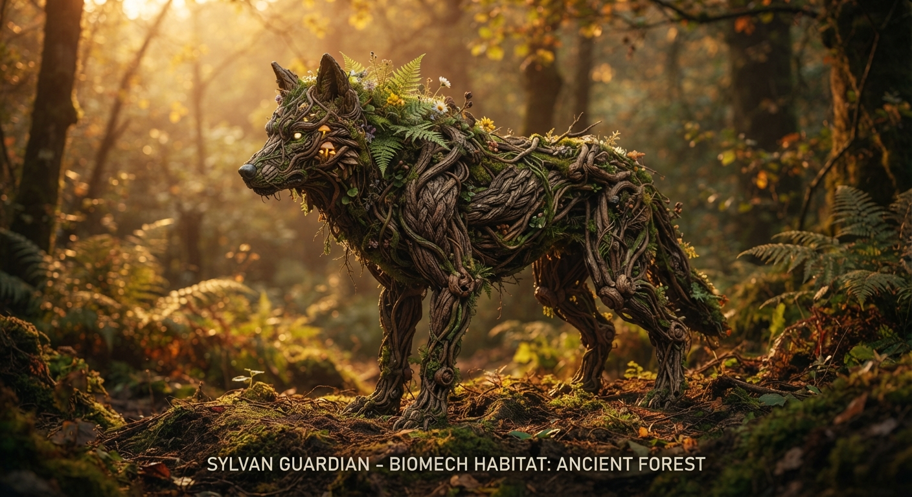
  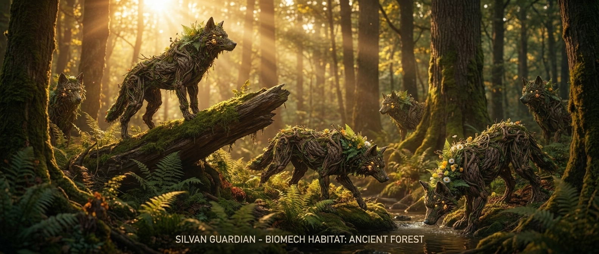
  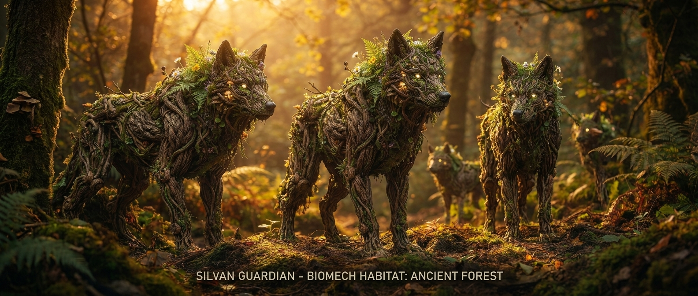
  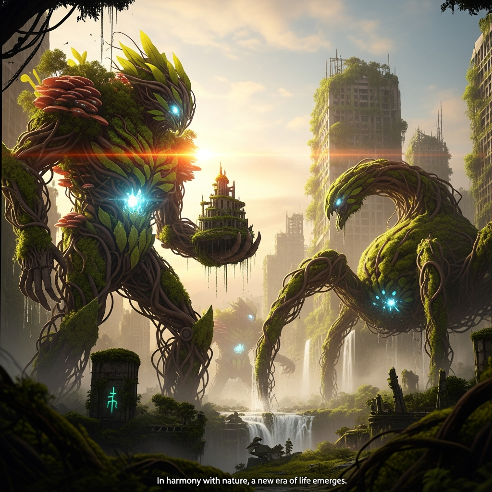
  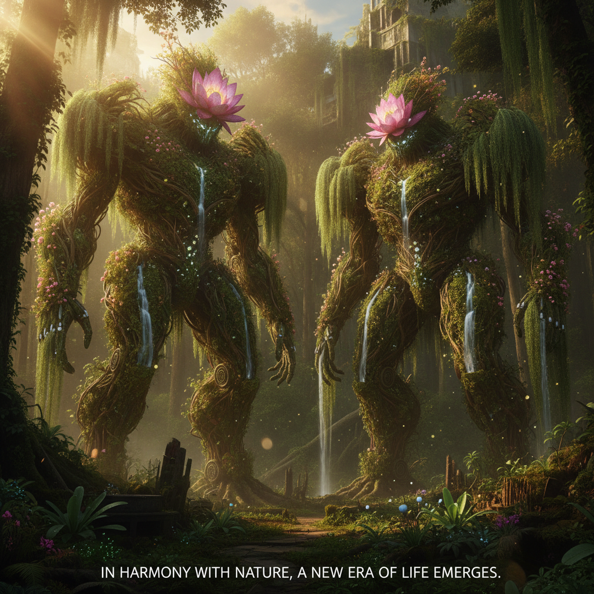
  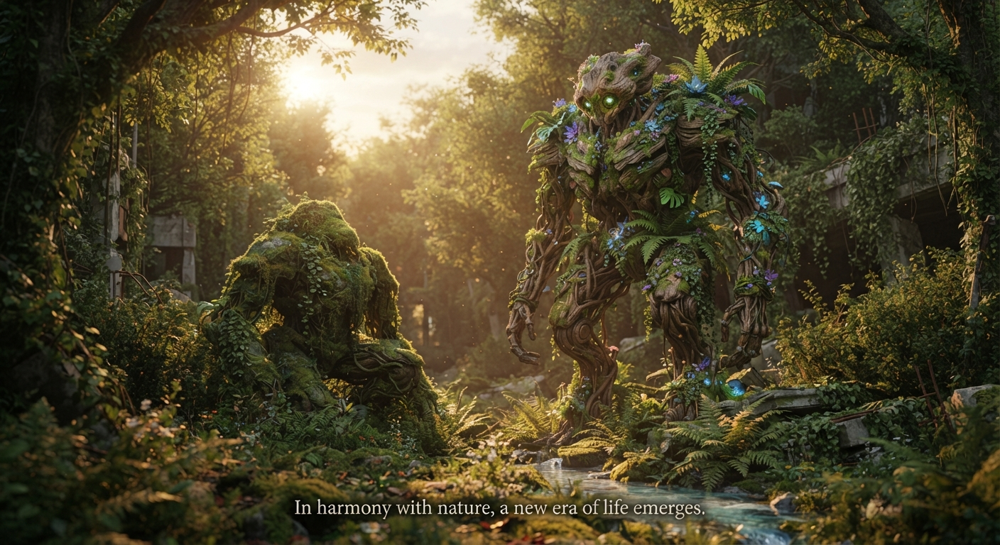
  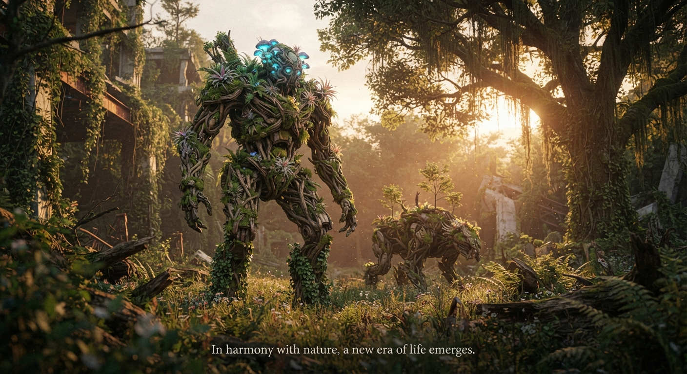
  
  <button onclick="switchBot()" class="toggle-btn">Next Image</button>

<button type="button">Botanical Robots</button>

<pre class="highlight"><code><ul><li><strong>Prompt 1 (Animals)</strong>: A photorealistic studio quality image of robot animals made of plants. The robots have no metal components, they are made of only parts of plants growing together symbiotically as appropriate to create a highly-realistic mech or robot depictions of animals (no metals). No people, but add subtitles if they add flair. Make it look inspiring with uncanny realism instead of other styles. Show the robot animal(s) in their natural settings at golden hour.</li><li><strong>Prompt 2 (Silvan Guardian)</strong>: This image is a photorealistic studio quality depiction of a plant-based robot animal. Use this image as a design guide, but create a high-resolution, ultra-detailed 1080p panoramic view depicting MULTIPLE of these creatures in their natural habitat at golden hour. The subtitle in the image currently says 'SYLVAN GUARDIAN'; you MUST change the spelling in the new subtitle to 'SILVAN GUARDIAN'. The creatures are completely made of symbiotic plants with zero metal parts. Make the details incredibly precise, sharp, and not blurry close up.</li><li><strong>Prompt 3 (Giants)</strong>: A photorealistic studio quality image of traditional giant mechs, but entirely plant-based and constructed of living, symbiotic flora with absolutely zero metal. They are depicted in nature, resembling a new biological lifeform existing at one with a lush, overgrown dystopian future where humans are only a legend. The image should evoke the theme: 'In harmony with nature, a new era of life emerges.' Include this phrase as a subtitle if it adds flair. Use cinematic studio-quality lighting, specifically golden hour or blue-hour lighting, with realistic lens effects (like bokeh or lens flare) to beautifully showcase these organic machines. Uncanny photo-realism, no humans.</li></ul></code></pre>

<h2 id="jul-27">Jul 27 // Dinosaurs: Quetzalcoatlus</h2>

  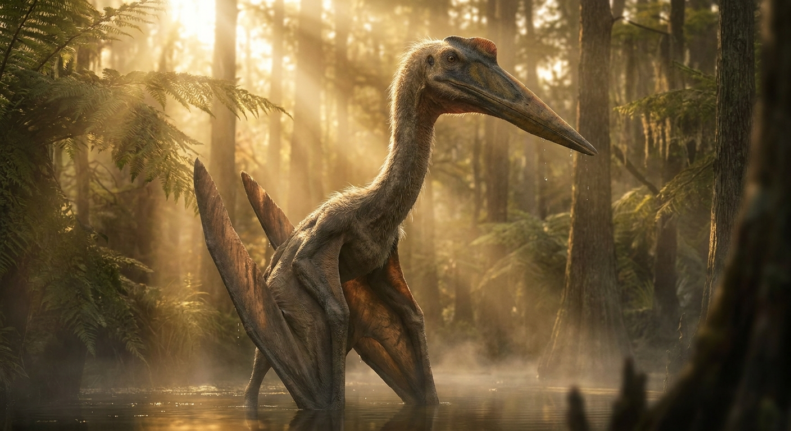
  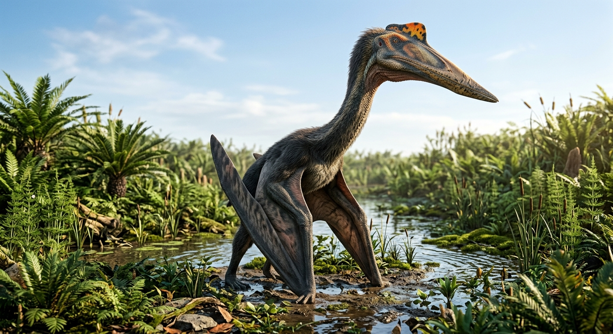
  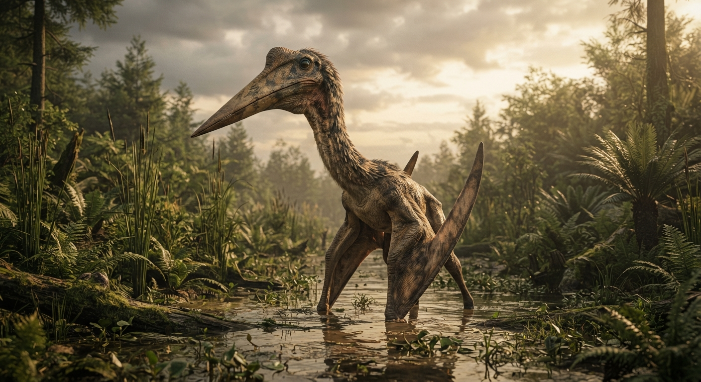
  
  <button onclick="switchQuetz()" class="toggle-btn">Next Image</button>

<button type="button">Dinosaurs: Quetzalcoatlus</button>

<pre class="highlight"><code>
A breathtaking, studio quality, hyper-realistic depiction of a Quetzalcoatlus (standing tall like a massive stork in a prehistoric marsh). Full environmental effects, incredibly exquisite detail on the animal's textures, skin, and authentic prehistoric environment. Subtle, realistic camera and lens effects. CRITICAL INSTRUCTION: There must be absolutely NO predator-prey interaction, no hunting, and no feeding depicted. If this is a carnivore, it must be depicted isolated from any prey species. Masterpiece quality. {lighting_and_atmosphere}

Lighting Variants ({lighting_and_atmosphere}):
Variant 1 (Morning): Lighting/Environment: Bright, crisp morning sunlight piercing through the atmosphere, vibrant colors, clear visibility.
Variant 2 (Dramatic): Lighting/Environment: Dramatic, moody late afternoon golden-hour, or overcast skies with soft, diffused atmospheric shadows.
</code></pre>

<h2 id="jul-26">Jul 26 // Dinosaurs: Archaeopteryx</h2>

  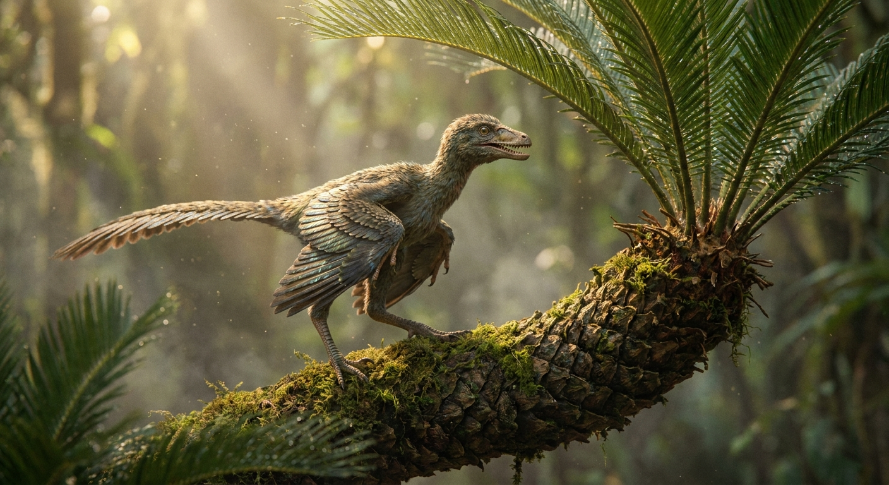
  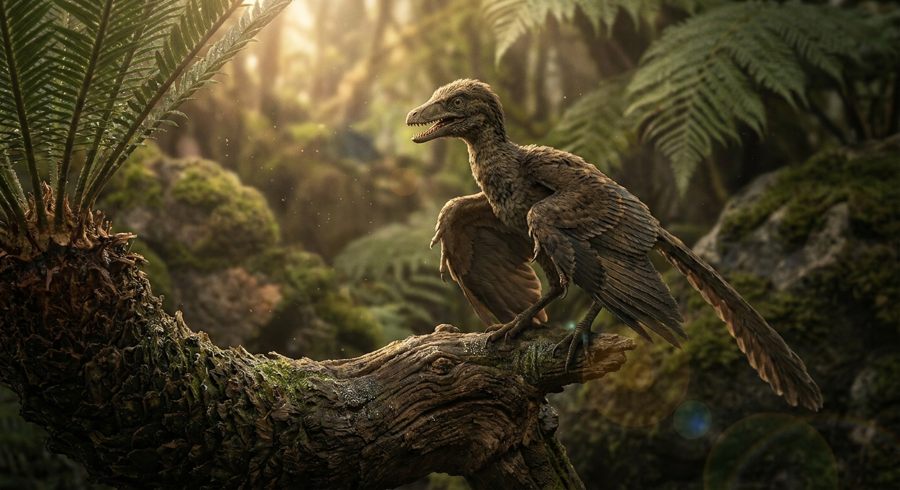
  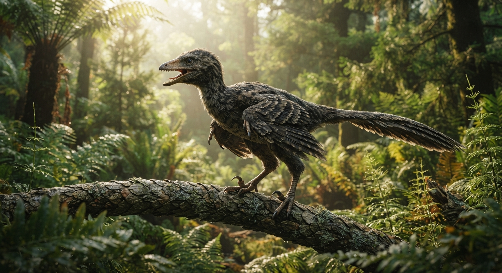
  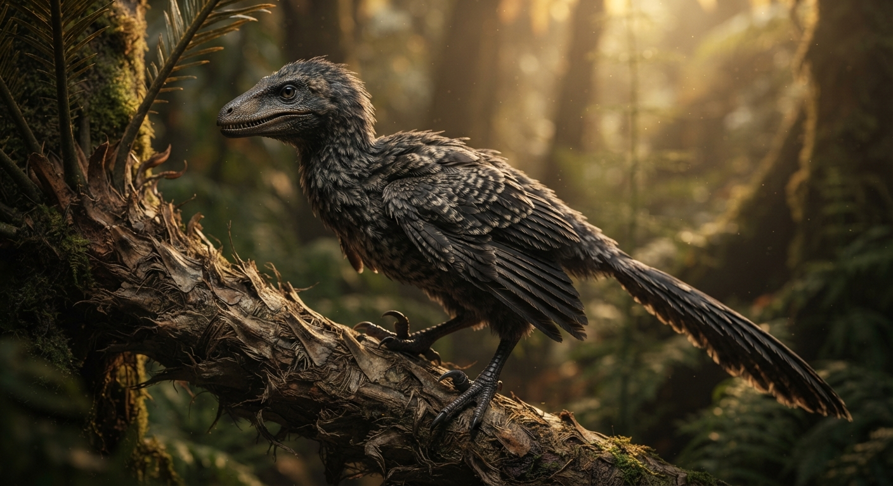
  
  <button onclick="switchArcha()" class="toggle-btn">Next Image</button>

<button type="button">Dinosaurs: Archaeopteryx</button>

<pre class="highlight"><code>
A breathtaking, studio quality, hyper-realistic depiction of a Archaeopteryx (perched on a cycad branch, macro lens focus). Full environmental effects, incredibly exquisite detail on the animal's textures, skin, and authentic prehistoric environment. Subtle, realistic camera and lens effects. CRITICAL INSTRUCTION: There must be absolutely NO predator-prey interaction, no hunting, and no feeding depicted. If this is a carnivore, it must be depicted isolated from any prey species. Masterpiece quality. {lighting_and_atmosphere}

Lighting Variants ({lighting_and_atmosphere}):
Variant 1 (Morning): Lighting/Environment: Bright, crisp morning sunlight piercing through the atmosphere, vibrant colors, clear visibility.
Variant 2 (Dramatic): Lighting/Environment: Dramatic, moody late afternoon golden-hour, or overcast skies with soft, diffused atmospheric shadows.
</code></pre>

<h2 id="jul-25">Jul 25 // Dinosaurs: Tyrannosaurus Rex</h2>

  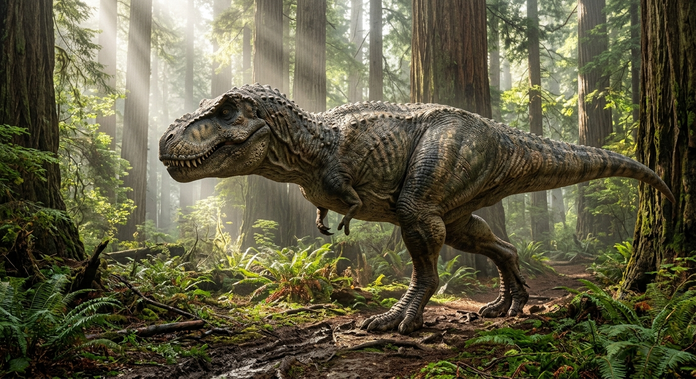
  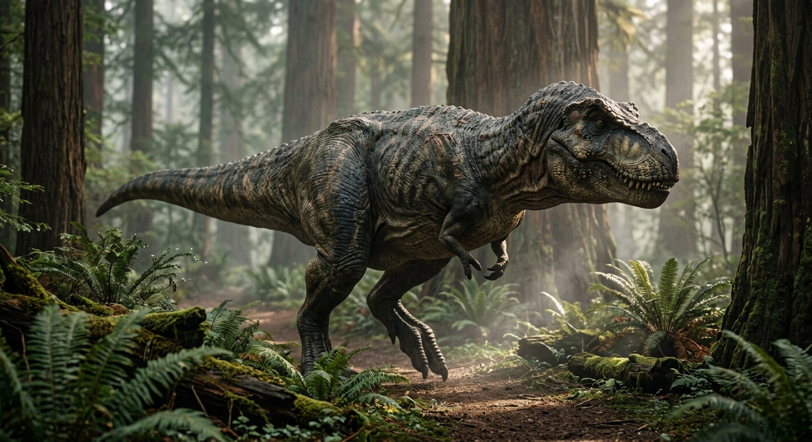
  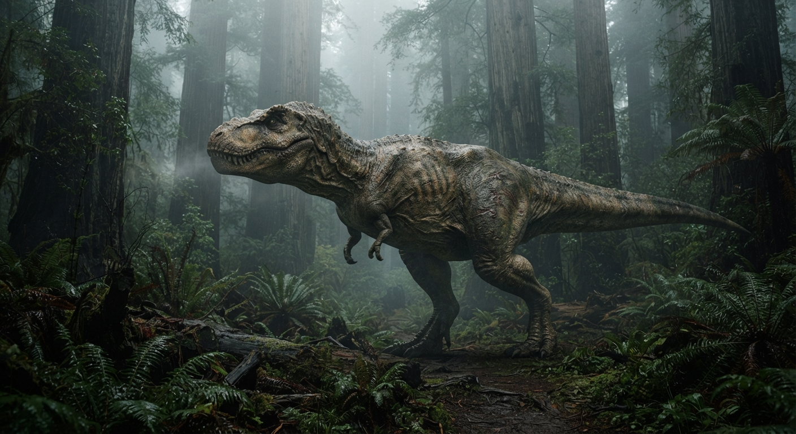
  
  <button onclick="switchTyran()" class="toggle-btn">Next Image</button>

<button type="button">Dinosaurs: Tyrannosaurus Rex</button>

<pre class="highlight"><code>
A breathtaking, studio quality, hyper-realistic depiction of a Tyrannosaurus Rex (dense misty redwood forest). Full environmental effects, incredibly exquisite detail on the animal’s textures, skin, and authentic prehistoric environment. Subtle, realistic camera and lens effects. CRITICAL INSTRUCTION: There must be absolutely NO predator-prey interaction, no hunting, and no feeding depicted. If this is a carnivore, it must be depicted isolated from any prey species. Masterpiece quality. {lighting_and_atmosphere}

Lighting Variants ({lighting_and_atmosphere}):
Variant 1 (Morning): Lighting/Environment: Bright, crisp morning sunlight piercing through the atmosphere, vibrant colors, clear visibility.
Variant 2 (Dramatic): Lighting/Environment: Dramatic, moody late afternoon golden-hour, or overcast skies with soft, diffused atmospheric shadows.
</code></pre>

<h2 id="jul-24">Jul 24 // Time-traveling Animals</h2>

  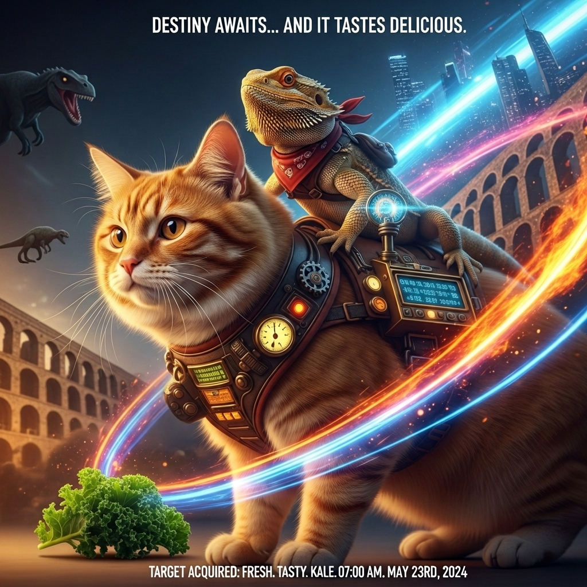
  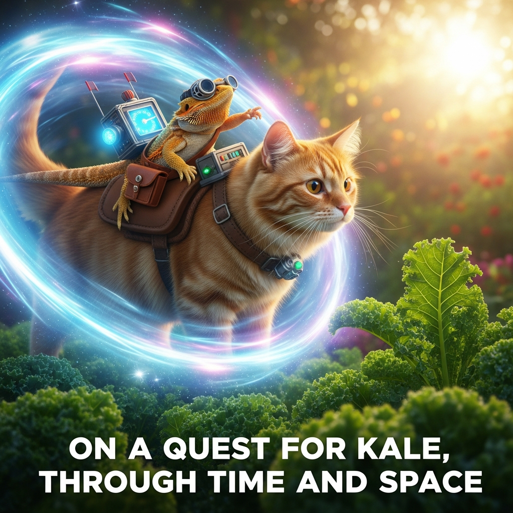
  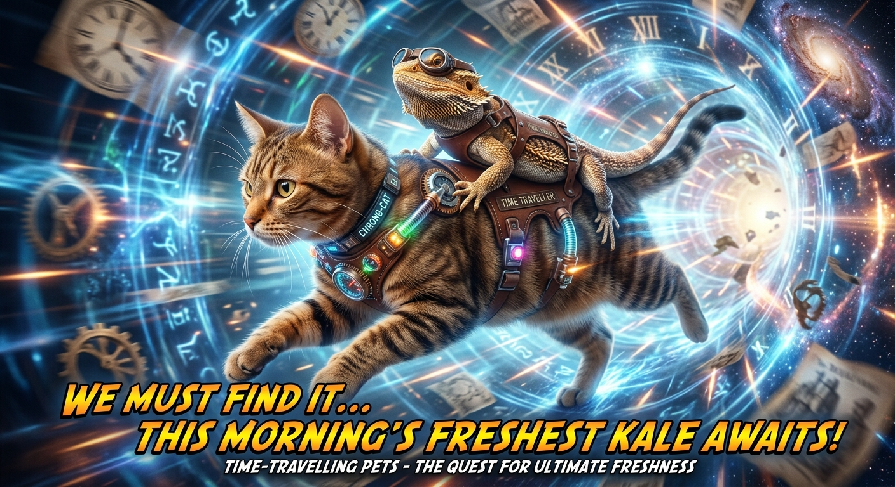
  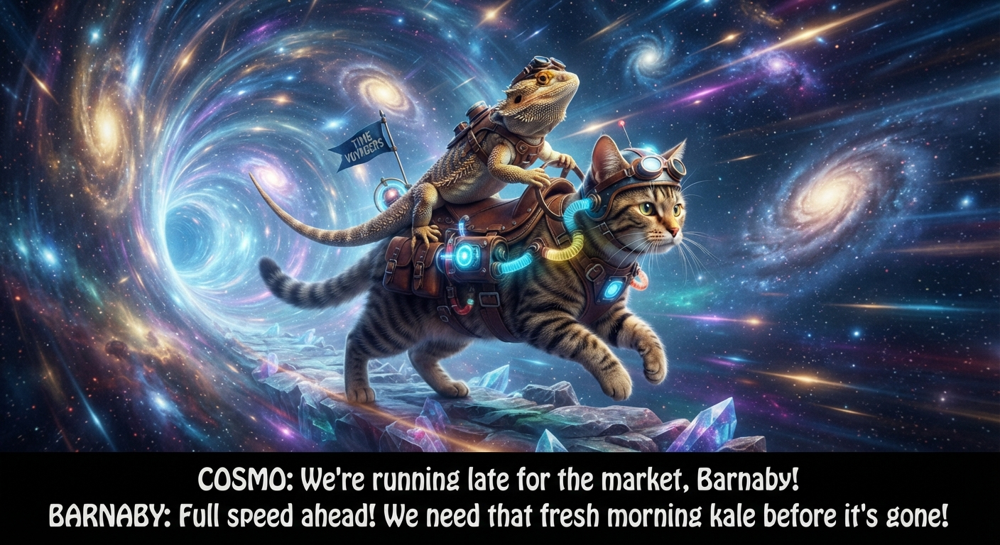
  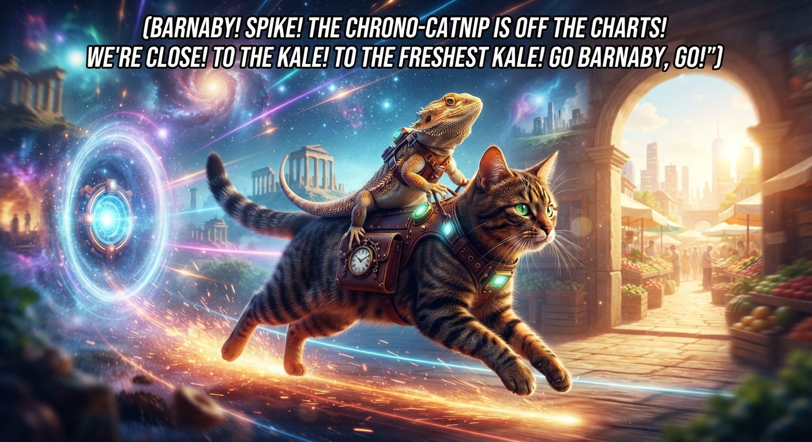
  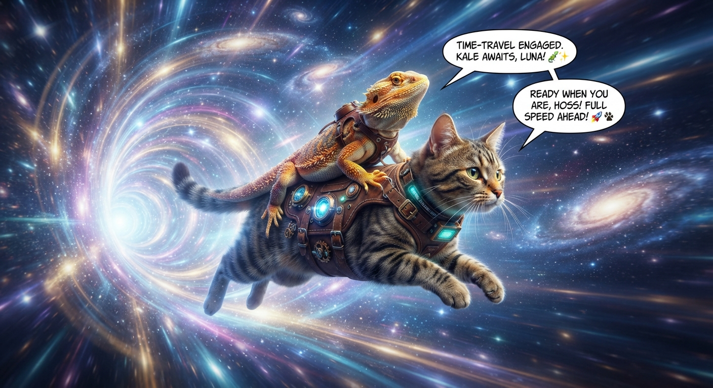
  
  <button onclick="switchTTP()" class="toggle-btn">Next Image</button>

<button type="button">Time-traveling Animals</button>

<pre class="highlight"><code>
A photorealistic studio quality image of a bearded dragon riding a time-traveling cat to find this mornings fresh tasty kale. No people, but add subtitles if they add flair. Make it look inspiring to impress. The cat and bearded dragon are time-traveling pets.
</code></pre>

  &times;
  
  

    <button id="lightbox-next-btn" class="lightbox-btn" style="display: none;">Next Image</button>
    <a href="" id="lightbox-link" target="_blank" class="lightbox-btn">View Original</a>
  


